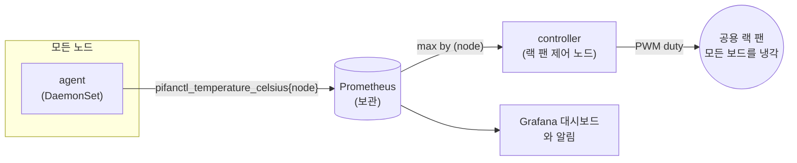
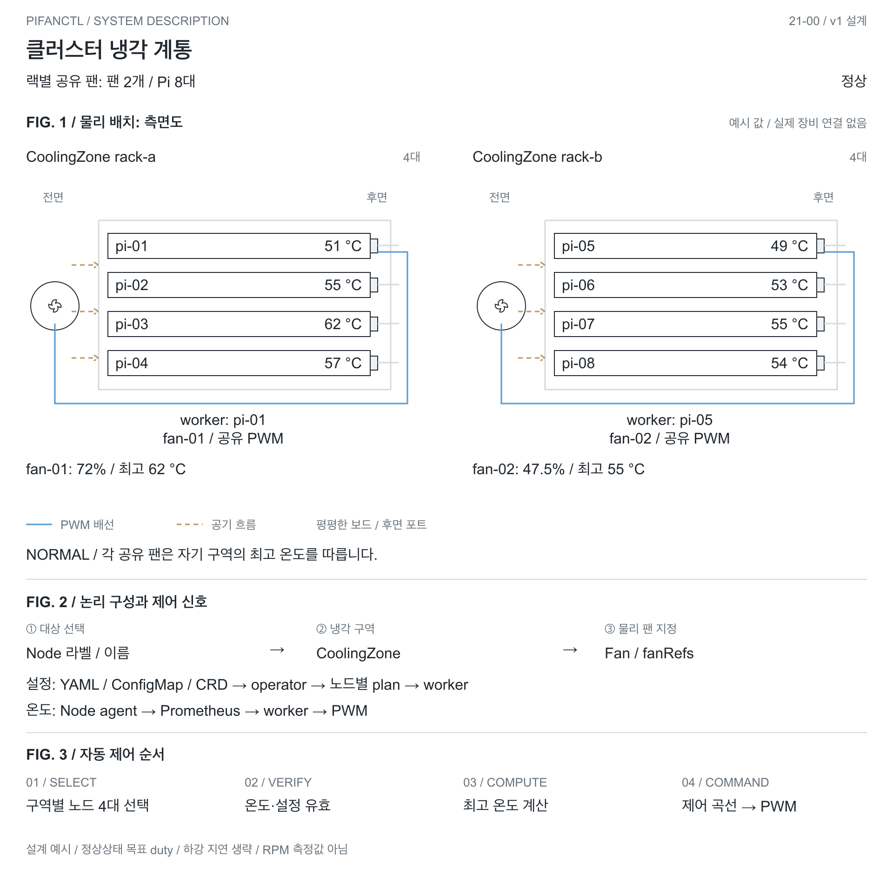
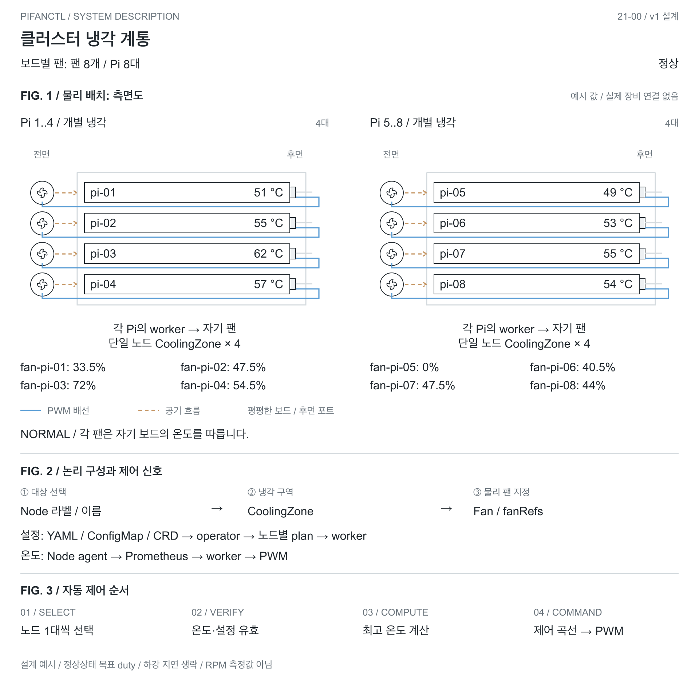
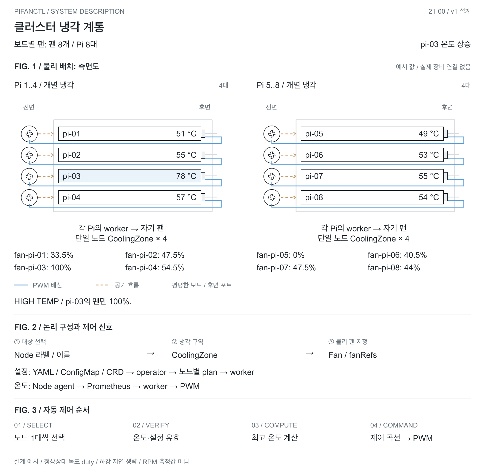
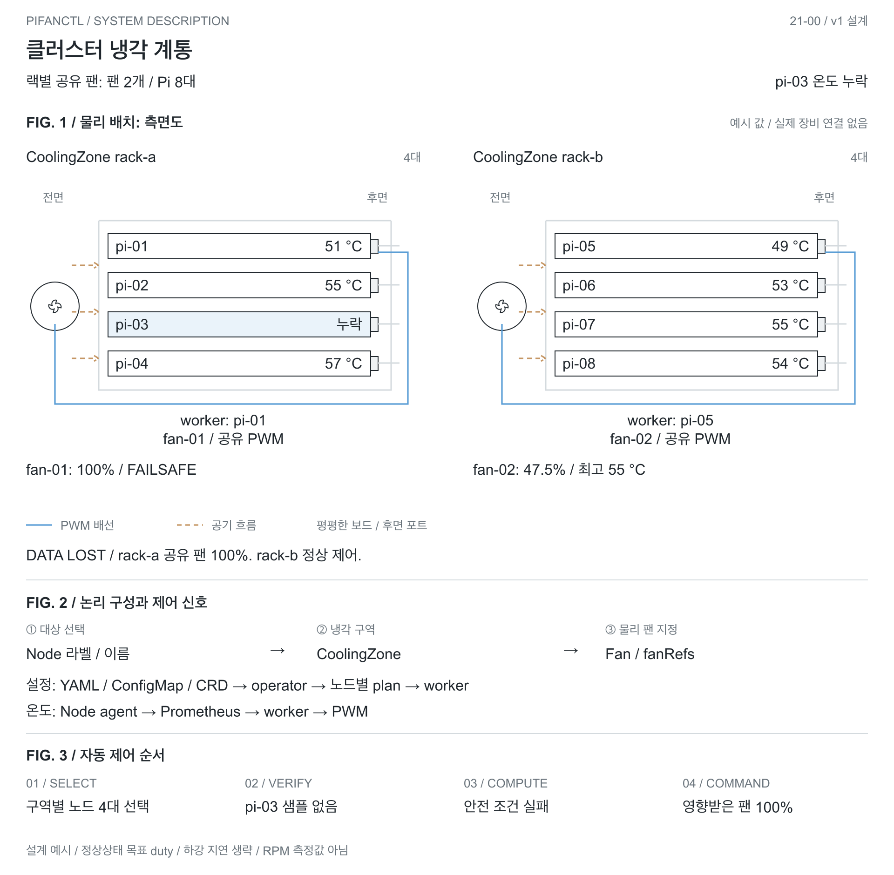
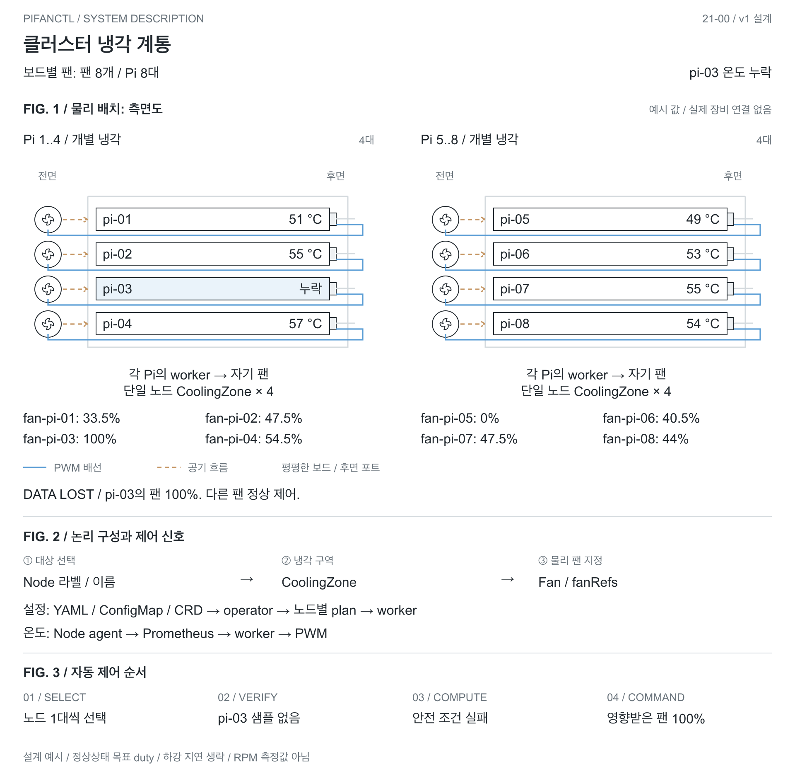
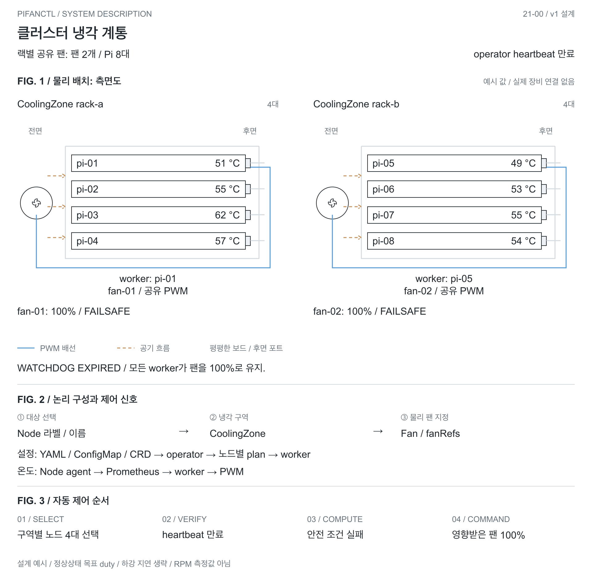
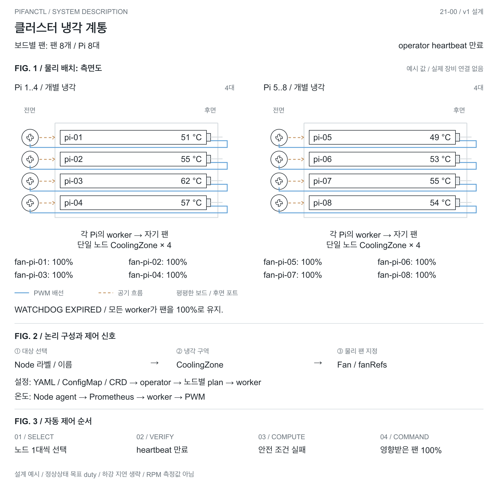

<div align="center">

# pifanctl: 라즈베리 파이 팬 컨트롤러


🥧 **라즈베리 파이**의 **PWM 팬 제어** CLI

[](https://typer.tiangolo.com/)
[](https://github.com/actions/actions-runner-controller)
[](https://typer.tiangolo.com/)
[](https://docker.io)
[](https://kubernetes.io)<br/>
[](https://github.com/jyje/pifanctl/actions/workflows/ci.yaml)
[](https://github.com/jyje/pifanctl/actions/workflows/build-image-main.yaml)
[](https://github.com/jyje/pifanctl/actions/workflows/build-image-develop.yaml)
[](https://github.com/jyje/pifanctl)

[English](README.md) | **한국어**

</div>

🐳 **pifanctl**은 라즈베리 파이의 PWM 팬을 제어하는 CLI입니다. 보드 한 대부터 클러스터 전체까지 지원하며, 클러스터의 주 사용 사례는 랙에 설치한 공용 팬 하나로 여러 보드를 함께 식히는 것입니다. 공용 팬은 **가장 뜨거운 노드**를 기준으로 동작하고, 모든 노드의 온도가 Prometheus에 보관됩니다. 일반 CLI, **Docker**, 또는 Helm 차트를 이용한 **Kubernetes**로 실행할 수 있고 ARM64에 최적화되어 있습니다. GitHub Actions와 Actions Runner Controller(ARC)로 구성한 CI/CD를 사용하므로 모든 빌드가 실제 라즈베리 파이에서 테스트됩니다.

프로젝트 일러스트는 열린 라즈베리 파이 랙과 중앙 공용 팬, 쿠버네티스 생태계의 고래 마스코트를 친근한 카툰 스타일로 표현합니다. 보드는 선반에 평평하게 두고 랙 안쪽 깊이 방향으로 돌려 포트와 케이블이 팬 반대쪽을 향합니다. 보드마다 팬이 따로 달린 모습이 아니라 랙 전체를 함께 식히는 구성을 보여주며, 파이 로고는 사용하지 않습니다. 단일 보드 팬 제어도 지원합니다. [일러스트 스타일과 스티커 시안 3개 보기](docs/illustration-style.md).



| | 보드 한 대 | 클러스터 |
| --- | --- | --- |
| 읽는 곳 | 자기 열 영역 | Prometheus를 통한 모든 노드 |
| 팬 구동 기준 | 자기 온도 | 가장 뜨거운 노드 |
| 냉각 구성 | 보드 한 대와 팬 하나 | 공용 랙 팬 하나가 여러 보드를 냉각 |
| 이력 | 없음 | Prometheus에 보관, 대시보드와 알림 제공 |
| 설치 | `install.sh`, Docker, 원시 매니페스트 | Helm 차트 |

> **상태.** 클러스터 모드는 라즈베리 파이 4 클러스터에서 RPi.GPIO 드라이버로 운영 중입니다. 라즈베리 파이 5용 커널 PWM 드라이버는 가짜 sysfs 트리를 이용한 테스트로만 검증했고, 팬이 달린 Pi 5에서는 아직 실행해 보지 못했습니다.

---
> 이 브랜치는 v1 alpha 소스입니다. registry 설치 전 alpha 이미지/차트 게시가 필요합니다. [런타임 매뉴얼](docs/v1/runtime-ko.md)을 확인하세요. 정식 v1.0.0의 하드웨어 검증은 남아 있습니다.

## 1. 실행

### 1.1. 요구 사항

- Raspberry Pi (ARM64)
- Python 3.10+

아래 명령은 Raspberry Pi (ARM64)에 접속해서 실행하세요.

### 1.2. 옵션 1: 패키지처럼 CLI 설치

```sh
curl -fsSL https://raw.githubusercontent.com/jyje/pifanctl/main/install.sh -o install-pifanctl.sh
chmod +x install-pifanctl.sh
./install-pifanctl.sh
rm install-pifanctl.sh

## 삭제
# rm -rf $HOME/.pifanctl
```

설치 후 `pifanctl --help`로 사용법을 확인하세요.

```
 Usage: pifanctl [OPTIONS] COMMAND [ARGS]...

 🥧 pifanctl: A CLI for PWM Fan Controlling of Raspberry Pi

╭─ Commands ───────────────────────────────────────────────────────────────────╮
│ status  Show current temperatures                                            │
│ agent   Publish this node's temperatures as Prometheus metrics               │
│ start   Start fan control                                                    │
╰──────────────────────────────────────────────────────────────────────────────╯
```

핀을 구동하려면 root가 필요하므로 컨트롤러는 `sudo pifanctl start`로 시작하세요. `pifanctl status`와 `pifanctl agent`는 필요 없습니다.

### 1.3. 옵션 2: Docker

```sh
docker run --rm -it ghcr.io/jyje/pifanctl:latest python main.py --help
```

팬을 구동하려면:

```sh
docker run --privileged --user 0 -it ghcr.io/jyje/pifanctl:latest python main.py start
```

```
INFO [2026-10-01 14:30:00Z] Detected 'Raspberry Pi 4 Model B Rev 1.5', using the RPi.GPIO driver
INFO [2026-10-01 14:30:00Z] Controller started with driver 'rpigpio', interval 5.0s
INFO [2026-10-01 14:30:00Z] Duty: 36.6%, Temperature: 51.9°C, Following: raspberrypi, Source: local, Nodes: raspberrypi=51.9*
```

핀 제어에는 GPIO와 `/dev/mem` 접근이 필요해서 `start`에는 `docker run --privileged --user 0`이 필요합니다. `agent`와 `status`는 권한 없이 실행되고, 이미지는 기본적으로 non-root 사용자로 실행됩니다.

### 1.4. 옵션 3: Helm으로 Kubernetes에 설치 (권장)

```sh
# 공용 랙 팬을 제어하는 GPIO가 연결된 Raspberry Pi 노드 한 곳에 라벨을 붙입니다.
kubectl label node <공용-랙-팬-제어-노드> pifanctl.jyje.online/fan=true

helm install pifanctl oci://ghcr.io/jyje/charts/pifanctl --version 0.2.0-alpha.1 \
  --namespace pifanctl --create-namespace \
  --set prometheus.url=http://prometheus-operated.monitoring.svc:9090 \
  --set monitoring.serviceMonitor.enabled=true \
  --set monitoring.prometheusRule.enabled=true \
  --set monitoring.grafanaDashboard.enabled=true
```

사전 조건: 컨트롤러에서 접근 가능한 Prometheus. `monitoring.*` 옵션에는 Prometheus Operator CRD(`ServiceMonitor`, `PrometheusRule`)가, `GrafanaDashboard`에는 grafana-operator가 필요합니다. `monitoring.*.labels`는 Prometheus가 선택하는 라벨(예: `release: prometheus`)로 지정하세요.

- `agent`: 모든 노드에서 도는 DaemonSet (모든 taint 허용), non-root, 읽기 전용 루트 파일시스템, 권한 없음.
- `controller`: GPIO 구동에 `/dev/mem`이 필요해서 root와 privileged로 실행됩니다. 공용 랙 팬 하나를 제어할 때는 해당 팬에 GPIO가 연결된 노드 한 곳을 선택합니다. 컨트롤러가 멈출 때는 최대 속도로 남습니다.
- `controllers`: 이름 있는 그룹의 맵입니다. 각 그룹은 자신의 `nodeSelector`로 한정된 DaemonSet이고 `controllerDefaults` 위에 덮어써지므로, 하드웨어가 다른 노드를 한 릴리스에 함께 선언할 수 있습니다.

  ```yaml
  controllers:
    pi4:
      nodeSelector: {pifanctl.jyje.online/fan: pi4}
      driver: rpigpio
    pi5:
      nodeSelector: {pifanctl.jyje.online/fan: pi5}
      driver: sysfs
      pwmChannel: 2
  ```

  그룹의 `nodeSelector`는 기본값과 병합되지 않고 적은 그대로 쓰입니다. 그룹을 선언하지 않으면 `pifanctl.jyje.online/fan=true` 라벨이 붙은 노드에서 `default` 그룹 하나가 실행됩니다. 노드는 최대 한 그룹에만 일치해야 하며, `nodeSelector`가 없는 그룹은 모든 노드에서 실행되어 핀을 두고 다툴 수 있으므로 렌더링 단계에서 거부됩니다.
- `monitoring`: 선택 사항인 `ServiceMonitor`, `PrometheusRule`(뜨거운 노드, 위험 온도, agent 중단, failsafe, 폴백, 컨트롤러 없음)과 recording rule, 그리고 Grafana 대시보드(사이드카용 `ConfigMap` 또는 grafana-operator `GrafanaDashboard`).
- 이미지 태그는 기본값이 `v<appVersion>`이며 `latest`는 쓰지 않습니다. `values.schema.json`이 알 수 없는 드라이버나 범위를 벗어난 duty를 거부하고, `extraResources`로 추가 매니페스트를 릴리스와 함께 렌더링할 수 있습니다.

모든 옵션은 [`charts/pifanctl/values.yaml`](charts/pifanctl/values.yaml), 검증된 예시는 [`charts/pifanctl/ci`](charts/pifanctl/ci)를 보세요.

#### 메트릭과 알림

| 메트릭 | 출처 | 의미 |
| --- | --- | --- |
| `pifanctl_temperature_celsius{node,zone,type}` | agent (`:9101`) | 열 영역마다 시계열 하나 |
| `pifanctl_node_temperature_max_celsius{node}` | agent | 노드에서 가장 뜨거운 영역 |
| `pifanctl_temperature_read_errors_total{node}` | agent | 열 영역을 찾지 못한 읽기 횟수 |
| `pifanctl_fan_duty_percent{node}` | controller (`:9102`) | 현재 적용 중인 duty |
| `pifanctl_control_temperature_celsius{node}` | controller | 팬이 반응한 온도 |
| `pifanctl_control_followed_node{node,followed}` | controller | 따라가는 노드 |
| `pifanctl_control_source{node,source}` | controller | `prometheus`, `local`, `failsafe` |
| `pifanctl_control_fallbacks_total{node,to}` | controller | 클러스터 값을 못 써서 물러난 주기 수 |

`monitoring.prometheusRule.enabled`를 켜면 다음에 알림이 옵니다: 노드가 10분간 75 °C 초과, 노드가 82 °C 초과, agent 수집 중단, 컨트롤러 failsafe, 컨트롤러가 자기 노드로 폴백, 보고하는 컨트롤러가 전혀 없음.

#### 보관(Retention)

온도는 이력이 있어야 쓸모가 있습니다. 이 차트는 메트릭을 내보낼 뿐 Prometheus를 소유하지 않으므로, 보관 설정은 Prometheus 쪽에서 합니다.

- 돌아보고 싶은 기간만큼 `retention`을 설정하고, TSDB가 디스크를 가득 채우지 않도록 `retentionSize`를 볼륨 크기보다 조금 작게 지정하세요.
- recording rule `pifanctl:node_temperature_max_celsius:max`는 클러스터 전체를 나타내는 시계열 하나입니다. 다운샘플링이나 장기 저장소로 보낼 때는 이 시계열을 보내면 됩니다.
- 노드가 한 자릿수라면 한 달에 수백 KB 수준입니다. 보관 용량은 pifanctl이 아니라 다른 워크로드가 좌우합니다.

### 1.5. 옵션 4: 원시 매니페스트로 Kubernetes에 설치 (노드 1대, Prometheus 없음)

```sh
kubectl create namespace pifanctl
kubectl apply -n pifanctl -f https://raw.githubusercontent.com/jyje/pifanctl/main/k8s/manifests/deployments.yaml
```

```sh
kubectl get pods -n pifanctl
kubectl logs -n pifanctl -l app=pifanctl
```

### 1.6. 옵션 5: 소스 코드 직접 실행

```sh
git clone https://github.com/jyje/pifanctl ~/.pifanctl
cd ~/.pifanctl/sources
pip install --upgrade -r requirements.raspi.txt
python ~/.pifanctl/sources/main.py --help
```

### 1.7. 클러스터 모드: 공용 랙 팬 하나로 여러 노드 냉각

랙에 설치한 PWM 팬 하나가 여러 라즈베리 파이 보드를 함께 식힙니다. 팬은 중앙에서 제어하고, 랙 안에서 **가장 뜨거운 노드**를 기준으로 속도를 정합니다. 각 보드에 팬을 따로 설치할 필요가 없습니다.

| 역할 | 명령 | 실행 위치 | 하는 일 |
| --- | --- | --- | --- |
| Agent | `pifanctl agent` | **모든 노드** (DaemonSet) | `/sys/class/thermal`을 읽어 `node` 라벨이 붙은 `pifanctl_*` 메트릭을 노출 |
| Prometheus | | 클러스터 | 온도를 수집하고 **보관** |
| Controller | `pifanctl start --source prometheus` | **지정된 팬 제어 노드 한 곳** | Prometheus에 `max by (node) (pifanctl_temperature_celsius)`를 질의해 가장 뜨거운 노드 기준으로 공용 랙 팬 구동 |

컨트롤러는 한 가지 소스만 믿지 않습니다. 매 주기마다 클러스터 값과 자기 노드 값 중 **높은 쪽**으로 동작하고, 안전하게 단계적으로 물러납니다.

1. Prometheus가 응답: `max(cluster, local)` 사용.
2. Prometheus가 중단되었거나 비어 있음: 로컬 온도를 사용하고 폴백을 기록.
3. 아무것도 읽을 수 없음: `--failsafe-duty`(기본 100%)로 팬 구동.

컨트롤러가 멈추면(SIGTERM, Pod 축출) 팬은 `--exit-duty`(기본 100%)로 남습니다. 멈춘 컨트롤러는 더 이상 보드를 지켜주지 못하기 때문입니다.

`--source local`(기본값)에서는 컨트롤러가 자기 노드의 온도만 사용합니다. 단일 보드 구성에 적합하며, 여러 노드가 공유하는 랙 팬은 `--source prometheus`를 사용해 가장 뜨거운 보드가 팬 속도를 결정하게 하세요.

```sh
# 모든 노드에서
pifanctl agent

# 공용 랙 팬을 제어하도록 지정한 노드에서
pifanctl start --source prometheus --prometheus-url http://prometheus:9090
```

#### 로그로 알 수 있는 것

매 주기마다 팬이 무엇에 반응했는지와 모든 노드의 온도를 높은 순으로 로그에 남깁니다. 따라간 노드에는 `*`가 붙습니다.

```
INFO [2026-10-01 14:30:05Z] Duty: 86.3%, Temperature: 70.5°C, Following: node-c, Source: prometheus, Nodes: node-c=70.5* node-b=52.1 node-d=51.8 node-a=49.2
```

보고하던 노드가 사라지면 한 번 경고합니다(`Node 'node-c' stopped reporting and is not part of the maximum`). 조용해진 노드가 뜨거운 노드일 수 있기 때문입니다. 같은 정보가 메트릭 `pifanctl_control_followed_node`(따라가는 노드)와 `pifanctl_control_temperature_celsius`로도 있습니다.

#### 온도 곡선

`--algorithm curve`(기본값)는 온도를 duty로 변환합니다. 올라갈 때는 즉시, 내려갈 때는 단계적으로(`--duty-down-step`) 움직이며, 이것이 임계값 근처에서 팬이 켜졌다 꺼졌다 하는 것을 막는 히스테리시스입니다.

| 온도 | Duty |
| --- | --- |
| `--temp-low`(50 °C) 미만 | `--duty-idle`(0%) |
| `--temp-low` | `--duty-start`(30%) |
| 그 사이 | 선형 증가 |
| `--temp-high`(70 °C) 이상 | `--duty-max`(100%) |

`--algorithm step`은 기존 동작(`--target-temperature`, `--duty-cycle-step`)을 유지합니다.

#### 드라이버

| `--driver` | 용도 |
| --- | --- |
| `auto`(기본값) | 라즈베리 파이 5는 커널 PWM, 그 외는 RPi.GPIO. **mock은 절대 선택하지 않으며**, 실제 하드웨어가 없으면 냉각하는 척하지 않고 오류로 종료 |
| `rpigpio` | `--pin`에 소프트웨어 PWM (라즈베리 파이 4 이하) |
| `sysfs` | `/sys/class/pwm`의 커널 하드웨어 PWM (`--pwm-chip`, `--pwm-channel`). PWM 오버레이 필요, 예: `dtoverlay=pwm-2chan` |
| `mock` | 개발 전용 |

모든 옵션은 환경 변수로도 지정할 수 있으며 `pifanctl start --help`에 나와 있습니다.

---
## 2. 빌드

> [!IMPORTANT]
> `RPi.GPIO` 패키지는 라즈베리 파이 OS(또는 라즈베리 파이 재단이 튜닝한 Linux)에서만 사용할 수 있습니다. 이 명령은 라즈베리 파이에서 실행하세요.

```sh
git clone https://github.com/jyje/pifanctl ~/.pifanctl
cd ~/.pifanctl/sources
pip install --upgrade -r requirements.raspi.txt
```

테스트는 라즈베리 파이가 필요 없습니다(차트 테스트는 `helm`도 필요).

```sh
pip install -r sources/requirements.dev.txt
python -m pytest --cov=sources --cov-report=term-missing
```

```sh
python ~/.pifanctl/sources/main.py --help
python ~/.pifanctl/sources/main.py --version
python ~/.pifanctl/sources/main.py status
```

---
## 3. CI/CD 파이프라인

ARM64 CI/CD에 [GitHub Actions와 Actions Runner Controller (ARC)](https://github.com/actions/actions-runner-controller)를 사용합니다. 빌드는 자체 호스팅 라즈베리 파이 러너에서 실행되어 ARM64 호환성을 네이티브로 보장합니다.

CI/CD 환경은 [app.jyje.online#stack](https://app.jyje.online/#stack)에서 확인할 수 있습니다.

### 3.1. 워크플로 구성

| 워크플로 | 트리거 | 하는 일 |
| --- | --- | --- |
| `ci` | 모든 풀 리퀘스트 | 워크플로 lint, Python 3.10/3.11/3.14 테스트, 차트 lint와 스키마 검증(kubeconform, `promtool`), 클러스터 내 러너에서 ARM64 이미지를 푸시 없이 빌드 |
| `build-image-main` | `main` push | `ghcr.io/jyje/pifanctl:latest`, 커밋 SHA 태그, `v<version>`(버전당 한 번) 발행 |
| `build-image-develop` | `develop` push | `ghcr.io/jyje/pifanctl-dev:latest`와 SHA 태그 발행 |
| `build-image-issue` | `issue-**` push | 임시 테스트용 `ghcr.io/jyje/pifanctl-issue:<sha>` 발행 |
| `release-chart` | `charts/pifanctl`을 바꾼 `main` push | 버전이 새로울 때 `oci://ghcr.io/jyje/charts/pifanctl`에 차트 발행 |

세 이미지 워크플로는 재사용 워크플로 `_build-image.yaml` 하나를 공유합니다.

### 3.2. 주요 기능

- 자체 호스팅 러너(**`r4spi-microk8s`**, 클러스터의 [ARC](https://github.com/actions/actions-runner-controller) 러너 스케일 셋)를 이용한 네이티브 ARM64 빌드. 포크의 풀 리퀘스트는 이 러너에서 실행되지 않습니다
- 커밋 메시지의 **`--no-ci`**로 CI 건너뛰기. 워크플로 엔진이 평가하며 셸 스크립트에 직접 넣지 않습니다
- GitHub Container Registry(ghcr.io) 연동, 불변 `v<version>` 태그
- 빌드된 이미지 테스트: 버전 출력, 권한 없이 실행, GPIO가 없는 곳에서 실제 GPIO 드라이버 기동 거부

### 3.3. 릴리스

버전은 두 곳에 있으며, 배포되는 것을 바꾸는 풀 리퀘스트는 버전을 올려야 합니다.

| 변경 | 올릴 것 | 확인 |
| --- | --- | --- |
| `sources/main.py` 또는 `sources/pifanctl/` | `sources/pifanctl/__init__.py`의 `__version__`과 `charts/pifanctl/Chart.yaml`의 `appVersion` | `Version bump` 잡 |
| `charts/pifanctl/` (`ci/` 값 파일 제외) | `charts/pifanctl/Chart.yaml`의 `version`. 애플리케이션 버전이 새로우면 `appVersion`이 바뀌므로 차트 버전도 새로워야 합니다 | `Version bump` 잡 |

`k8s/manifests/deployments.yaml`의 이미지 태그와 위 설치 명령의 차트 버전도 함께 바꾸세요. 어긋나면 테스트가 실패합니다.

`main`에 병합하면 나머지는 자동입니다.

1. `build-image-main`이 `latest`, 커밋 태그, 그리고 버전이 처음 나타날 때 `v<version>`을 발행합니다.
2. 이미지가 생긴 뒤 git 태그 `v<version>`과 자동 생성 노트가 붙은 GitHub 릴리스를 만듭니다.
3. `release-chart`가 차트가 가리키는 이미지를 기다린 뒤 `oci://ghcr.io/jyje/charts/pifanctl`에 차트를 발행하고, 태그 `chart-v<version>`과 릴리스를 만듭니다.

각 단계는 이미 있는 것을 건너뛰므로 실패한 워크플로를 다시 실행해도 안전합니다. 애플리케이션 릴리스는 `v*`, 차트 릴리스는 `chart-v*` 태그를 씁니다.

---
## 4. 문제 해결

문제가 있나요? [trouble-shooting.md](docs/trouble-shooting.md)를 보세요.

### v1 alpha: 선언형 냉각 토폴로지

v1 제안은 Node 라벨로 냉각 대상을 선택하고 `CoolingZone`으로 구역을 구성한 뒤
`Fan`으로 물리 PWM 팬을 연결합니다. 공유 랙 팬과 보드별 팬을 같은 모델로 표현하고
YAML, ConfigMap, Helm, kubectl/CLI 흐름을 연결합니다.
[오퍼레이터 설계](docs/v1/README-ko.md)와 [CRD·예시](design/v1/README.md)를
검토할 수 있습니다. operator·worker·CLI를 alpha로 구현했습니다.
설치, migration과 검증 범위는 [런타임 매뉴얼](docs/v1/runtime-ko.md),
단계별 작업과 정식 출시 게이트는 [PLAN.md](PLAN.md)를 확인하세요.


#### 냉각 계통 설명: 시나리오 도해

예시 온도로 v1 모델의 동작을 설명합니다. 출력은 정상상태 목표 duty이며 하강 지연은 생략했습니다. 실제 하드웨어 측정값이 아닙니다.



<details>
<summary>NORMAL: 보드별 팬</summary>

각 팬은 자기 보드의 온도를 따릅니다.



</details>

<details>
<summary>HIGH TEMPERATURE: pi-03 온도 상승</summary>

뜨거워진 멤버에 연결된 팬을 최대 출력으로 올립니다. 다른 냉각 구역에는 영향을 주지 않습니다.




</details>

<details>
<summary>DATA LOST: pi-03 온도 누락</summary>

공유 구역의 온도가 불완전하면 해당 공용 팬을 100%로 합니다. 보드별 팬에서는 누락된 보드의 팬만 안전 동작으로 전환합니다.





</details>

<details>
<summary>WATCHDOG EXPIRED: operator heartbeat 만료</summary>

operator heartbeat가 만료되면 영향을 받은 모든 worker가 팬을 100%로 유지합니다.





</details>

[SVG 원본과 렌더링 방법](docs/v1/figures/README.md).

---
## 5. 참고 자료

- [공식: Raspberry Pi Foundation](https://www.raspberrypi.org)
- [블로그: Using Raspberry Pi to Control a PWM Fan and Monitor its Speed](https://blog.driftking.tw/en/2019/11/Using-Raspberry-Pi-to-Control-a-PWM-Fan-and-Monitor-its-Speed/)
