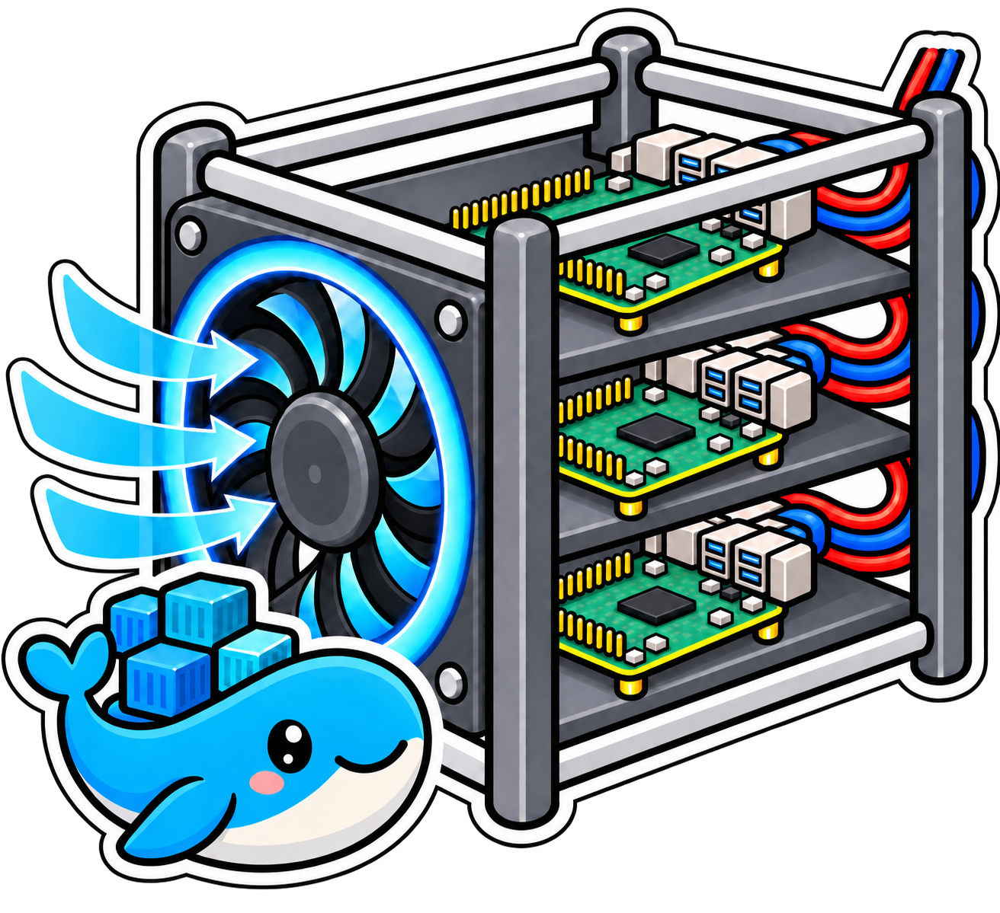
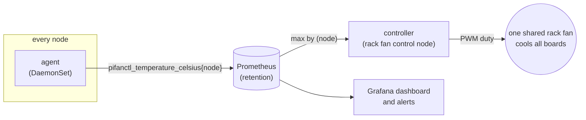
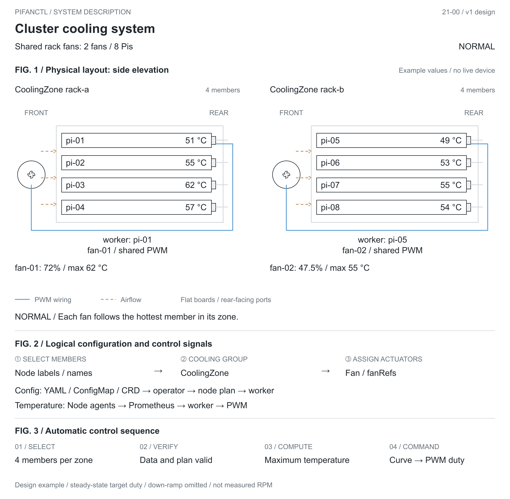
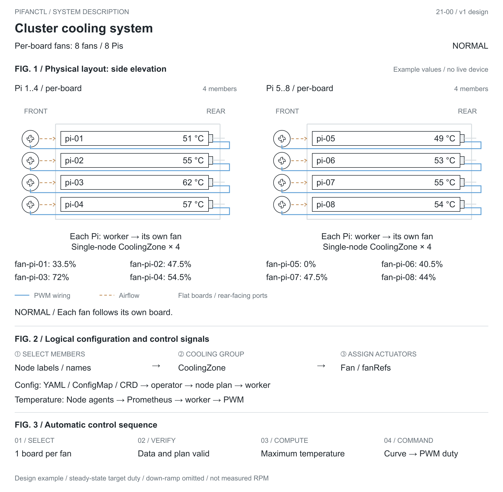
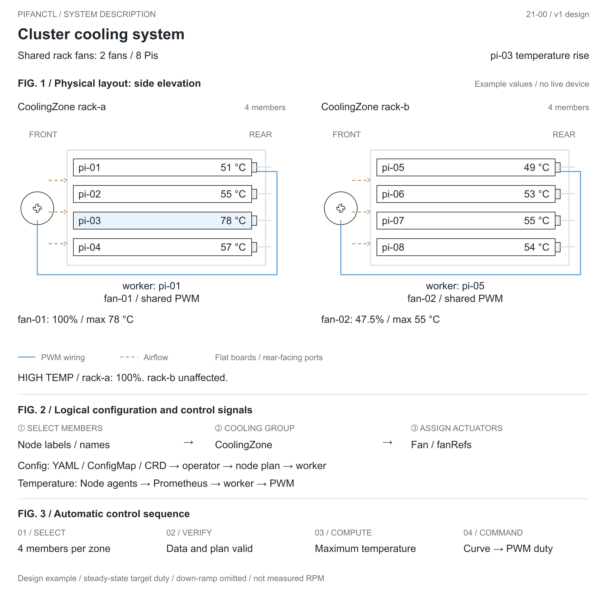
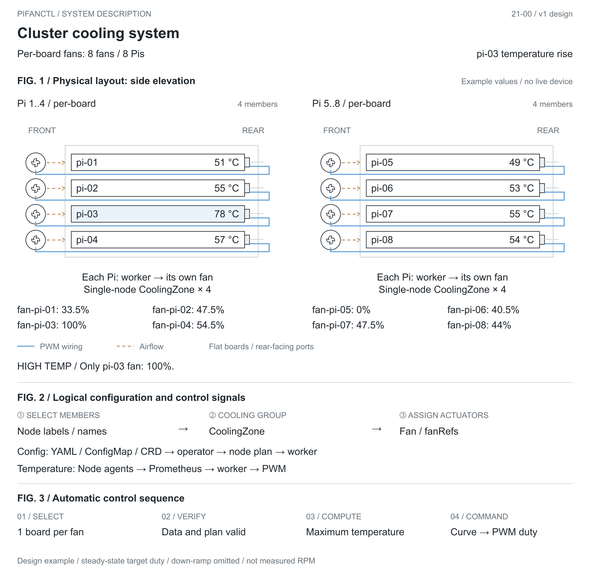
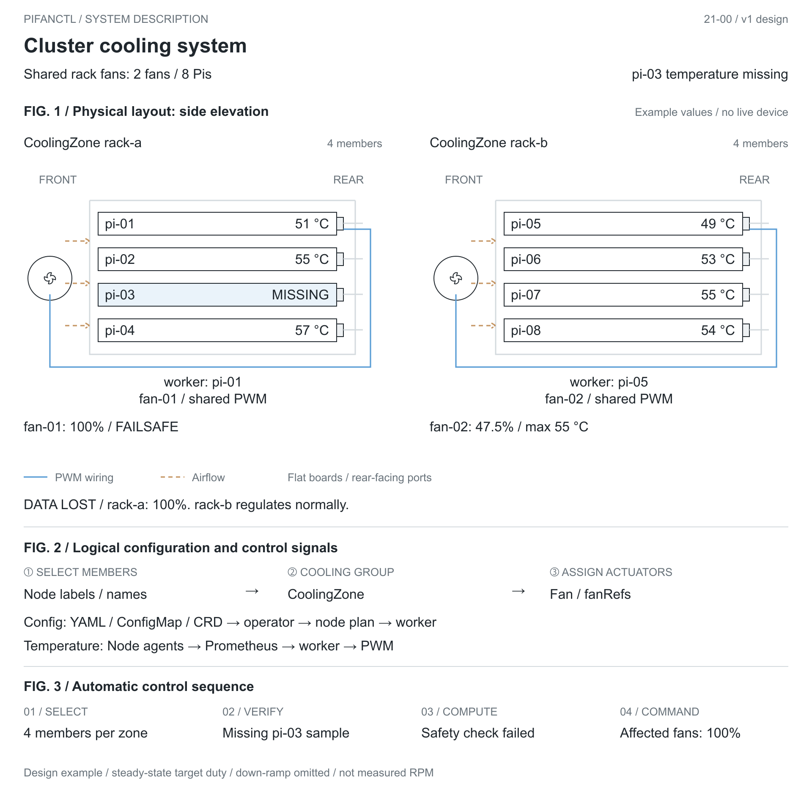
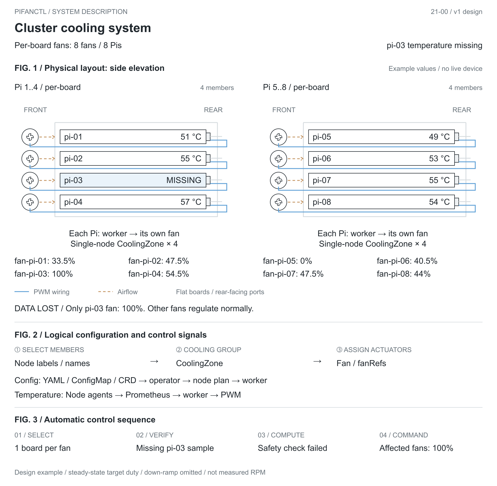
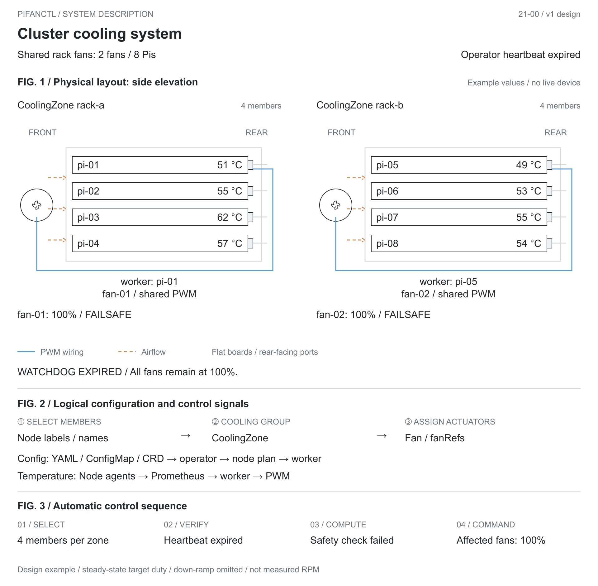
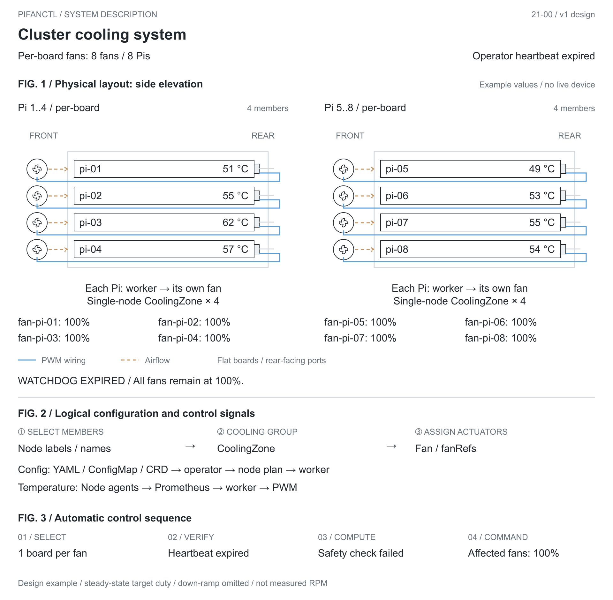

<div align="center">

# pifanctl: Raspberry Pi Cluster Fan Control, the Kubernetes Way



🥧 One controller node. One shared rack fan. The hottest node sets its speed.

[](https://typer.tiangolo.com/)
[](https://github.com/actions/actions-runner-controller)
[](https://typer.tiangolo.com/)
[](https://docker.io)
[](https://kubernetes.io)<br/>
[](https://github.com/jyje/pifanctl/actions/workflows/ci.yaml)
[](https://github.com/jyje/pifanctl/actions/workflows/build-image-main.yaml)
[](https://github.com/jyje/pifanctl/actions/workflows/build-image-develop.yaml)
[](https://github.com/jyje/pifanctl)

**English** | [한국어](README-ko.md)

</div>

🐳 **pifanctl** (Pi Fan Control) runs its controller on one Raspberry Pi node wired to the rack's shared PWM fan. An agent on every cluster node reports temperatures to Prometheus, and the controller drives the fan according to the **hottest node**. Deploy it with Helm on Kubernetes or run it as a CLI or Docker container. See the [jyje/cluster deployment](https://github.com/jyje/cluster/blob/main/clusters/r4spi/apps/pifanctl.yaml) for an example. pifanctl is optimized for ARM64, and its GitHub Actions CI/CD builds are tested on Raspberry Pi runners managed by Actions Runner Controller (ARC).

The sticker shows the same cluster setup: an abstract rack, one shared front fan, boards with rear-facing ports, and a whale mascot from the Kubernetes ecosystem. The Raspberry Pi logo is omitted. [See the illustration style and all three sticker concepts](docs/illustration-style.md).




| Component | Runs on | Role |
| --- | --- | --- |
| Agent | every cluster node | Publishes that node's temperature |
| Prometheus | the cluster | Retains node temperatures and provides the hottest-node value |
| Controller | one Raspberry Pi with GPIO wired to the shared fan | Sets the shared fan's PWM from the hottest node |

> **Status.** Cluster mode runs on a Raspberry Pi 4 cluster with the RPi.GPIO driver. The kernel PWM driver for Raspberry Pi 5 is covered by tests against a fake sysfs tree, but has not been run on a Pi 5 with a fan yet.

---
## 1. Run

### 1.1. Requirements

- Raspberry Pi (ARM64)
- Python 3.10+

You should access the Raspberry Pi (ARM64) to run the following commands.

### 1.2. OPTION 1: Install CLI like a package

```sh
curl -fsSL https://raw.githubusercontent.com/jyje/pifanctl/main/install.sh -o install-pifanctl.sh
chmod +x install-pifanctl.sh
./install-pifanctl.sh
rm install-pifanctl.sh

## Uninstall
# rm -rf $HOME/.pifanctl
```

After installation, run `pifanctl --help`:

```
 Usage: pifanctl [OPTIONS] COMMAND [ARGS]...

 🥧 pifanctl: A CLI for PWM Fan Controlling of Raspberry Pi

 Run `agent` on every node to publish temperatures, and `start` on the node
 that has the fan. With `--source prometheus` the fan follows the hottest
 node of the cluster.

╭─ Commands ───────────────────────────────────────────────────────────────────╮
│ status  Show current temperatures                                            │
│ agent   Publish this node's temperatures as Prometheus metrics               │
│ start   Start fan control                                                    │
╰──────────────────────────────────────────────────────────────────────────────╯
```

Driving the pin needs root, so start the controller with `sudo pifanctl start`. `pifanctl status` and `pifanctl agent` do not.

### 1.3. OPTION 2: Using Docker
```sh
docker run --rm -it ghcr.io/jyje/pifanctl:latest python main.py --help
```

To start the fan:

```sh
docker run --privileged --user 0 -it ghcr.io/jyje/pifanctl:latest python main.py start
```

```
INFO [2026-10-01 14:30:00Z] Detected 'Raspberry Pi 4 Model B Rev 1.5', using the RPi.GPIO driver
INFO [2026-10-01 14:30:00Z] Controller started with driver 'rpigpio', interval 5.0s
INFO [2026-10-01 14:30:00Z] Duty: 36.6%, Temperature: 51.9°C, Following: raspberrypi, Source: local, Nodes: raspberrypi=51.9*
```

Controlling the pin needs access to GPIO and `/dev/mem`, so `start` needs `docker run --privileged --user 0`. The `agent` and `status` commands run unprivileged, and the image runs as a non-root user by default.


### 1.4. OPTION 3: On Kubernetes with Helm (recommended)

```sh
# Label the one Raspberry Pi whose GPIO controls the shared rack fan.
kubectl label node <node-that-controls-the-rack-fan> pifanctl.jyje.online/fan=true

helm install pifanctl oci://ghcr.io/jyje/charts/pifanctl --version 0.1.3 \
  --namespace pifanctl --create-namespace \
  --set prometheus.url=http://prometheus-operated.monitoring.svc:9090 \
  --set monitoring.serviceMonitor.enabled=true \
  --set monitoring.prometheusRule.enabled=true \
  --set monitoring.grafanaDashboard.enabled=true
```

Prerequisites: a Prometheus reachable from the controller. The `monitoring.*` options need the Prometheus Operator CRDs (`ServiceMonitor`, `PrometheusRule`), and a `GrafanaDashboard` needs grafana-operator. Set `monitoring.*.labels` to whatever your Prometheus selects on (for example `release: prometheus`).

- `agent`: a DaemonSet on every node (tolerates every taint), non-root, read-only root filesystem, no privileges.
- `controller`: runs as root and privileged, because driving GPIO needs `/dev/mem`. For one shared rack fan, select one controller node whose GPIO is wired to that fan; it stops at full speed.
- `controllers`: a map of named groups. Each group is a DaemonSet limited by its own `nodeSelector` and merged over `controllerDefaults`, so nodes with different hardware live in one release:

  ```yaml
  controllers:
    pi4:
      nodeSelector: {pifanctl.jyje.online/fan: pi4}
      driver: rpigpio
    pi5:
      nodeSelector: {pifanctl.jyje.online/fan: pi5}
      driver: sysfs
      pwmChannel: 2
  ```

  A group's `nodeSelector` is used exactly as written, never merged with a default. With no groups declared, one `default` group runs on nodes labelled `pifanctl.jyje.online/fan=true`. A node must match at most one group, and a group without a `nodeSelector` is rejected at render time, because it would run everywhere and fight over the pin.
- `monitoring`: an optional `ServiceMonitor`, a `PrometheusRule` (hot node, critical node, agent down, failsafe, fallback, no controller) with a recording rule, and a Grafana dashboard, either as a sidecar `ConfigMap` or as a grafana-operator `GrafanaDashboard`.
- The image tag defaults to `v<appVersion>`, never `latest`. `values.schema.json` rejects unknown drivers and out-of-range duties, and `extraResources` renders any extra manifest with the release.

See [`charts/pifanctl/values.yaml`](charts/pifanctl/values.yaml) for every option and [`charts/pifanctl/ci`](charts/pifanctl/ci) for tested examples.

#### Metrics and alerts

| Metric | From | Meaning |
| --- | --- | --- |
| `pifanctl_temperature_celsius{node,zone,type}` | agent (`:9101`) | One series per thermal zone |
| `pifanctl_node_temperature_max_celsius{node}` | agent | Hottest zone of the node |
| `pifanctl_temperature_read_errors_total{node}` | agent | Reads that found no thermal zone |
| `pifanctl_fan_duty_percent{node}` | controller (`:9102`) | Duty currently applied |
| `pifanctl_control_temperature_celsius{node}` | controller | Temperature the fan acted on |
| `pifanctl_control_followed_node{node,followed}` | controller | The node being followed |
| `pifanctl_control_source{node,source}` | controller | `prometheus`, `local` or `failsafe` |
| `pifanctl_control_fallbacks_total{node,to}` | controller | Cycles that could not use the cluster view |

With `monitoring.prometheusRule.enabled` the chart alerts on: a node above 75 °C for 10 minutes, a node above 82 °C, an agent that is not scraped, a controller on failsafe, a controller that fell back to its own node, and no controller reporting at all.

#### Retention

Temperatures are only as useful as their history. The chart exports metrics but does not own Prometheus, so keep them with the Prometheus settings:

- Set `retention` for the period you want to look back over, and `retentionSize` slightly below the volume size so the TSDB can never fill its disk.
- `pifanctl:node_temperature_max_celsius:max` (recording rule) is one series for the whole cluster. If you downsample or federate to a long-term store, this is the series to send.
- A node count in the single digits costs a few hundred kilobytes per month: the retention budget is decided by the other workloads, not by pifanctl.

### 1.5. OPTION 4: On Kubernetes, raw manifest (one node, no Prometheus)

Run the following command to install the pifanctl on Kubernetes with Raspberry Pies and a PWM Fan.

```sh
kubectl create namespace pifanctl
kubectl apply -n pifanctl -f https://raw.githubusercontent.com/jyje/pifanctl/main/k8s/manifests/deployments.yaml
```

You can check the status of the pifanctl with the following command:

```sh
kubectl get pods -n pifanctl
```

You can check the logs of the pifanctl with the following command:

```sh
kubectl logs -n pifanctl -l app=pifanctl
```


### 1.6. OPTION 5: Run Source Code
```sh
git clone https://github.com/jyje/pifanctl ~/.pifanctl
cd ~/.pifanctl/sources
pip install --upgrade -r requirements.raspi.txt
python ~/.pifanctl/sources/main.py --help
```


### 1.7. Cluster mode: one shared rack fan, many nodes

One PWM fan mounted on the rack cools several Raspberry Pi boards together. The fan is controlled centrally, and its speed follows the hottest node in the rack. The boards do not each need their own fan.

| Role | Command | Runs on | What it does |
| --- | --- | --- | --- |
| Agent | `pifanctl agent` | **every node** (DaemonSet) | Reads `/sys/class/thermal` and serves `pifanctl_*` metrics, labelled with `node` |
| Prometheus | | the cluster | Scrapes and **retains** the temperatures |
| Controller | `pifanctl start --source prometheus` | **one designated fan-control node** | Asks Prometheus for `max by (node) (pifanctl_temperature_celsius)` and drives the shared rack fan from the hottest node |

The controller never trusts a single source. Each cycle it acts on the highest of the cluster value and its own node's value, and it degrades safely:

1. Prometheus answers: use `max(cluster, local)`.
2. Prometheus is down or empty: use the local temperature, count a fallback.
3. Nothing is readable: run the fan at `--failsafe-duty` (default 100%).

When the controller stops (SIGTERM, pod eviction) the fan is left at `--exit-duty` (default 100%), because a stopped controller no longer protects the board.

With `--source local` (the default), the controller uses only its own node's temperature. This suits a single-board setup; for a rack fan shared across nodes, use `--source prometheus` so the hottest board sets the fan speed.

```sh
# on every node
pifanctl agent

# on the designated fan-control node for the shared rack fan
pifanctl start --source prometheus --prometheus-url http://prometheus:9090
```

#### What the log tells you

Every cycle logs what the fan reacted to and what every node reads, hottest first. The node it followed is marked with `*`:

```
INFO [2026-10-01 14:30:05Z] Duty: 86.3%, Temperature: 70.5°C, Following: node-c, Source: prometheus, Nodes: node-c=70.5* node-b=52.1 node-d=51.8 node-a=49.2
```

A node that reported before and then disappears is warned about once (`Node 'node-c' stopped reporting and is not part of the maximum`), because a silent node may be a hot one. The same facts are metrics: `pifanctl_control_followed_node` (the node being followed) and `pifanctl_control_temperature_celsius`.

#### Temperature curve

`--algorithm curve` (the default) maps temperature to duty. It rises immediately and falls in steps (`--duty-down-step`), which is the hysteresis that keeps the fan from toggling around the threshold.

| Temperature | Duty |
| --- | --- |
| below `--temp-low` (50 °C) | `--duty-idle` (0%) |
| `--temp-low` | `--duty-start` (30%) |
| between | linear ramp |
| `--temp-high` (70 °C) and above | `--duty-max` (100%) |

`--algorithm step` keeps the original behaviour (`--target-temperature`, `--duty-cycle-step`).

#### Drivers

| `--driver` | Use |
| --- | --- |
| `auto` (default) | Kernel PWM on Raspberry Pi 5, RPi.GPIO elsewhere. **Never the mock**: without real hardware the process exits with an error instead of pretending to cool |
| `rpigpio` | Software PWM on `--pin` (Raspberry Pi 4 and older) |
| `sysfs` | Kernel hardware PWM in `/sys/class/pwm` (`--pwm-chip`, `--pwm-channel`); needs the PWM overlay, for example `dtoverlay=pwm-2chan` |
| `mock` | Development only |

Every option is also an environment variable, listed in `pifanctl start --help`.


---
## 2. Build

If you want to build it yourself, you can do the following:

> [!IMPORTANT]
> The package `RPi.GPIO` is available on the Raspberry Pi OS or Linux OS tuned by Raspberry Pi Foundation. So you should run following command on Raspberry Pi.

```sh
git clone https://github.com/jyje/pifanctl ~/.pifanctl
cd ~/.pifanctl/sources
pip install --upgrade -r requirements.raspi.txt
```

Run the tests (they need no Raspberry Pi; the chart tests also need `helm`):

```sh
pip install -r sources/requirements.dev.txt
python -m pytest --cov=sources --cov-report=term-missing
```

Then you can debug the source code with the following command:

```sh
python ~/.pifanctl/sources/main.py --help
python ~/.pifanctl/sources/main.py --version
python ~/.pifanctl/sources/main.py status
```


---
## 3. CI/CD Pipeline

This project uses [GitHub Actions with Actions Runner Controller (ARC)](https://github.com/actions/actions-runner-controller) for ARM64-based CI/CD pipeline. The builds are executed on self-hosted Raspberry Pi runners, ensuring native ARM64 compatibility.

You can check the environment of CI/CD pipeline in [app.jyje.online#stack](https://app.jyje.online/#stack)

### 3.1. Workflow Structure

| Workflow | Trigger | What it does |
| --- | --- | --- |
| `ci` | every pull request | Lints the workflows, runs tests on every stable Python minor release from 3.10 through 3.14, lints and schema-validates the chart (kubeconform, `promtool`), and builds the ARM64 image on the in-cluster runner without pushing |
| `build-image-main` | push to `main` | Publishes `ghcr.io/jyje/pifanctl:latest`, the commit SHA tag and `v<version>` (once per version) |
| `build-image-develop` | push to `develop` | Publishes `ghcr.io/jyje/pifanctl-dev:latest` and the SHA tag |
| `build-image-issue` | push to `issue-**` | Publishes `ghcr.io/jyje/pifanctl-issue:<sha>` for temporary testing |
| `release-chart` | push to `main` touching `charts/pifanctl` | Publishes the chart to `oci://ghcr.io/jyje/charts/pifanctl` when its version is new |

The three image workflows share one reusable workflow, `_build-image.yaml`.

### 3.2. Key Features

- Native ARM64 builds using self-hosted runners (**`r4spi-microk8s`**, an [ARC](https://github.com/actions/actions-runner-controller) runner scale set in the cluster). Pull requests from forks never run on it
- Skip CI option with **`--no-ci`** in a commit message, evaluated by the workflow engine and never interpolated into a shell script
- GitHub Container Registry (ghcr.io) integration, with immutable `v<version>` tags
- The built image is tested: it prints its version, runs unprivileged, and refuses to start the real GPIO driver where there is no GPIO

### 3.3. Releasing

The version lives in two places, and a pull request that changes what ships has to bump it:

| Changed | Bump | Checked by |
| --- | --- | --- |
| `sources/main.py` or `sources/pifanctl/` | `__version__` in `sources/pifanctl/__init__.py`, and `appVersion` in `charts/pifanctl/Chart.yaml` | the `Version bump` job |
| `charts/pifanctl/` (not its `ci/` value sets) | `version` in `charts/pifanctl/Chart.yaml`. A new application version changes `appVersion`, so it needs a new chart version too | the `Version bump` job |

Also update the image tag in `k8s/manifests/deployments.yaml` and the chart version in the install command above; a test fails when they drift.

Merging to `main` does the rest:

1. `build-image-main` publishes `latest`, the commit tag, and `v<version>` the first time a version appears.
2. After the image exists, it creates the git tag `v<version>` and a GitHub release with generated notes.
3. `release-chart` waits for the image the chart points at, publishes the chart to `oci://ghcr.io/jyje/charts/pifanctl`, and creates the tag `chart-v<version>` and its release.

Each step skips what already exists, so re-running a failed workflow is safe. Application releases are tagged `v*` and chart releases `chart-v*`.

---
## 4. Trouble Shooting

Is there any problem? see [trouble-shooting.md](docs/trouble-shooting.md)

### v1 design proposal

The proposed v1 API uses Node labels to select cooling members, `CoolingZone`
resources to group them, and `Fan` resources to assign physical PWM fans. It covers
shared rack fans and one fan per board, with YAML, ConfigMap, Helm and kubectl/CLI
workflows. [Read the operator design](docs/v1/README.md) and
[review the CRDs and examples](design/v1/README.md). These are design artifacts;
the v1 operator and CLI are not implemented yet.


#### Cooling systems manual: scenario figures

Example temperatures illustrate the proposed v1 behavior. Figures show steady-state target duty; the downward ramp is omitted. These are not hardware measurements.



<details>
<summary>NORMAL: one fan per board</summary>

Each fan follows its own board.



</details>

<details>
<summary>HIGH TEMPERATURE: pi-03 heats up</summary>

A hot member drives its assigned fan to full duty. Other cooling zones are unaffected.





</details>

<details>
<summary>DATA LOST: pi-03 stops reporting</summary>

An incomplete shared zone forces its fan to 100%. With per-board fans, only the missing board's fan enters failsafe.





</details>

<details>
<summary>WATCHDOG EXPIRED: operator heartbeat lost</summary>

Expired operator heartbeat forces every affected worker to hold its fans at 100%.





</details>

[SVG originals and rendering instructions](docs/v1/figures/README.md).


---
## 5. References

- [Official: Raspberry Pi Foundation](https://www.raspberrypi.org)
- [Blog: Using Raspberry Pi to Control a PWM Fan and Monitor its Speed](https://blog.driftking.tw/en/2019/11/Using-Raspberry-Pi-to-Control-a-PWM-Fan-and-Monitor-its-Speed/)
