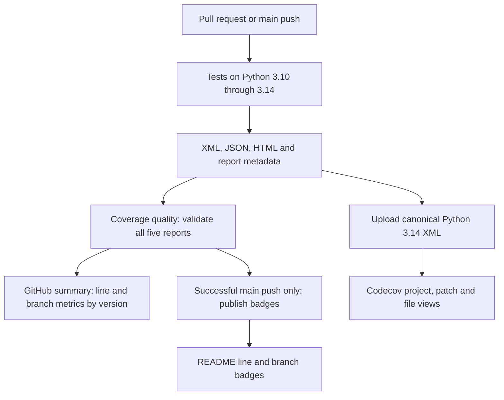

# Coverage reporting and regression policy

Status: v1 implementation guide for issue #42. CI measurement, reporting,
Codecov upload configuration, Changesets validation and main badge publishing
are implemented in this change. A local five-version baseline and the first
GitHub Actions PR matrix passed. The main baseline and trusted badge publish
still require a successful main workflow run. The first OIDC upload returned
`Repository not found`; the workflow now uses the configured repository upload
token. No branch floor has been invented. See the
[coverage runbook](testing/coverage.md).

## 1. Recommended architecture

Use coverage.py through pytest-cov for measurement, GitHub Actions for enforceable
quality checks, and Codecov for pull request review and coverage navigation.
Generate separate line and branch badges from the same coverage.py JSON report.

Codecov's hosted coverage service is free for open source projects and public
repositories. The Codecov product is Fair Source, not OSI open source. The
proposal does not depend on self-hosting Codecov. See
[Codecov for open source](https://about.codecov.io/for/open-source/) and
[Codecov's license explanation](https://about.codecov.io/blog/codecov-is-now-fair-source/).



Start with one canonical Codecov upload. Retain all five version reports as
GitHub artifacts. This keeps the initial setup small and avoids merged reports
hiding a version-specific gap. Add version flags later only if their separate
views provide useful information.

## 2. Current repository and migration constraints

The current workflow tests Python 3.10, 3.11, 3.12, 3.13 and 3.14. Its command is:

```sh
python -m pytest --cov=sources --cov-report=term-missing --cov-fail-under=90
```

- Coverage is currently measured without branch collection.
- The workflow runs for pull requests and manual dispatch, without a main push
  trigger. Add a main push measurement to keep main badges current.
- pytest-cov is pinned; coverage.py currently arrives transitively. Pin a tested
  coverage.py version that supports the complete Python matrix.
- Python 3.14 is the default in `docker/all.dockerfile`. Use it as the canonical
  reporting environment. Alternate supported runtimes retain their own tests.
- `tests/test_operator_chart.py` currently assumes the test command is the last
  workflow step and contains `--cov-fail-under=90`. Replace that structural
  assertion with checks for the matrix and the actual line coverage policy.
- Preserve the existing restriction on self-hosted ARM64 runners. The coverage
  jobs should use GitHub-hosted runners and mock hardware and external services.

The recorded line coverage results are approximately 95.7%. They are historical
line measurements, not a branch baseline and not interchangeable across local
and CI environments. Do not invent a branch percentage from them.

## 3. Metric definitions

| Metric | Calculation or interpretation | Intended use |
| --- | --- | --- |
| Line coverage | `covered_lines / num_statements` | Preserve the current line floor |
| Branch coverage | `covered_branches / num_branches` | Detect untested control-flow destinations |
| coverage.py total | Statements and branch destinations combined | Diagnostic output, clearly labeled |
| Codecov project score | Codecov's interpretation of uploaded coverage | Review and trends |
| Codecov patch score | Coverage of lines changed in a PR | Review newly changed code |

With branch collection enabled, coverage.py's total includes statements and
branch destinations. Therefore, adding `--cov-branch` while retaining
`--cov-fail-under=90` would change the meaning of the existing gate. Calculate
line and branch percentages independently from JSON. See
[coverage.py branch measurement](https://coverage.readthedocs.io/en/latest/branch.html).

Codecov's score uses its hit, partial and miss classifications. Label its badge
`Codecov`, and label the JSON-derived badges `lines` and `branches`.
See [Codecov coverage definitions](https://docs.codecov.com/docs/about-code-coverage).

Use integer counts or exact ratios for decisions. Round only the display.
A module with no branches has branch coverage `N/A`, not 100%. Missing reports,
invalid counts, absent branch metadata and an empty application source set are
errors, not successful zero-work measurements.

## 4. Measurement and report contract

Run the complete test suite once per version, producing all report formats from
that execution. An illustrative command is:

```sh
python -m pytest --cov=sources --cov-branch \
  --cov-report=term-missing \
  --cov-report=xml:coverage.xml \
  --cov-report=json:coverage.json \
  --cov-report=html:coverage-html
```

Validate the local policy after pytest. Report upload should run even when tests
fail, where reports exist, to aid diagnosis. A failed test job still fails CI and
cannot publish successful main badges.

Each artifact contains the reports and a small manifest with:

- Schema version, tested commit SHA and event type.
- Python version, coverage.py version, workflow run ID and attempt.
- Measurement timestamp and project-level raw line and branch counts.

The initial manifest does not record PR head/base SHAs, pytest versions, a
configuration digest or per-module counts. Those fields are not needed for the
same-run matrix gate and can be added if later baseline comparisons need them.

Record the actual checkout SHA. GitHub may test a synthetic PR merge commit;
that SHA must not be presented as a direct measurement of the PR head. Upload
metadata and baseline comparisons must use a documented, consistent convention.

Keep `sources/` as the initial source scope. Do not include tests in the
application percentage. Give coverage policy scripts their own tests and, if
measured, a separately named tooling report. Adding tooling must not inflate the
runtime badge. Use repository-relative paths and validate XML path mapping in
Codecov on the first PR.

Retain PR artifacts for 30 days and main reports for up to 90 days, subject to
repository limits. Store only public test data. Reports should not contain
private cluster configuration or credentials.

## 5. Quality gates and baseline policy

Use a stable required check name, `Coverage quality`, in addition to the existing
test checks. It validates that all five expected reports exist, refer to the
same tested commit, and have compatible measurement settings.

| Policy | Bootstrap | After the baseline is reviewed |
| --- | --- | --- |
| Line floor on every Python version | 90% required | Keep 90%; raise through reviewed changes |
| Branch floor on every Python version | Report only | Establish a measured floor for each version |
| Canonical line and branch regression | Report only | Compare against an equivalent base measurement |
| Codecov project status | Informational during initial observation | Enforced auto baseline with 0.1-point tolerance |
| Codecov patch status | Informational during initial observation | Enforced 95% target; missing reports fail |
| Selected safety decisions | Scenario checklist | Require all identified branch destinations and scenarios |

The 95% patch target is a Codecov patch policy, not a pure branch threshold.
Native statuses now enforce it after review of PRs #66, #70, #72, #73 and #74.
Summary comments are disabled; detailed partial-branch reports remain available.
See the current [runbook](testing/coverage.md) for normal/pass interpretation.

### Bootstrap and ratchet

1. Measure main and one representative runtime PR with identical pinned tools.
2. Review missing branches and intentional exclusions.
3. Set per-version floors from observed data. Do not assume branches already
   meet 90%. Record approved counts, tool versions and commit provenance.
4. Introduce a ratchet: threshold increases are routine; reductions require an
   explicit rationale and review. Read the established policy from the trusted
   base revision so a PR cannot silently lower its own gate.
5. Aim for at least 90% global branch coverage as a later milestone, subject to
   the first measurement. Prioritize selected safety decisions reaching full
   coverage before raising a project-wide percentage.

### PR comparisons

Use the PR's actual merge base, including stacked PRs. Never substitute the
latest main report for a different base revision. Compare only reports with
compatible Python, coverage tooling and source scope. If a matching base report
is unavailable, measure that revision in an isolated canonical environment.

During bootstrap, an unavailable comparison is explicitly informational and
the fixed floor still applies. Once regression checking is required, an
unavailable or incompatible baseline fails that check with a recovery action.
It must not silently pass.

A proposed tolerance is 0.1 percentage points for canonical line and branch
regression, to be confirmed after observing repeat runs. Log changes in missing
counts alongside ratios. A percentage improvement caused by removing code or
changing exclusions still requires review. Tool upgrades or canonical Python
changes require an explicit rebaseline.

Codecov can supply project and patch statuses, including informational mode.
See [Codecov status configuration](https://docs.codecov.com/docs/commit-status).
The independent local gate continues to operate during a Codecov outage.

## 6. Python matrix handling

- Canonical measurement: Python 3.14 on Ubuntu 24.04 with pinned tools.
- Compatibility: all five versions execute the complete suite and line gate.
- GitHub summary: a table of separate line and branch counts by version.
- Initial Codecov upload: canonical XML only, with an explicit `python314` flag.
- Optional later uploads: one report per distinct version flag; canonical
  statuses explicitly select `python314` and do not use carryforward data.

Codecov automatically merges uploaded reports. The merged score can reflect
coverage achieved in different environments; it is not the average of five
percentages. Do not use that aggregate as the canonical regression score.
See [Codecov report merging](https://docs.codecov.com/docs/merging-reports).

## 7. README badges and freshness

Show two small badges near the existing CI badges:

- `lines: measured percentage`
- `branches: measured percentage`

Both use the latest successful canonical main measurement. They link to the
coverage runbook, while `assets/coverage/metadata.json` records the measured
SHA, timestamp, workflow run and event. A separate Codecov badge is optional;
avoid three visually redundant percentage badges if the two precise metrics
already provide enough information. Keep badge labels consistent in README.md
and README-ko.md.

Publish generated SVG badges and metadata under `assets/coverage/` on `main`.
Generate them with a small deterministic script from JSON. The successful main
workflow commits updated assets only when their contents change. The workflow
ignores asset-only pushes to avoid redundant CI. Use repository-relative image
links in the README. The badges are small SVG assets, not the project's raster
logo illustrations.

Publisher rules:

- Run only after the main push tests and quality checks succeed.
- Require `contents: write` only in this job; tests keep read-only permissions.
- Verify the measured commit is still current main immediately before publish.
- Serialize publishing and reject older runs overwriting newer metadata.
- A stale or failed main run preserves the last successful measurement and its
  original SHA and timestamp. Label it as the last successful measurement.
- Manual workflow dispatch can produce reports but does not publish badges.
- A fork PR can generate preview badges as artifacts, but cannot publish them.

If explicitly live freshness is needed later, add a status indicator comparing
the stored SHA with current main. A static percentage image alone cannot prove
that it represents the newest commit. README links must make this limitation
visible without pretending a failed run has 0% coverage.

Codecov also provides native badges. Their exact URL should come from the
repository's configured badge settings after activation. See
[Codecov badges](https://docs.codecov.com/docs/status-badges).

## 8. Authentication and event boundaries

Use Codecov's GitHub integration for PR annotations and review views. Upload
the canonical report with the repository-scoped `CODECOV_TOKEN` Actions secret.
The uploader runs only on main pushes and trusted same-repository PRs, never on
fork PRs or Dependabot PRs. Keep `fail_ci_if_error: false`; local coverage gates
remain authoritative. See
[Codecov Action authentication](https://github.com/codecov/codecov-action).

Fork PRs still run local report generation and quality gates, but do not upload
to Codecov because GitHub withholds repository secrets. Dependabot PRs also skip
the upload because GitHub withholds Actions secrets from Dependabot by default.

Do not use `pull_request_target` to execute PR code. Do not introduce a privileged
`workflow_run` publisher that executes files from PR artifacts. Treat downloaded
reports as bounded, validated data. Pin new third-party Actions to reviewed full
commit SHAs and maintain those pins with normal dependency updates.

## 9. Test priorities for pifanctl

Coverage targets should follow control responsibilities, with overlapping
diagnostic groups where necessary:

| Area | Tests to prioritize | Expected behavior |
| --- | --- | --- |
| Thermal input | Missing, stale, future, malformed and non-finite readings | Apply the configured failsafe behavior |
| Worker control | Invalid plans, slow queries, watchdog expiry and recovery | Preserve the safety latch until valid recovery |
| PWM ownership | Lock conflicts, write failure, close failure and repeated cleanup | Prevent concurrent ownership; retain actionable errors |
| Operator reports | Real report-reader code with mocked HTTP responses and timeouts | Reject invalid reports without blocking unrelated reconciliation |
| Operator lifecycle | Lease conflict, leader loss, finalizer release and restart | Avoid competing control and unsafe premature deletion |
| Kubernetes transport | API errors, watch expiry and reconnect | Retry or resynchronize with the intended ownership checks |
| CLI and configuration | Invalid inputs, schema boundaries and command dispatch | Fail clearly before applying invalid control configuration |

Mock HTTP, Kubernetes and GPIO boundaries. Exercise the function being measured
instead of replacing it with a stub. For safety functions, enumerate combinations
of validity, freshness, ownership, watchdog state and write success in a scenario
table. Assert output duty, status, cleanup and recovery behavior.

Branch coverage tracks control-flow destinations. It does not establish full
Boolean condition coverage, MC/DC, all concurrency schedules or physical fan
rotation. Keep hardware acceptance evidence separate from the Python badge.
Allow `no cover` or `no branch` only for a specific justified case with review;
do not blanket-exclude error handlers to achieve a target.

## 10. Implementation sequence and checklist

Each stage should be a separate English commit with its validation evidence.
Implement the reporting stages before adding stricter regression requirements.

### Stage A: Measurement and compatibility

- [x] Add `.coveragerc` with branch collection and consistent paths.
- [x] Pin a compatible coverage.py version.
- [x] Produce XML, JSON and HTML on all five Python versions.
- [x] Add metrics parsing, manifests and a separate 90% line gate.
- [x] Update the existing CI policy regression test.
- [x] Validate missing, malformed, empty and zero-branch reports using fixtures.
- [x] Record a preliminary local branch baseline and per-version differences.

### Stage B: Codecov review

- [x] Activate the repository's Codecov integration; the bot confirmed setup on PR #43.
- [x] Add `codecov.yml` with canonical project and patch statuses.
- [x] Upload canonical XML using explicit files and disabled report discovery.
- [ ] Verify path mapping, commit mapping and one normal PR annotation after enabling the project.
- [ ] Verify fork and Dependabot behavior and a simulated upload failure.
- [x] Keep service statuses informational during initial observation.

### Stage C: Main badges

- [x] Add main push measurement without broadening self-hosted runner access.
- [x] Add deterministic badge rendering and metadata publication.
- [ ] Test stale-run rejection and preservation after a failed main run.
- [x] Add English badge labels to both README variants.
- [x] Document how to find the measured commit and full report.

### Stage D: Regression enforcement

- [ ] Review measured floors and record them in a coverage policy file.
- [ ] Implement compatible merge-base comparison and bootstrap behavior.
- [ ] Exercise stacked PRs, missing baselines and tool-version mismatches.
- [ ] Protect the stable local `Coverage quality` check.
- [ ] Evaluate the proposed 95% patch target and 0.1-point regression tolerance.
- [ ] Publish a tested rollback path to informational branch reporting.

### Stage E: Safety coverage improvements

- [ ] Add scenario tables for selected worker and operator safety decisions.
- [ ] Cover report-reader HTTP paths and failure handling.
- [ ] Cover ownership, release, watchdog and PWM failure paths.
- [ ] Review exclusions individually and raise approved thresholds.
- [ ] Track remaining gaps without claiming coverage proves hardware safety.

Expected files include `.coveragerc`, `codecov.yml`, the CI workflow, a coverage
policy file, small metrics/gate/badge scripts, their fixture tests, README badge
updates and `docs/testing/coverage.md`. Keep scripts in the standard library
where practical. A reusable coverage workflow is optional if another workflow
needs the same matrix; it is unnecessary for the initial implementation.

## 11. Acceptance and recovery

| Condition | Required outcome |
| --- | --- |
| Any supported Python version fails tests or the line floor | CI fails |
| One of five reports is missing or has a different SHA | Quality check fails |
| Branch reporting is disabled accidentally | Report validation fails |
| New branch misses exceed the approved policy | Required regression check fails |
| Docs-only patch has no executable changes | Patch status is explicitly not applicable |
| Codecov upload is unavailable | Upload failure is visible; local gates remain authoritative |
| Main tests fail | No new successful percentage badges are published |
| Older main run finishes late | It cannot overwrite a newer published measurement |
| Fork PR executes tests | Reports work without main publishing permissions |
| Canonical runtime or coverage tool changes | Review and rebaseline before enforcing comparisons |

Roll back enforcement by a reviewed change that restores informational branch
checks while retaining measurement, report artifacts and the existing 90% line
floor. Disable a broken uploader independently. Preserve the last successful
badge metadata and explain its age. No stage requires a change to the deployed
fan controller.
