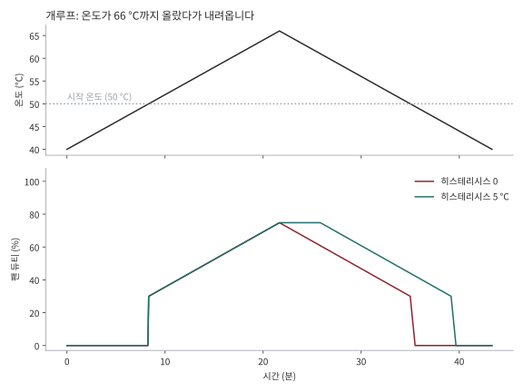

# 온도 히스테리시스

[English](hysteresis.md)

팬 곡선은 온도를 듀티로 바꿔 줍니다. 히스테리시스가 없으면 같은 온도에는 언제나 같은 듀티가 나오는데, 팬이 켜졌다 꺼지기를 반복하는 원인이 바로 이것입니다. 팬이 따라가는 노드를 시작 온도 아래로 식혀 버리고, 멈추고, 노드가 다시 달아오르면 또 켜지는 일이 생깁니다. 이 문서는 히스테리시스가 무엇을 하는지, 그래프로 어떻게 보이는지, 값을 어떻게 고르면 되는지를 설명합니다.

## 한눈에 보기

- 팬은 지금까지처럼 `temp-low`에서 **시작**합니다.
- 팬은 지금까지 본 가장 높은 온도보다 `temp-hysteresis`(기본 **5 °C**)만큼 내려가야 **멈춥니다**.
- 온도가 오를 때는 지연이 없습니다. 내려갈 때는 같은 곡선을 히스테리시스만큼 아래로 옮겨서 따라갑니다.
- `0`이면 꺼집니다. 값은 곡선의 폭(`temp-high - temp-low`)보다 작아야 합니다.

공식 Raspberry Pi 5 팬이 모든 기준 온도에 5 °C 히스테리시스를 두는 것과 같은 방식입니다.

## 쉽게 설명하면

방의 온도 조절기를 떠올려 보세요. 20 °C에서 난방을 켜고 20 °C에서 끈다면 난방기가 20 °C 근처에서 몇 초마다 딸깍거릴 것입니다. 그래서 실제 조절기는 20 °C에서 켜고 22 °C가 되어야 끕니다. 이 두 기준의 차이가 히스테리시스입니다.

팬은 방향만 반대인 같은 상황입니다. 노드가 뜨거워지면 켜지고, 팬이 부는 바람이 노드를 식힙니다. 노드가 시작 온도 아래로 살짝 내려가자마자 팬이 멈춘다면 노드는 다시 달아오르고 팬은 또 켜져야 합니다. 최고 온도보다 5 °C 내려갈 때까지 기다리면, 팬이 성공의 기미가 보이자마자 그만두지 않고 일을 끝까지 하게 됩니다.

## 동작 방식

컨트롤러는 **유지 온도**라는 숫자 하나를 기억합니다.

| 측정 온도 `T`가... | 유지 온도는... |
| --- | --- |
| 유지 온도 이상이면 | `T`가 됩니다 (바로 올라갑니다) |
| 유지 온도보다 히스테리시스 이내로 낮으면 | 그대로입니다 (팬이 듀티를 유지합니다) |
| 유지 온도보다 히스테리시스 넘게 낮으면 | `T + 히스테리시스`가 됩니다 (5 °C 뒤에서 따라 내려옵니다) |

듀티는 유지 온도를 일반 곡선에 넣은 값입니다. 기본 곡선(50 °C 미만 정지, 50 °C에서 30%, 75 °C에서 100%, 그 사이는 직선)과 5 °C 히스테리시스를 쓰면 다음과 같습니다.

| 상황 | 유지 온도 | 듀티 |
| --- | --- | --- |
| 60 °C 정점까지 상승 | 60 °C | 58% |
| 56 °C로 하강 (정점보다 5 °C 이내) | 60 °C | 58%, 변하지 않음 |
| 54 °C로 하강 | 59 °C | 55% |
| 45 °C로 하강 | 50 °C | 30% |
| 44.9 °C로 하강 | 49.9 °C | 0%, 팬 정지 |

듀티 하강 제한(`--duty-down-step`, `curve.dutyDownStep`)은 별개의 설정입니다. 듀티가 내려갈 수 있게 된 뒤에 한 번에 몇 %p까지 내려갈지를 제한해서, 듀티가 뚝 떨어지지 않고 미끄러지게 합니다. 히스테리시스는 듀티가 **언제** 내려갈 수 있는지를, 하강 제한은 **얼마나 빨리** 내려가는지를 정합니다.

## 그래프로 보면

첫 번째 그림은 개루프입니다. 온도를 직접 66 °C까지 올렸다가 내리면서, 히스테리시스가 있을 때와 없을 때의 듀티를 겹쳐 그렸습니다. 오를 때는 두 선이 같습니다. 내려갈 때는 히스테리시스가 있으면 온도가 5 °C 내려갈 때까지 정점의 듀티를 유지하고, 팬도 5 °C 늦게(50 °C가 아니라 45 °C에서) 멈춥니다.



두 번째 그림은 폐루프입니다. 팬이 없으면 55 °C에 머물 노드를 팬이 식히는 상황입니다.

- **히스테리시스가 없으면** (왼쪽) 팬이 켜져서 노드를 50 °C 바로 아래까지 식히고, 멈추고, 노드가 다시 달아오릅니다. 부하가 이어지는 동안 듀티가 약 5%와 30% 사이를 계속 오갑니다.
- **5 °C 히스테리시스가 있으면** (오른쪽) 팬이 약 31%의 한 듀티에서 안정되고 노드는 약 45 °C에 머뭅니다. 더 이상 켜지고 꺼지지 않습니다.


> [!NOTE]
> 그림은 실제 컨트롤러 코드(`scripts/plot_hysteresis.py`)로 그렸고, 그림이 말하는 내용은 테스트가 확인합니다. 폐루프의 노드는 측정값이 아니라 모델입니다. 부하가 가벼운 Raspberry Pi 4 클러스터에 맞춘 값(듀티 1%당 약 0.32 °C 냉각, 1차 지연)이고, 컨트롤러가 5초마다 한 번 갱신한다고 가정했습니다. 보드마다 숫자는 다르지만 모양은 같습니다.

## 대가: 더 안정적이고, 조금 더 시원하고, 조금 더 바쁜 팬

히스테리시스에는 대가가 있습니다. 폐루프 예시에서 평균 듀티는 히스테리시스가 없을 때 약 18%(팬이 계속 멈추기 때문)이고, 있을 때 약 31%(팬이 계속 돌기 때문)입니다. 실제 r4spi 클러스터에서도 평균 듀티가 약 29%에서 약 37%로 올랐고, 따라가는 온도는 몇 도 낮은 곳에서 안정되었습니다. 그 대신 팬이 켜지고 꺼지지 않으므로, 듀티가 요동치는 것보다 팬에 부담이 적고 소리도 덜 거슬립니다.

안정적인 팬보다 가장 낮은 평균 듀티가 더 중요하다면 `--temp-hysteresis 0`으로 끄거나 값을 줄이세요. 이 경우 `temp-low` 바로 위에 머무는 노드는 다시 순환합니다.

## 값 고르기

| 값 | 효과 |
| --- | --- |
| `0` | 히스테리시스 없음. `temp-low` 근처에서 팬이 오락가락할 수 있습니다. |
| `2` ~ `3` | 짧게 유지합니다. 팬이 조용하고 온도를 촘촘하게 관리하고 싶을 때 적당합니다. |
| `5` (기본) | 공식 Raspberry Pi 5의 값입니다. 시작하기에 좋습니다. |
| `8` 이상 | 길게 유지합니다. 부하가 지나간 뒤에도 팬이 더 오래 돕니다. `temp-high - temp-low`보다 한참 작게 두세요. |

5 °C로도 노드가 계속 순환한다면 보통은 부하 때문에 `temp-low` 바로 위에 머무는 경우입니다. 히스테리시스를 키워도 순환 주기만 길어질 뿐입니다. 이럴 때는 `temp-low`를 몇 도 낮춰서, 팬이 낮은 듀티로 계속 돌게 하세요.

## 설정 위치

| 위치 | 설정 | 기본값 |
| --- | --- | --- |
| `pifanctl start` | `--temp-hysteresis` 또는 `TEMP_HYSTERESIS` | `5` |
| `pifanctl` Helm 차트 | `curve.hysteresis` (컨트롤러 그룹별: `controllers.<이름>.curve.hysteresis`) | `5` |
| v1 `Fan` 커스텀 리소스 | `spec.control.curve.temperatureHysteresis` | `5` |

값의 단위는 섭씨이며, 음수일 수 없고 `temp-high - temp-low`보다 작아야 합니다. 컨트롤러는 갱신할 때마다 따라가는 온도를 로그로 남기므로 유지 동작을 로그에서 볼 수 있습니다. 로그의 온도가 `temp-low`보다 낮은데도 듀티가 그대로입니다.

## 한계

- 팬이 돌고 있는데도 `temp-low` 바로 위에 머무는 노드의 순환은 없애지 못합니다. 순환 주기를 길게 만들 뿐입니다.
- 컨트롤러가 따라가는 온도(클러스터 모드에서는 가장 뜨거운 노드)에 적용되며, 노드마다 따로 적용되지는 않습니다.
- 유지 온도는 컨트롤러 프로세스 안에 있습니다. 재시작하면 첫 측정값에서 다시 시작합니다.

## 그림 다시 만들기

그림은 diff가 잘 보이고 GitHub에서 바로 렌더링되도록 SVG로 되어 있습니다. 손으로 그린 것이 아니라 생성한 것입니다.

```sh
uv run --with matplotlib python scripts/plot_hysteresis.py
```

영어판과 한국어판이 `docs/images/`에 만들어집니다. matplotlib은 그릴 때만 필요하고, 데이터 함수는 matplotlib 없이도 `tests/test_plot_hysteresis.py`로 검증됩니다.
