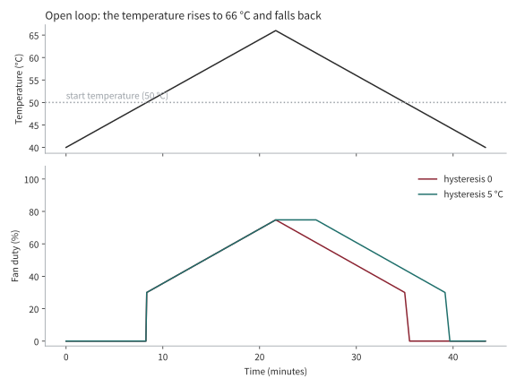

# Temperature hysteresis

[Korean](hysteresis-ko.md)

A fan curve turns a temperature into a duty. Without hysteresis, the same temperature always gives the same duty, and that is exactly what makes a fan hunt: it can cool the node it follows below the point where it starts, stop, and let the node heat up again. This page explains what the hysteresis does, shows it on a graph, and tells you how to choose its value.

## In short

- The fan **starts** at `temp-low`, as before.
- The fan only **stops** once the temperature is `temp-hysteresis` (default **5 °C**) below the highest temperature it has seen.
- Rising temperatures are never delayed. Falling temperatures follow the same curve, shifted down by the hysteresis.
- `0` turns it off. The value must be smaller than the width of the curve (`temp-high - temp-low`).

It is the same idea as the 5 °C hysteresis on every threshold of the official Raspberry Pi 5 fan.

## The idea, explained simply

Think of a room thermostat. If it switched the heating on at 20 °C and off at 20 °C, the heater would click on and off every few seconds around 20 °C. So a real thermostat switches on at 20 °C and only switches off at 22 °C. The two different thresholds are the hysteresis.

A fan is the same thing in the other direction. It switches on when the node gets hot, and the cooler air it blows makes the node cooler. If the fan stopped the moment the node dipped under the start temperature, the node would warm up again and the fan would have to restart. By waiting until the node is 5 °C below its peak, the fan is allowed to finish its job instead of quitting at the first sign of success.

## How it works

The controller remembers one number, the **held temperature**:

| The measured temperature `T` is... | The held temperature becomes... |
| --- | --- |
| at or above the held temperature | `T` (it rises immediately) |
| below the held temperature by less than the hysteresis | unchanged (the fan keeps its duty) |
| below the held temperature by more than the hysteresis | `T + hysteresis` (it follows down, 5 °C behind) |

The duty is then the normal curve evaluated at the held temperature. With the default curve (off below 50 °C, 30% at 50 °C, 100% at 75 °C, a straight line in between) and a 5 °C hysteresis:

| Situation | Held temperature | Duty |
| --- | --- | --- |
| Rising to a peak of 60 °C | 60 °C | 58% |
| Cooling to 56 °C (less than 5 °C below the peak) | 60 °C | 58%, unchanged |
| Cooling to 54 °C | 59 °C | 55% |
| Cooling to 45 °C | 50 °C | 30% |
| Cooling to 44.9 °C | 49.9 °C | 0%, the fan stops |

The duty-down limit (`--duty-down-step`, `curve.dutyDownStep`) is a different setting. It limits how many percentage points the duty may fall per update once it is allowed to fall, so the duty glides instead of dropping. The hysteresis decides **when** the duty may fall; the down step decides **how fast**.

## What it looks like

The first figure is an open loop: the temperature is moved up to 66 °C and back down by hand, and the two curves show the duty with and without hysteresis. Going up they are identical. Going down, the hysteresis keeps the duty at its peak until the temperature is 5 °C lower, and the fan stops 5 °C later (at 45 °C instead of 50 °C).



The second figure is a closed loop: a node that would sit at 55 °C with the fan off, cooled by the fan.

- **Without hysteresis** (left) the fan starts, cools the node just under 50 °C, stops, and the node warms up again. The duty swings between about 5% and 30% for as long as the load lasts.
- **With a 5 °C hysteresis** (right) the fan settles on one duty of about 31% and the node holds at about 45 °C. Nothing switches any more.


> [!NOTE]
> The figures are drawn by the real controller code (`scripts/plot_hysteresis.py`), and the tests check what they claim. The node in the closed loop is a model, not a measurement. It was fitted to a light-load Raspberry Pi 4 cluster (each duty percent cools the node by about 0.32 °C, with a first-order lag), and one controller update is assumed every 5 seconds. Your boards will differ in the numbers but not in the shape.

## The price: a steadier, slightly cooler, slightly busier fan

Hysteresis is not free. In the closed-loop example the average duty is about 18% without it, because the fan keeps stopping, and about 31% with it, because the fan keeps running. On the real r4spi cluster the average duty went from about 29% to about 37%, and the followed temperature settled a few degrees lower. In exchange the fan no longer starts and stops, which is easier on the fan and quieter than a duty that swings.

If you prefer the lowest average duty over a steady fan, set `--temp-hysteresis 0` or lower the value. A node that stays just above `temp-low` will then cycle again.

## Choosing a value

| Value | Effect |
| --- | --- |
| `0` | No hysteresis. The fan can hunt around `temp-low`. |
| `2` to `3` | A short hold. Fine if your fan is quiet and you want a tight temperature. |
| `5` (default) | The official Raspberry Pi 5 value. A good start. |
| `8` or more | A long hold. The fan runs longer after a load peak. Keep it well below `temp-high - temp-low`. |

If the node is still cycling with 5 °C, the cause is usually that the load keeps it just above `temp-low`. Raising the hysteresis only makes each cycle longer. Lower `temp-low` by a few degrees instead, so the fan runs continuously at a low duty.

## Where to set it

| Where | Setting | Default |
| --- | --- | --- |
| `pifanctl start` | `--temp-hysteresis`, or `TEMP_HYSTERESIS` | `5` |
| `pifanctl` Helm chart | `curve.hysteresis` (per controller group: `controllers.<name>.curve.hysteresis`) | `5` |
| v1 `Fan` custom resource | `spec.control.curve.temperatureHysteresis` | `5` |

The value is in degrees Celsius, must not be negative and must be below `temp-high - temp-low`. The controller logs the temperature it follows on every update, so you can see the hold in the logs: the duty stays put while the logged temperature is below `temp-low`.

## Limits

- It does not remove cycling for a node that hovers just above `temp-low` even with the fan running. It only makes each cycle longer.
- It acts on the temperature the controller follows (the hottest node in cluster mode), not on each node separately.
- The held temperature lives in the controller process. After a restart it starts again from the first measurement.

## Regenerating the figures

The figures are plain SVG so they diff well and render on GitHub. They are generated, not drawn by hand:

```sh
uv run --with matplotlib python scripts/plot_hysteresis.py
```

This writes the English and Korean versions into `docs/images/`. matplotlib is only needed for drawing; the data functions are covered by `tests/test_plot_hysteresis.py` without it.
