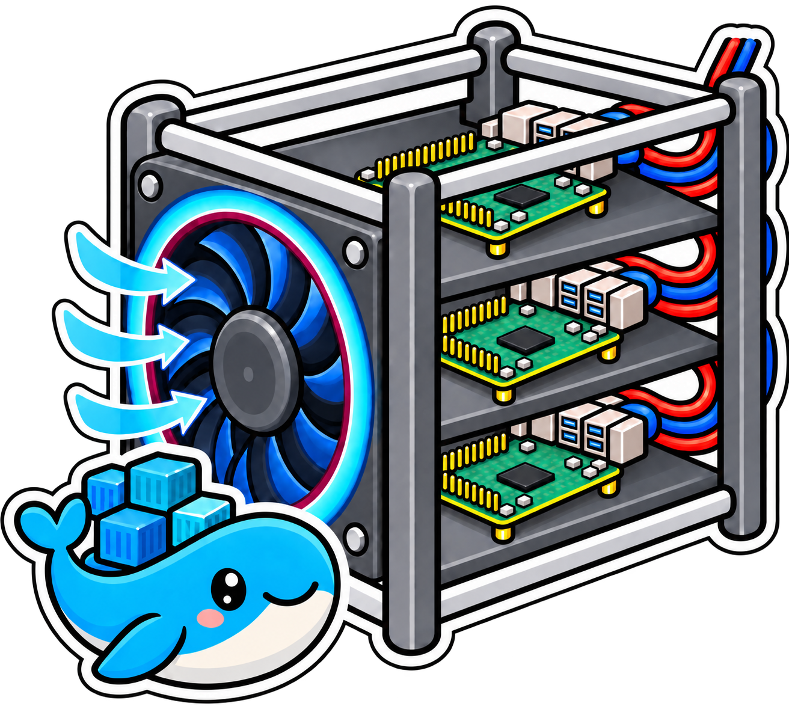
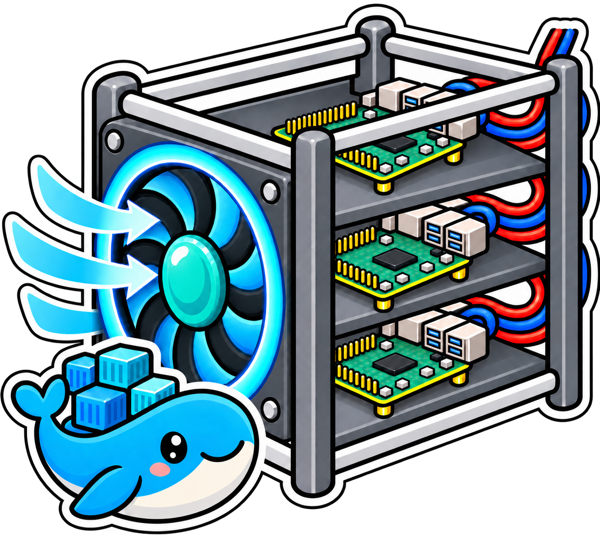
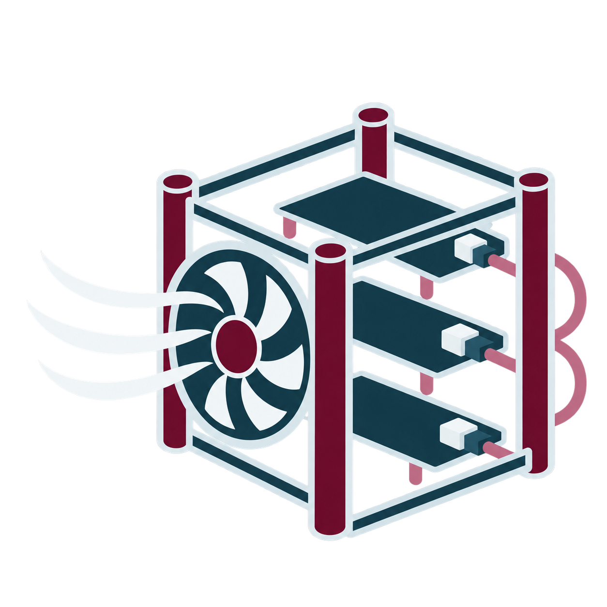

# pifanctl Illustration Style

[Korean](illustration-style-ko.md)

pifanctl's primary illustration is a friendly cartoon of the hardware use case: several Raspberry Pi boards in a generic open rack and cooled together by one centrally managed PWM fan. A blue whale mascot references the Kubernetes ecosystem. The artwork should make the shared rack fan easy to recognize and must not suggest a separate fan on every board. Keep the rack abstract rather than matching a particular enclosure product or brand. Identify the boards through generic PCB, GPIO header, chip, and port shapes. Do not include the Raspberry Pi berry logo or registered mark.

For clear cable access, mount the shared fan on the front face. Keep each board flat on its horizontal shelf and rotate the complete board 90 degrees within the shelf plane, so its long axis recedes into the rack and its ports face the rear, away from the fan. Cables should exit at the rear without crossing the fan or its airflow path.

Single-board fan control is also supported. The rack illustration represents the primary cluster use case, where the controller reads every node's temperature and sets the shared fan from the hottest node.

### Sticker concepts

1. Front three-quarter view, shared front fan, flat boards turned toward the rack depth, rear-facing ports, and a whale mascot with three container blocks.

   

2. Same fixed view and hardware layout, with a burgundy-accented fan ring and smaller airflow marks.

   

3. Same fixed view and hardware layout, with broad fan blades, a teal hub, and smooth airflow ribbons.

   

### Minimalist alternative

A non-character option can reduce the same hardware idea to a few geometric shapes: a simple rack outline, several board bars, one shared fan symbol, and a clean airflow path. Use the burgundy, deep teal, pale gray, and muted pink palette from the Profile-2 site. Avoid product-specific rack details and avoid showing per-board fans.

The three sticker variants keep the same camera view, rack layout, and board orientation. Each board lies flat and turns 90 degrees within its shelf plane, with its ports and cables at the rear, away from the shared front fan. The Raspberry Pi logo and registered mark are omitted.
