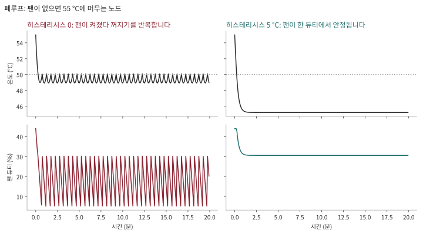

# v0 사용법 보관

과거 사용법입니다. 아래 명령은 v1 애플리케이션에서 지원하지 않습니다. 기존 운영은 [v0.2.1 소스](https://github.com/jyje/pifanctl/tree/v0.2.1)를 사용하세요. 아래 main 브랜치 설치 스크립트와 버전을 고정하지 않은 이미지 태그를 v1에 사용하지 마세요. 마이그레이션 전에 배포를 보관하고 [v1 런타임 매뉴얼](../v1/runtime-ko.md)을 확인하세요.

## 1. 실행

### 1.1. 요구 사항

- Raspberry Pi (ARM64)
- Python 3.10+

아래 명령은 Raspberry Pi (ARM64)에 접속해서 실행하세요.

### 1.2. 옵션 1: 패키지처럼 CLI 설치

```sh
curl -fsSL https://raw.githubusercontent.com/jyje/pifanctl/main/install.sh -o install-pifanctl.sh
chmod +x install-pifanctl.sh
./install-pifanctl.sh
rm install-pifanctl.sh

## 삭제
# rm -rf $HOME/.pifanctl
```

설치 후 `pifanctl --help`로 사용법을 확인하세요.

```
 Usage: pifanctl [OPTIONS] COMMAND [ARGS]...

 🥧 pifanctl: A CLI for PWM Fan Controlling of Raspberry Pi

╭─ Commands ───────────────────────────────────────────────────────────────────╮
│ status  Show current temperatures                                            │
│ agent   Publish this node's temperatures as Prometheus metrics               │
│ start   Start fan control                                                    │
╰──────────────────────────────────────────────────────────────────────────────╯
```

핀을 구동하려면 root가 필요하므로 컨트롤러는 `sudo pifanctl start`로 시작하세요. `pifanctl status`와 `pifanctl agent`는 필요 없습니다.

### 1.3. 옵션 2: Docker

```sh
docker run --rm -it ghcr.io/jyje/pifanctl:latest python main.py --help
```

팬을 구동하려면:

```sh
docker run --privileged --user 0 -it ghcr.io/jyje/pifanctl:latest python main.py start
```

```
INFO [2026-10-01 14:30:00Z] Detected 'Raspberry Pi 4 Model B Rev 1.5', using the RPi.GPIO driver
INFO [2026-10-01 14:30:00Z] Controller started with driver 'rpigpio', interval 5.0s
INFO [2026-10-01 14:30:00Z] Duty: 36.6%, Temperature: 51.9°C, Following: raspberrypi, Source: local, Nodes: raspberrypi=51.9*
```

핀 제어에는 GPIO와 `/dev/mem` 접근이 필요해서 `start`에는 `docker run --privileged --user 0`이 필요합니다. `agent`와 `status`는 권한 없이 실행되고, 이미지는 기본적으로 non-root 사용자로 실행됩니다.

### 1.4. 옵션 3: Helm으로 Kubernetes에 설치 (권장)

```sh
# 공용 랙 팬을 제어하는 GPIO가 연결된 Raspberry Pi 노드 한 곳에 라벨을 붙입니다.
kubectl label node <공용-랙-팬-제어-노드> pifanctl.jyje.online/fan=true

helm install pifanctl oci://ghcr.io/jyje/charts/pifanctl --version 0.2.0-alpha.2 \
  --namespace pifanctl --create-namespace \
  --set prometheus.url=http://prometheus-operated.monitoring.svc:9090 \
  --set monitoring.serviceMonitor.enabled=true \
  --set monitoring.prometheusRule.enabled=true \
  --set monitoring.grafanaDashboard.enabled=true
```

사전 조건: 컨트롤러에서 접근 가능한 Prometheus. `monitoring.*` 옵션에는 Prometheus Operator CRD(`ServiceMonitor`, `PrometheusRule`)가, `GrafanaDashboard`에는 grafana-operator가 필요합니다. `monitoring.*.labels`는 Prometheus가 선택하는 라벨(예: `release: prometheus`)로 지정하세요.

- `agent`: 모든 노드에서 도는 DaemonSet (모든 taint 허용), non-root, 읽기 전용 루트 파일시스템, 권한 없음.
- `controller`: GPIO 구동에 `/dev/mem`이 필요해서 root와 privileged로 실행됩니다. 공용 랙 팬 하나를 제어할 때는 해당 팬에 GPIO가 연결된 노드 한 곳을 선택합니다. 컨트롤러가 멈출 때는 최대 속도로 남습니다.
- `controllers`: 이름 있는 그룹의 맵입니다. 각 그룹은 자신의 `nodeSelector`로 한정된 DaemonSet이고 `controllerDefaults` 위에 덮어써지므로, 하드웨어가 다른 노드를 한 릴리스에 함께 선언할 수 있습니다.

  ```yaml
  controllers:
    pi4:
      nodeSelector: {pifanctl.jyje.online/fan: pi4}
      driver: rpigpio
    pi5:
      nodeSelector: {pifanctl.jyje.online/fan: pi5}
      driver: sysfs
      pwmChannel: 2
  ```

  그룹의 `nodeSelector`는 기본값과 병합되지 않고 적은 그대로 쓰입니다. 그룹을 선언하지 않으면 `pifanctl.jyje.online/fan=true` 라벨이 붙은 노드에서 `default` 그룹 하나가 실행됩니다. 노드는 최대 한 그룹에만 일치해야 하며, `nodeSelector`가 없는 그룹은 모든 노드에서 실행되어 핀을 두고 다툴 수 있으므로 렌더링 단계에서 거부됩니다.
- `monitoring`: 선택 사항인 `ServiceMonitor`, `PrometheusRule`(뜨거운 노드, 위험 온도, agent 중단, failsafe, 폴백, 컨트롤러 없음)과 recording rule, 그리고 Grafana 대시보드(사이드카용 `ConfigMap` 또는 grafana-operator `GrafanaDashboard`).
- 이미지 태그는 기본값이 `v<appVersion>`이며 `latest`는 쓰지 않습니다. `values.schema.json`이 알 수 없는 드라이버나 범위를 벗어난 duty를 거부하고, `extraResources`로 추가 매니페스트를 릴리스와 함께 렌더링할 수 있습니다.

모든 옵션은 [`charts/pifanctl/values.yaml`](../../charts/pifanctl/values.yaml), 검증된 예시는 [`charts/pifanctl/ci`](../../charts/pifanctl/ci)를 보세요.

#### 메트릭과 알림

| 메트릭 | 출처 | 의미 |
| --- | --- | --- |
| `pifanctl_temperature_celsius{node,zone,type}` | agent (`:9101`) | 열 영역마다 시계열 하나 |
| `pifanctl_node_temperature_max_celsius{node}` | agent | 노드에서 가장 뜨거운 영역 |
| `pifanctl_temperature_read_errors_total{node}` | agent | 열 영역을 찾지 못한 읽기 횟수 |
| `pifanctl_fan_duty_percent{node}` | controller (`:9102`) | 현재 적용 중인 duty |
| `pifanctl_control_temperature_celsius{node}` | controller | 팬이 반응한 온도 |
| `pifanctl_control_followed_node{node,followed}` | controller | 따라가는 노드 |
| `pifanctl_control_source{node,source}` | controller | `prometheus`, `local`, `failsafe` |
| `pifanctl_control_fallbacks_total{node,to}` | controller | 클러스터 값을 못 써서 물러난 주기 수 |

`monitoring.prometheusRule.enabled`를 켜면 다음에 알림이 옵니다: 노드가 10분간 75 °C 초과, 노드가 82 °C 초과, agent 수집 중단, 컨트롤러 failsafe, 컨트롤러가 자기 노드로 폴백, 보고하는 컨트롤러가 전혀 없음.

#### 보관(Retention)

온도는 이력이 있어야 쓸모가 있습니다. 이 차트는 메트릭을 내보낼 뿐 Prometheus를 소유하지 않으므로, 보관 설정은 Prometheus 쪽에서 합니다.

- 돌아보고 싶은 기간만큼 `retention`을 설정하고, TSDB가 디스크를 가득 채우지 않도록 `retentionSize`를 볼륨 크기보다 조금 작게 지정하세요.
- recording rule `pifanctl:node_temperature_max_celsius:max`는 클러스터 전체를 나타내는 시계열 하나입니다. 다운샘플링이나 장기 저장소로 보낼 때는 이 시계열을 보내면 됩니다.
- 노드가 한 자릿수라면 한 달에 수백 KB 수준입니다. 보관 용량은 pifanctl이 아니라 다른 워크로드가 좌우합니다.

### 1.5. 옵션 4: 원시 매니페스트로 Kubernetes에 설치 (노드 1대, Prometheus 없음)

```sh
kubectl create namespace pifanctl
kubectl apply -n pifanctl -f https://raw.githubusercontent.com/jyje/pifanctl/main/k8s/manifests/deployments.yaml
```

```sh
kubectl get pods -n pifanctl
kubectl logs -n pifanctl -l app=pifanctl
```

### 1.6. 옵션 5: 소스 코드 직접 실행

```sh
git clone https://github.com/jyje/pifanctl ~/.pifanctl
cd ~/.pifanctl/sources
pip install --upgrade -r requirements.raspi.txt
python ~/.pifanctl/sources/main.py --help
```

### 1.7. 클러스터 모드: 공용 랙 팬 하나로 여러 노드 냉각

랙에 설치한 PWM 팬 하나가 여러 라즈베리 파이 보드를 함께 식힙니다. 팬은 중앙에서 제어하고, 랙 안에서 **가장 뜨거운 노드**를 기준으로 속도를 정합니다. 각 보드에 팬을 따로 설치할 필요가 없습니다.

| 역할 | 명령 | 실행 위치 | 하는 일 |
| --- | --- | --- | --- |
| Agent | `pifanctl agent` | **모든 노드** (DaemonSet) | `/sys/class/thermal`을 읽어 `node` 라벨이 붙은 `pifanctl_*` 메트릭을 노출 |
| Prometheus | | 클러스터 | 온도를 수집하고 **보관** |
| Controller | `pifanctl start --source prometheus` | **지정된 팬 제어 노드 한 곳** | Prometheus에 `max by (node) (pifanctl_temperature_celsius)`를 질의해 가장 뜨거운 노드 기준으로 공용 랙 팬 구동 |

컨트롤러는 한 가지 소스만 믿지 않습니다. 매 주기마다 클러스터 값과 자기 노드 값 중 **높은 쪽**으로 동작하고, 안전하게 단계적으로 물러납니다.

1. Prometheus가 응답: `max(cluster, local)` 사용.
2. Prometheus가 중단되었거나 비어 있음: 로컬 온도를 사용하고 폴백을 기록.
3. 아무것도 읽을 수 없음: `--failsafe-duty`(기본 100%)로 팬 구동.

컨트롤러가 멈추면(SIGTERM, Pod 축출) 팬은 `--exit-duty`(기본 100%)로 남습니다. 멈춘 컨트롤러는 더 이상 보드를 지켜주지 못하기 때문입니다.

`--source local`(기본값)에서는 컨트롤러가 자기 노드의 온도만 사용합니다. 단일 보드 구성에 적합하며, 여러 노드가 공유하는 랙 팬은 `--source prometheus`를 사용해 가장 뜨거운 보드가 팬 속도를 결정하게 하세요.

```sh
# 모든 노드에서
pifanctl agent

# 공용 랙 팬을 제어하도록 지정한 노드에서
pifanctl start --source prometheus --prometheus-url http://prometheus:9090
```

#### 로그로 알 수 있는 것

매 주기마다 팬이 무엇에 반응했는지와 모든 노드의 온도를 높은 순으로 로그에 남깁니다. 따라간 노드에는 `*`가 붙습니다.

```
INFO [2026-10-01 14:30:05Z] Duty: 86.3%, Temperature: 70.5°C, Following: node-c, Source: prometheus, Nodes: node-c=70.5* node-b=52.1 node-d=51.8 node-a=49.2
```

보고하던 노드가 사라지면 한 번 경고합니다(`Node 'node-c' stopped reporting and is not part of the maximum`). 조용해진 노드가 뜨거운 노드일 수 있기 때문입니다. 같은 정보가 메트릭 `pifanctl_control_followed_node`(따라가는 노드)와 `pifanctl_control_temperature_celsius`로도 있습니다.

#### 온도 곡선

`--algorithm curve`(기본값)는 온도를 duty로 변환합니다. 올라갈 때는 온도를 즉시 따라가고, 내려갈 때는 두 설정이 적용됩니다. `--temp-hysteresis`는 **언제** 내려갈 수 있는지, `--duty-down-step`은 **얼마나 빠르게** 내려가는지를 정합니다.

| 온도 | Duty |
| --- | --- |
| `--temp-low`(50 °C) 미만 | `--duty-idle`(0%) |
| `--temp-low` | `--duty-start`(30%) |
| 그 사이 | 선형 증가 |
| `--temp-high`(70 °C) 이상 | `--duty-max`(100%) |

`--algorithm step`은 기존 동작(`--target-temperature`, `--duty-cycle-step`)을 유지합니다.

##### 온도 히스테리시스

팬이 따라가는 노드를 식히다 보면 온도가 `--temp-low` 아래로 내려가 팬이 꺼지고, 노드가 다시 달아올라 켜지는 일이 계속 반복될 수 있습니다. 히스테리시스는 서모스탯처럼 팬에 두 개의 기준을 줍니다. 팬은 `--temp-low`에서 **켜지지만**, 온도가 최고점보다 `--temp-hysteresis`(기본 5 °C) 아래로 내려와야 **멈춥니다.**

```
온도
50 °C  - - - - - - ●  여기서 팬이 켜짐 (30%)
                    |
48 °C               |  이 구간에서는 팬이 계속 돎
                    |
45 °C  - - - - - - ●  이 아래로 내려가야 멈출 수 있음
```

내려갈 때는 곡선 전체를 히스테리시스만큼 내려서 씁니다. 60 °C(58%)를 찍은 뒤에는 55 °C 밑으로 내려갈 때까지 58%를 유지하고, 54 °C에서는 곡선이 59 °C에 주는 duty를 씁니다. 올라갈 때는 지연이 없습니다. 공식 라즈베리 파이 5 팬과 같은 5 °C입니다. `--temp-hysteresis 0`이면 꺼지고, 곡선 폭보다 작아야 합니다.

하지 못하는 일도 있습니다. 팬이 도는데도 노드가 `--temp-low` 바로 위에 머문다면 팬은 두 기준 사이를 계속 오갑니다. 서모스탯과 같이 한 번의 주기가 길어질 뿐이고, 한 기준점 주변에서 빠르게 왔다 갔다 하는 것이 사라집니다.



그림은 팬이 없으면 55 °C에 머물 노드를 모델로 둔 폐루프입니다. 히스테리시스가 없으면(왼쪽) 듀티가 약 5%와 30% 사이를 오갑니다. 5 °C가 있으면(오른쪽) 한 듀티에서 안정되고 노드는 약 45 °C에 머물며, 대신 평균 듀티는 높아집니다. 동작 원리, 계산 예시, 값 고르는 법, 그림을 만드는 법은 [온도 히스테리시스](../../docs/hysteresis-ko.md)를 보세요.

#### 드라이버

| `--driver` | 용도 |
| --- | --- |
| `auto`(기본값) | 라즈베리 파이 5는 커널 PWM, 그 외는 RPi.GPIO. **mock은 절대 선택하지 않으며**, 실제 하드웨어가 없으면 냉각하는 척하지 않고 오류로 종료 |
| `rpigpio` | `--pin`에 소프트웨어 PWM (라즈베리 파이 4 이하) |
| `sysfs` | `/sys/class/pwm`의 커널 하드웨어 PWM (`--pwm-chip`, `--pwm-channel`). PWM 오버레이 필요, 예: `dtoverlay=pwm-2chan` |
| `mock` | 개발 전용 |

모든 옵션은 환경 변수로도 지정할 수 있으며 `pifanctl start --help`에 나와 있습니다.

---
