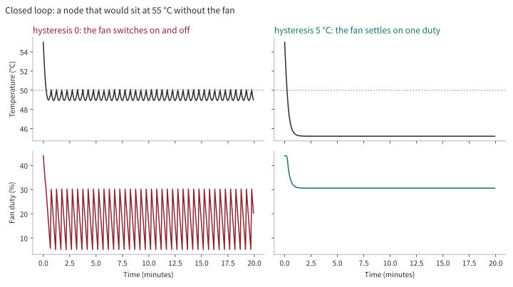

# Archived v0 usage

Historical instructions only. These commands are not supported by the v1 application. Use the [v0.2.1 source](https://github.com/jyje/pifanctl/tree/v0.2.1) for legacy operations. Do not run the historical main-branch installer or unpinned image tags below against v1. Preserve the archived deployment before migration. See the [v1 runtime manual](../v1/runtime.md).

## 1. Run

### 1.1. Requirements

- Raspberry Pi (ARM64)
- Python 3.10+

You should access the Raspberry Pi (ARM64) to run the following commands.

### 1.2. OPTION 1: Install CLI like a package

```sh
curl -fsSL https://raw.githubusercontent.com/jyje/pifanctl/main/install.sh -o install-pifanctl.sh
chmod +x install-pifanctl.sh
./install-pifanctl.sh
rm install-pifanctl.sh

## Uninstall
# rm -rf $HOME/.pifanctl
```

After installation, run `pifanctl --help`:

```
 Usage: pifanctl [OPTIONS] COMMAND [ARGS]...

 🥧 pifanctl: A CLI for PWM Fan Controlling of Raspberry Pi

 Run `agent` on every node to publish temperatures, and `start` on the node
 that has the fan. With `--source prometheus` the fan follows the hottest
 node of the cluster.

╭─ Commands ───────────────────────────────────────────────────────────────────╮
│ status  Show current temperatures                                            │
│ agent   Publish this node's temperatures as Prometheus metrics               │
│ start   Start fan control                                                    │
╰──────────────────────────────────────────────────────────────────────────────╯
```

Driving the pin needs root, so start the controller with `sudo pifanctl start`. `pifanctl status` and `pifanctl agent` do not.

### 1.3. OPTION 2: Using Docker
```sh
docker run --rm -it ghcr.io/jyje/pifanctl:latest python main.py --help
```

To start the fan:

```sh
docker run --privileged --user 0 -it ghcr.io/jyje/pifanctl:latest python main.py start
```

```
INFO [2026-10-01 14:30:00Z] Detected 'Raspberry Pi 4 Model B Rev 1.5', using the RPi.GPIO driver
INFO [2026-10-01 14:30:00Z] Controller started with driver 'rpigpio', interval 5.0s
INFO [2026-10-01 14:30:00Z] Duty: 36.6%, Temperature: 51.9°C, Following: raspberrypi, Source: local, Nodes: raspberrypi=51.9*
```

Controlling the pin needs access to GPIO and `/dev/mem`, so `start` needs `docker run --privileged --user 0`. The `agent` and `status` commands run unprivileged, and the image runs as a non-root user by default.


### 1.4. OPTION 3: On Kubernetes with Helm (recommended)

```sh
# Label the one Raspberry Pi whose GPIO controls the shared rack fan.
kubectl label node <node-that-controls-the-rack-fan> pifanctl.jyje.online/fan=true

helm install pifanctl oci://ghcr.io/jyje/charts/pifanctl --version 0.2.0-alpha.2 \
  --namespace pifanctl --create-namespace \
  --set prometheus.url=http://prometheus-operated.monitoring.svc:9090 \
  --set monitoring.serviceMonitor.enabled=true \
  --set monitoring.prometheusRule.enabled=true \
  --set monitoring.grafanaDashboard.enabled=true
```

Prerequisites: a Prometheus reachable from the controller. The `monitoring.*` options need the Prometheus Operator CRDs (`ServiceMonitor`, `PrometheusRule`), and a `GrafanaDashboard` needs grafana-operator. Set `monitoring.*.labels` to whatever your Prometheus selects on (for example `release: prometheus`).

- `agent`: a DaemonSet on every node (tolerates every taint), non-root, read-only root filesystem, no privileges.
- `controller`: runs as root and privileged, because driving GPIO needs `/dev/mem`. For one shared rack fan, select one controller node whose GPIO is wired to that fan; it stops at full speed.
- `controllers`: a map of named groups. Each group is a DaemonSet limited by its own `nodeSelector` and merged over `controllerDefaults`, so nodes with different hardware live in one release:

  ```yaml
  controllers:
    pi4:
      nodeSelector: {pifanctl.jyje.online/fan: pi4}
      driver: rpigpio
    pi5:
      nodeSelector: {pifanctl.jyje.online/fan: pi5}
      driver: sysfs
      pwmChannel: 2
  ```

  A group's `nodeSelector` is used exactly as written, never merged with a default. With no groups declared, one `default` group runs on nodes labelled `pifanctl.jyje.online/fan=true`. A node must match at most one group, and a group without a `nodeSelector` is rejected at render time, because it would run everywhere and fight over the pin.
- `monitoring`: an optional `ServiceMonitor`, a `PrometheusRule` (hot node, critical node, agent down, failsafe, fallback, no controller) with a recording rule, and a Grafana dashboard, either as a sidecar `ConfigMap` or as a grafana-operator `GrafanaDashboard`.
- The image tag defaults to `v<appVersion>`, never `latest`. `values.schema.json` rejects unknown drivers and out-of-range duties, and `extraResources` renders any extra manifest with the release.

See [`charts/pifanctl/values.yaml`](../../charts/pifanctl/values.yaml) for every option and [`charts/pifanctl/ci`](../../charts/pifanctl/ci) for tested examples.

#### Metrics and alerts

| Metric | From | Meaning |
| --- | --- | --- |
| `pifanctl_temperature_celsius{node,zone,type}` | agent (`:9101`) | One series per thermal zone |
| `pifanctl_node_temperature_max_celsius{node}` | agent | Hottest zone of the node |
| `pifanctl_temperature_read_errors_total{node}` | agent | Reads that found no thermal zone |
| `pifanctl_fan_duty_percent{node}` | controller (`:9102`) | Duty currently applied |
| `pifanctl_control_temperature_celsius{node}` | controller | Temperature the fan acted on |
| `pifanctl_control_followed_node{node,followed}` | controller | The node being followed |
| `pifanctl_control_source{node,source}` | controller | `prometheus`, `local` or `failsafe` |
| `pifanctl_control_fallbacks_total{node,to}` | controller | Cycles that could not use the cluster view |

With `monitoring.prometheusRule.enabled` the chart alerts on: a node above 75 °C for 10 minutes, a node above 82 °C, an agent that is not scraped, a controller on failsafe, a controller that fell back to its own node, and no controller reporting at all.

#### Retention

Temperatures are only as useful as their history. The chart exports metrics but does not own Prometheus, so keep them with the Prometheus settings:

- Set `retention` for the period you want to look back over, and `retentionSize` slightly below the volume size so the TSDB can never fill its disk.
- `pifanctl:node_temperature_max_celsius:max` (recording rule) is one series for the whole cluster. If you downsample or federate to a long-term store, this is the series to send.
- A node count in the single digits costs a few hundred kilobytes per month: the retention budget is decided by the other workloads, not by pifanctl.

### 1.5. OPTION 4: On Kubernetes, raw manifest (one node, no Prometheus)

Run the following command to install the pifanctl on Kubernetes with Raspberry Pies and a PWM Fan.

```sh
kubectl create namespace pifanctl
kubectl apply -n pifanctl -f https://raw.githubusercontent.com/jyje/pifanctl/main/k8s/manifests/deployments.yaml
```

You can check the status of the pifanctl with the following command:

```sh
kubectl get pods -n pifanctl
```

You can check the logs of the pifanctl with the following command:

```sh
kubectl logs -n pifanctl -l app=pifanctl
```


### 1.6. OPTION 5: Run Source Code
```sh
git clone https://github.com/jyje/pifanctl ~/.pifanctl
cd ~/.pifanctl/sources
pip install --upgrade -r requirements.raspi.txt
python ~/.pifanctl/sources/main.py --help
```


### 1.7. Cluster mode: one shared rack fan, many nodes

One PWM fan mounted on the rack cools several Raspberry Pi boards together. The fan is controlled centrally, and its speed follows the hottest node in the rack. The boards do not each need their own fan.

| Role | Command | Runs on | What it does |
| --- | --- | --- | --- |
| Agent | `pifanctl agent` | **every node** (DaemonSet) | Reads `/sys/class/thermal` and serves `pifanctl_*` metrics, labelled with `node` |
| Prometheus | | the cluster | Scrapes and **retains** the temperatures |
| Controller | `pifanctl start --source prometheus` | **one designated fan-control node** | Asks Prometheus for `max by (node) (pifanctl_temperature_celsius)` and drives the shared rack fan from the hottest node |

The controller never trusts a single source. Each cycle it acts on the highest of the cluster value and its own node's value, and it degrades safely:

1. Prometheus answers: use `max(cluster, local)`.
2. Prometheus is down or empty: use the local temperature, count a fallback.
3. Nothing is readable: run the fan at `--failsafe-duty` (default 100%).

When the controller stops (SIGTERM, pod eviction) the fan is left at `--exit-duty` (default 100%), because a stopped controller no longer protects the board.

With `--source local` (the default), the controller uses only its own node's temperature. This suits a single-board setup; for a rack fan shared across nodes, use `--source prometheus` so the hottest board sets the fan speed.

```sh
# on every node
pifanctl agent

# on the designated fan-control node for the shared rack fan
pifanctl start --source prometheus --prometheus-url http://prometheus:9090
```

#### What the log tells you

Every cycle logs what the fan reacted to and what every node reads, hottest first. The node it followed is marked with `*`:

```
INFO [2026-10-01 14:30:05Z] Duty: 86.3%, Temperature: 70.5°C, Following: node-c, Source: prometheus, Nodes: node-c=70.5* node-b=52.1 node-d=51.8 node-a=49.2
```

A node that reported before and then disappears is warned about once (`Node 'node-c' stopped reporting and is not part of the maximum`), because a silent node may be a hot one. The same facts are metrics: `pifanctl_control_followed_node` (the node being followed) and `pifanctl_control_temperature_celsius`.

#### Temperature curve

`--algorithm curve` (the default) maps temperature to duty. The duty rises immediately with the temperature. On the way down two settings apply: `--temp-hysteresis` decides **when** it may fall, and `--duty-down-step` decides **how fast**.

| Temperature | Duty |
| --- | --- |
| below `--temp-low` (50 °C) | `--duty-idle` (0%) |
| `--temp-low` | `--duty-start` (30%) |
| between | linear ramp |
| `--temp-high` (70 °C) and above | `--duty-max` (100%) |

`--algorithm step` keeps the original behaviour (`--target-temperature`, `--duty-cycle-step`).

##### Temperature hysteresis

A fan that cools the node it follows can pull the temperature back under `--temp-low`, switch off, let the node heat up again, and switch on again, over and over. A hysteresis gives the fan two different thresholds, like a thermostat: it **starts** at `--temp-low`, but only **stops** once the temperature has fallen `--temp-hysteresis` (default 5 °C) below its peak.

```
temperature
50 °C  - - - - - - ●  fan starts here (30%)
                    |
48 °C               |  the fan keeps running in this band
                    |
45 °C  - - - - - - ●  fan may stop only below here
```

On the way down the whole curve is used shifted down by the hysteresis: after a peak of 60 °C (58%), the duty stays at 58% until the temperature is under 55 °C, and at 54 °C it is the duty the curve gives for 59 °C. On the way up nothing is delayed. These are the same 5 °C as the official Raspberry Pi 5 fan. `--temp-hysteresis 0` turns it off. It must be smaller than the width of the curve.

What it does not do: if a node sits just above `--temp-low` even with the fan running, the fan still cycles between the two thresholds. The hysteresis only makes each cycle longer, as with any thermostat, and removes the rapid back-and-forth around a single threshold.



The figure is a closed loop on a modelled node that would sit at 55 °C without the fan. Without hysteresis (left) the duty swings between about 5% and 30%. With 5 °C (right) it settles on one duty and the node holds about 45 °C, at the price of a higher average duty. See [Temperature hysteresis](../../docs/hysteresis.md) for how it works, a worked example, how to choose the value and how the figures are made.

#### Drivers

| `--driver` | Use |
| --- | --- |
| `auto` (default) | Kernel PWM on Raspberry Pi 5, RPi.GPIO elsewhere. **Never the mock**: without real hardware the process exits with an error instead of pretending to cool |
| `rpigpio` | Software PWM on `--pin` (Raspberry Pi 4 and older) |
| `sysfs` | Kernel hardware PWM in `/sys/class/pwm` (`--pwm-chip`, `--pwm-channel`); needs the PWM overlay, for example `dtoverlay=pwm-2chan` |
| `mock` | Development only |

Every option is also an environment variable, listed in `pifanctl start --help`.


---
