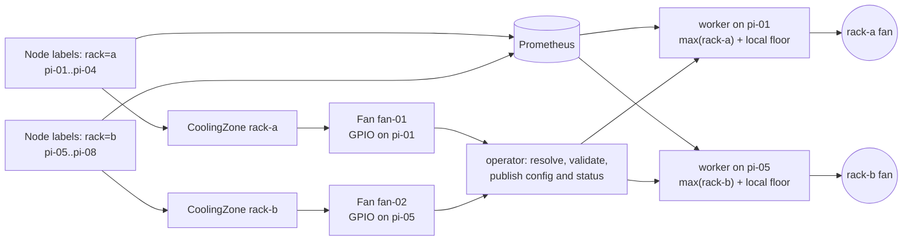

# v1: cooling topology and operator design

**English** | [Korean](README-ko.md)

**Status: implemented alpha (`1.0.0-alpha.3`), not a stable v1 release.**
The shared planner, freshness metric, worker, operator, CLI and chart are implemented.
See the [runtime manual](runtime.md) for current commands and limitations, and
[PLAN.md](../../PLAN.md) for verification and remaining hardware release gates.
The candidate serves `v1` with `v1alpha1` compatibility. See the [API migration procedure](api-migration.md).

Implementation roadmap: [issue #39](https://github.com/jyje/pifanctl/issues/39).

## 1. What exists and what changes

Today an agent publishes each node's temperature. A controller on a fan node
uses a Prometheus query and its local temperature to drive PWM. The Helm chart
supports named controller groups, hardware overrides and per-group Prometheus
queries. The default query includes the entire cluster. Manually filtering a
group query is possible, but membership and fan assignments are not explicit
resources. Missing remote samples are excluded; a failed remote query falls back
to local temperature. Neither behavior proves a shared rack is safely cooled.

v1 makes physical cooling relationships explicit. Two fans cooling four boards
each must follow their own four boards. A fan connected to `pi-01` can cool other
nodes, and `pi-01` can simultaneously be a cooling member. One PWM fan per Pi is
the same model with a one-node zone and a fan on that node.

## 2. Decision: labels select nodes; resources describe cooling

The initial `FanMember` / `FanWorker` idea identifies useful roles, but those
roles do not need one custom object per node. A node can have both roles and
multiple fans. Use existing `Node` identity rather than duplicating it.

| Model | Benefits | Costs | Decision |
| --- | --- | --- | --- |
| Node labels only | Native grouping, no CRDs, easy `kubectl label` | Poor fit for PWM hardware, control curves, multiple fans, fan references and observed status; labels are not structured configuration | Use for membership, not the whole API |
| One member and one worker CR per node | Explicit individual roles | Duplicates Node identity; one worker node may have several fans; membership updates grow with node count | Do not adopt |
| ConfigMap containing the whole topology | Simple YAML and Helm/GitOps friendly | Whole-document updates, custom status and weaker API discovery | Excluded from v1; CRDs are required |
| `CoolingZone` + `Fan`, with Node selectors | Member-centered grouping, physical fan identity, structured policy/status, native API discovery | Requires CRDs and an operator; selectors and cross-object safety need reconciliation | Preferred Kubernetes API |

Labels are Kubernetes' grouping primitive. This design keeps that behavior and
uses custom resources for application configuration and observed state.
[Labels and selectors](https://kubernetes.io/docs/concepts/overview/working-with-objects/labels/),
[custom resources](https://kubernetes.io/docs/concepts/extend-kubernetes/api-extension/custom-resources/).

No `FanGroup` or `CoolingPolicy` CRD is needed initially. A zone names the group;
the fan holds its hardware-specific curve. A node-per-member CRD can be added
later only if individual overrides cannot be represented by separate zones.

## 3. API and invariants

Both resources are cluster scoped because their target `Node` objects and
physical PWM claims are cluster scoped. Names are unique across the installation.
Only cluster administrators manage this API initially. Multi-tenant hardware
delegation would need additional authorization design.

### `Fan`: one physical actuator

- `spec.nodeName`: exact Kubernetes Node name, not a selector that might match
  several workers. Immutable while the fan exists.
- `spec.hardware`: exactly one explicit `rpigpio` or `sysfs` configuration.
  Immutable. No automatic driver detection or mock hardware in production.
- `spec.control`: temperature curve, decision interval, full-speed failsafe and
  exit duty. The alpha API fixes failsafe and exit duty at 100%.
- Status: conditions, referenced zones, physical claim, Node UID, worker Pod,
  desired/applied topology hashes, heartbeat, requested PWM duty and temperature.

One node may host multiple fans on different physical channels. RPi.GPIO claims
are `(Node UID, BCM pin)`; sysfs claims are `(Node UID, chip, channel)`. Alpha
rejects mixing GPIO and sysfs drivers on the same node because their physical
aliases cannot be reliably inferred. Changing node/hardware requires a controlled
replacement and acknowledged release of the old claim.

### `CoolingZone`: members first, assigned fans second

- Exactly one of `spec.nodeSelector` (Kubernetes LabelSelector) or
  `spec.nodeNames` (explicit names). Empty selectors and empty lists are rejected.
- `spec.fanRefs`: one or more `Fan` names. The fan's zone list is derived from
  these references, never maintained as a second desired list.
- `spec.telemetry`: `prometheus` with an HTTP(S) endpoint and a sample-age limit,
  or `local` for exactly one explicitly named node. Local mode requires every
  referenced fan to be on that same node.
- Status: resolved nodes, missing nodes, fan names, hottest temperature and its
  observation time, topology hash and conditions.

Membership is many-to-many: a node can be in several zones, a zone can use several
fans, and a fan can serve several zones. A fan follows the maximum temperature
of the union of its assigned zones. Its own live temperature is an additional
safety floor. Different curves for the same physical fan are not accepted.

The planner rejects conflicting telemetry definitions for the same node within
a fan's input union. Node names in Prometheus must exactly match Kubernetes Node
names. Status is not a substitute for retained Prometheus time series.

| Check | Where it belongs |
| --- | --- |
| Required fields, bounds, hardware union, immutable fields, nonempty selection | CRD schema and CEL; equivalent file validation |
| Kubernetes label key/value syntax, curve ordering in Helm/file input | Shared semantic validator; Kubernetes validation for native CRs |
| Node/fan existence, unique physical claims, telemetry consistency, local-source placement | Planner plus worker claim enforcement |
| Temperature freshness/completeness, applied revision, safe deletion | Worker and reconciliation |

CRD schemas cannot check references to other objects. Strict field validation
and server dry-run should accompany `kubectl apply`. The CRDs expose `/status`
separately from desired `spec`.
[CRD validation and subresources](https://kubernetes.io/docs/tasks/extend-kubernetes/custom-resources/custom-resource-definitions/).

## 4. Scenarios and examples

| Physical arrangement | Declaration |
| --- | --- |
| Two racks, four Pis per rack | `rack-a` selects four nodes and references `fan-01`; `rack-b` selects four and references `fan-02` |
| Every Pi has one fan | One single-node zone and one colocated Fan per Pi |
| Two fans cool the same four boards | One zone references two Fans; these can be on one node with distinct pins |
| One fan cools several logical zones | Several zones reference the same Fan; worker uses their member union |
| Single-node Kubernetes cluster | One single-node CoolingZone and one colocated Fan |

See [two racks](../../design/v1/examples/two-racks.yaml),
[per-node fans](../../design/v1/examples/per-node.yaml), and
[multiple fans](../../design/v1/examples/multi-fan.yaml).
The [kernel PWM example](../../design/v1/examples/sysfs.yaml) illustrates a Pi 5
sysfs configuration; its overlay and physical channel still need hardware verification.

Proposed membership labels for the two-rack example:

```sh
kubectl label nodes pi-01 pi-02 pi-03 pi-04 pifanctl.jyje.online/rack=a
kubectl label nodes pi-05 pi-06 pi-07 pi-08 pifanctl.jyje.online/rack=b
```

These labels describe the boards a fan physically cools. They do not move a fan,
attach wiring or select its controller node. Operator status must show the
resolved membership so a misplaced label is visible.



## 5. CRD-only desired state

The portable document is a Kubernetes `v1/List` containing the same `Fan` and
`CoolingZone` envelopes and specs as the native API. It is a serialization
format for validation and planning tools. Kubernetes runtime topology is always
represented by native `Fan` and `CoolingZone` custom resources.

| Source | Desired state | Observed state | Kubernetes dependency |
| --- | --- | --- | --- |
| Native API | Fan and CoolingZone CRs rendered through the operator chart's `extraResources` values | Resource `/status`, Events, metrics | CRDs + operator |
| Local file | List YAML for offline validation or live planning only | CLI output | API access is needed to resolve selectors; local PWM control is unsupported |

The operator chart is the only supported pifanctl chart in v1. It installs the
operator runtime and CRDs, then renders `Fan` and `CoolingZone` instances from
`extraResources`. GitOps stores these values in the cluster repository's
operator Application. There is no separate pifanctl instance chart or
ConfigMap topology mode in v1. The [experimental design chart](../../design/v1/helm)
is not a supported v1 installation path. CRD schema upgrades still require an
explicit lifecycle procedure because Helm does not upgrade or delete CRDs.

## 6. Operator and worker responsibilities

Implement the first operator in Python using the existing application's shared
configuration/planner package and the official Kubernetes client. A Go operator
would add a second implementation language before reconciliation needs justify
it. Use leader election, list/watch with resourceVersion recovery, indexed
references, idempotent reconciliation and optimistic status updates.

The operator is unprivileged and never writes PWM. It watches Nodes, topology,
owned workloads/config and worker reports. It runs only in its configured
namespace. Agents stay unprivileged and expose node identity, temperature and
last successful sensor-read time to Prometheus. Agent removal must not publish
a fresh timestamp for an old sensor value.

### Reconciliation sequence

1. Read a consistent topology snapshot and validate individual objects.
2. Resolve selectors/names against Node identity and UID. Build reverse indexes
   from nodes to zones and fans, and from zones to fans. Keep NotReady members
   in the expected set; do not silently omit them.
3. Resolve fan references and hardware claims. A pending or invalid zone linked
   to an existing fan contributes an unhealthy input, not an empty member list.
4. Produce one immutable, hashed plan per worker node. It contains each fan's
   exact member set, zone provenance, telemetry sources, curve and safety limits.
5. Reconcile one worker Deployment per hardware node, replicas=1, Recreate
   strategy, exact Node placement and no surge. One worker owns all fans on that
   node. Resolve the actual hostname label from the Node; do not assume it equals
   the Node name. Pin required affinity and validate the injected Node name/UID.
6. Publish plan files in a managed ConfigMap. Workers atomically validate/reload
   plans and report the applied hash, per-fan health and heartbeat. Configuration
   changes do not require a hardware Pod restart.
7. Update Ready/Degraded/Conflict conditions only for the observed generation.
   Readiness requires fresh reports, complete data and matching applied hashes.
   Requeue at bounded intervals for stale reports and retry transient failures.

One agent DaemonSet can cover all participating Pis or reuse existing agents
with matching metric identity. A user chooses the managed/reuse mode explicitly;
the operator does not adopt or delete a legacy release's agents.

Workers have no Kubernetes API credentials by default. Reports come from a
private metrics/status endpoint in the operator namespace; only the operator
may reach it. Generated owner references point to the cluster scoped Fan, with
the lexicographically first Fan on a node as primary workload owner. When that
Fan is removed, transfer ownership before finalization if other fans remain.
Kubernetes workload ConfigMaps contain internal worker plans only. They are
operator-managed implementation details, not an alternate topology API.
Mounted worker-plan updates are eventually delivered, not immediate. Workers
read the complete new file, validate, then swap. Readiness depends on
applied-hash acknowledgement. On an invalid or delayed plan, retain the last
valid plan and mark Degraded; never silently declare convergence.

### Data correctness and physical safety

- Fetch only resolved nodes with correctly escaped exact identities. Preserve
  node labels and sample timestamps; do not reduce a Prometheus query to one
  scalar before checking completeness. A recent scrape timestamp alone does not
  prove a recent sensor read; v1 adds `pifanctl_temperature_observed_timestamp_seconds`.
- Compute a zone maximum only if every expected member has a finite, recent
  sample. Reject future timestamps beyond a small defined clock-skew allowance.
  Any incomplete zone forces all its fans to 100%, even if other zones are healthy.
- Prometheus outage, missing member, expired sample, empty selection, unresolved
  reference, worker-node replacement or lost configuration health must not fall
  back to only the worker's local temperature. Local temperature is a floor,
  not proof that remote boards are cool. Local-only mode is explicitly declared.
- If operator/API access is lost, keep the last applied member set. A worker
  watchdog uses a bounded operator heartbeat timeout (alpha default 120s) to force full
  speed. It may resume regulation only after fresh configuration acknowledgement.
  The operator periodically refreshes a separate heartbeat file in the managed
  ConfigMap, outside the plan hash. Validate its timestamp and Node UID; file
  delivery delays count toward the timeout. This is independent of the worker's
  own report heartbeat. Tune the timeout only after measuring projection latency.
- Hold an exclusive host-wide lock, on a shared host lock directory,
  across local CLI and Pods. Leader election and replicas=1 alone do not prevent
  duplicate PWM writers. Never steal a lock after lease expiry if the old process
  may still be alive. Partitioned nodes must not move fan control to another node.
- Initialize each claimed fan at 100% before reading temperatures or accepting
  a plan; only reduce duty after all safety checks pass.
- Fail driver initialization visibly, not through a mock fallback. Requested duty
  is not measured RPM. No tachometer or automatic physical fan-failure detection
  is promised by this proposal.
- Process termination should set 100%. Hard node/power failure cannot guarantee
  PWM or fan power remains on. Electrical fail-open behavior and independent fan
  power must be validated on hardware before any cooling guarantee.

Finalizers serialize removal: removing a zone publishes a replacement plan and
waits for affected workers to acknowledge it; a fan with no remaining zones stays
at 100%. Removing a fan sets full duty, acknowledges release of its claim, then
removes only its owned workload/config when no other fan needs them. A zone that
still references the removed fan becomes Degraded. An unreachable worker keeps
the finalizer pending with a visible reason; forced removal is an explicit admin
action and does not establish safe hardware state. Input ConfigMap deletion uses
the same node-worker handover via a namespaced finalizer.

### Status, monitoring and access

The alpha implements `Ready` with reasons. Future diagnostic conditions include `Ready`, `MembersResolved`, `ReferencesResolved`,
`TelemetryHealthy`, `HardwareClaimed`, `ConfigurationApplied` and `Degraded` where
applicable. Report reasons such as `EmptySelection`, `MissingNode`, `MissingFan`,
`HardwareConflict`, `StaleTemperature`, `PlanNotApplied` and `WorkerUnavailable`.
Status writes are rate limited; do not write every thermal sample to etcd.

Add low-cardinality metrics for fan duty, zone temperature, missing member count,
failsafe reason, applied configuration and worker heartbeat. Retain per-node
temperatures in Prometheus. Emit alerts for incomplete membership, stale data,
failed reconciliation, stalled deletion and missing workers. Avoid config hashes
as unbounded metric labels.

[Proposed RBAC](../../design/v1/operator/rbac.yaml) grants read-only Node access,
topology status/finalizer updates and workload/config management only in the
operator namespace. It cannot create CRDs, change Node labels, read Secrets or
create namespaces. Native CR specs are updated only to manage finalizers; the
operator does not own user spec fields. Kubernetes RBAC cannot restrict a patch
to only metadata, so application behavior and optional admission policy must
enforce that convention. Worker Pods receive only driver-specific host access;
GPIO privileges never belong to the operator. Final operator packaging also
needs NetworkPolicy, restricted securityContext, probes and image digests.

## 7. Proposed CLI and kubectl contract

These commands are implemented in the alpha. Use the runtime manual for installation:

```sh
pifanctl topology validate topology.yaml
pifanctl topology render topology.yaml
pifanctl --context lab topology plan topology.yaml --live
pifanctl --context lab topology apply topology.yaml --dry-run
pifanctl --context lab topology apply topology.yaml
pifanctl --context lab zone list
pifanctl --context lab zone describe rack-a
pifanctl --context lab fan list
pifanctl --context lab fan watch
```

`validate` is offline shape/reference validation. `plan` resolves live selectors,
shows target Nodes/UIDs, claims and membership changes without mutations. `apply`
uses the Kubernetes API and server-side apply with a dedicated field manager,
never shell interpolation or privileged remote GPIO access. It respects
`KUBECONFIG`, `--kubeconfig` and `--context`. Hardware workers are managed only
by the operator. Offline validation is available, while live selectors and
application require API access.

Ship an optional `kubectl-pifanctl` wrapper so `kubectl pifanctl fan list` invokes
the same CLI. Plain `kubectl get fans,coolingzones`, `describe`, `apply`, `diff`
and `wait --for=condition=Ready fan/fan-01` remain supported. The goal resembles
Argo's resource-oriented CLI: validation and useful output over native Kubernetes
resources. No extra control server is necessary in the first version.
[Argo CLI](https://argo-workflows.readthedocs.io/en/latest/walk-through/argo-cli/).

`apply` targets native CRs. GitOps users edit the source repository and can put
the same resources in the operator chart's `extraResources` values. The CLI shows
managed-field conflicts and does not force ownership or secretly modify
Helm/Argo-managed configuration. Manual fan duty overrides and stop-at-zero
commands are deferred until a safe override API exists.

## 8. Migration and delivery gates

1. Inventory real fan wiring, controller nodes, driver/pin/channel and the nodes
   each fan cools. Translate existing group query assumptions into explicit zones.
2. Create labels/topology and compare a read-only plan with the inventory. Keep
   legacy controllers running while the plan is only being inspected.
3. Add freshness metrics and v1 shared schema/planner/file loading. Exercise
   offline and mock behavior before Kubernetes reconciliation.
4. Implement node workers, host locks, hot reload and safety watchdogs. Validate
   real Pi 4 GPIO and Pi 5 sysfs behavior, including abrupt process/node failure.
5. Implement operator, status, finalizers, CLI and kubectl wrapper.
   Use dry-run and mock workers in a disposable Kubernetes cluster first.
6. Hand over one fan at a time: leave full duty, stop its legacy controller and
   verify no old PWM writer remains, then enable the v1 worker. Do not run both.
   Roll back by stopping v1, releasing the claim, then restoring the legacy config.
7. Publish v1 images and operator/topology charts only after hardware and failure
   acceptance criteria pass. The implemented alpha is versioned separately from stable v1.0.0.

Acceptance criteria for implementation:

- [ ] Two four-node zones drive independent fans and ignore the other zone's heat.
- [ ] One PWM fan per Pi, multiple fans per node and shared fans across zones work.
- [ ] GitOps-rendered Fan/CoolingZone CRs produce the expected normalized plan.
- [ ] Label changes/Node deletion are visible; all missing/stale data forces full duty.
- [ ] Conflicting claims, dangling references and invalid local-mode placement fail.
- [ ] No concurrent hardware writers during restart, rollout, partition or handover.
- [ ] Updates/deletion are acknowledged; operator outage triggers worker watchdogs.
- [ ] CLI kubeconfig/context, server dry-run, GitOps conflict handling and kubectl work.
- [ ] Bounded status/metrics scale to a documented fleet size without sample writes to etcd.
- [ ] Pi 4 and Pi 5 electrical/driver behavior is measured; commanded duty is never described as verified cooling.

This design deliberately starts with two domain resources. Additional API
objects, a dedicated service or generalized scheduling should follow demonstrated
requirements rather than the size of the initial feature request.
