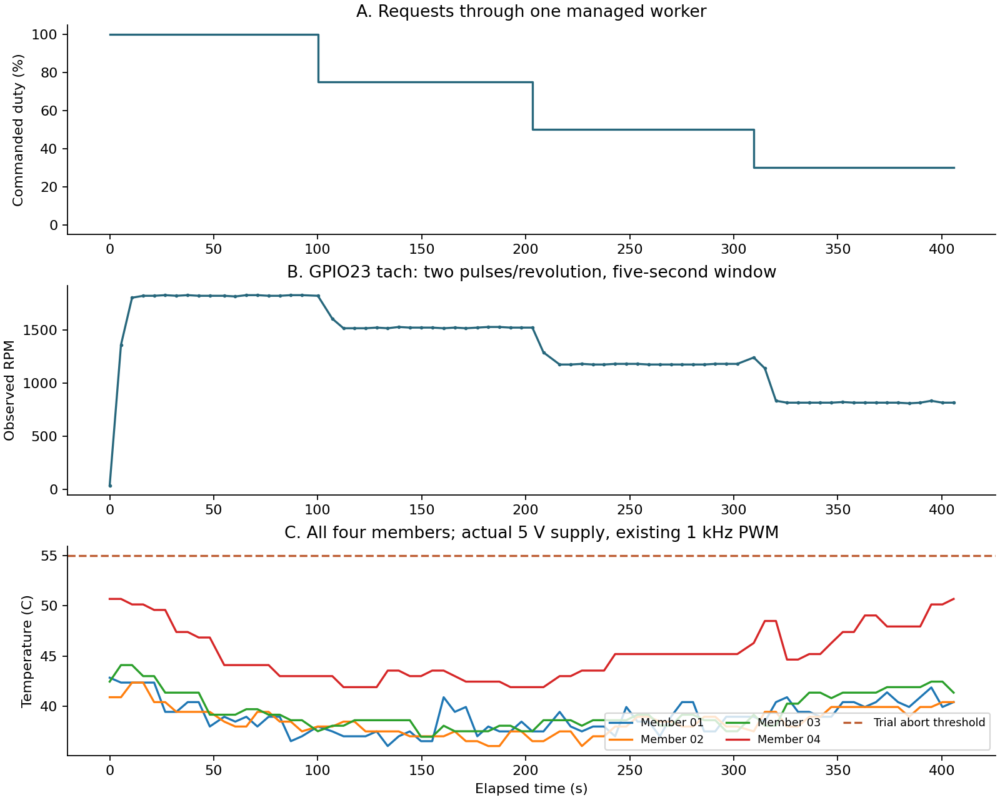

# v1.1 RPM feedback acceptance: installed 5 V rack

Date: 2026-10-09. Outcome: **GitOps RPM collection and the four duty-response
stages passed; deliberate stop/restart was skipped by its temperature gate.**

## Installation and evidence

The maintainer reports an NF-A12x25 PWM (12 V rated) powered from the Pi 5 V pin.
The existing Pi 4 actuator cools four Raspberry Pi 4/5 members. This campaign
uses that installation and its existing 1 kHz software PWM. It does not certify
rated 12 V performance, connector voltage, a conforming 25 kHz waveform, airflow,
Pi 5 actuation or an independently calibrated RPM instrument.

BCM18 (physical 12) remains the PWM output. The green fan tach conductor, through
the gray extension, uses BCM23 (physical 16) with the explicitly authorized
internal pull-up. App and operator chart are 1.1.0; runtime is `v1.1.0-py312`.
The same managed worker remained the only GPIO output owner.

The permanent Fan configuration is:

```yaml
feedback:
  tachometer:
    gpio:
      pin: 23
      pull: up
    pulsesPerRevolution: 2
    sampleSeconds: 5
```

[Cluster PR #154](https://github.com/jyje/cluster/pull/154) enables this declaration.
The complete-window baseline passed for 62.24 seconds: 12 observations,
966-972 RPM at 38.12% command. Fan `status.feedback.tachometer`, the worker's
collector and actual Prometheus samples were checked with source timestamps.
Normal idle may report zero RPM and `NoPulses`; this is not sufficient by itself
to establish physical rotor motion or a wiring fault.

## Measured response

Every stage waited at least 30 seconds after configuration acknowledgement,
then observed at least 60 seconds. Samples are five-second rolling pulse counts:
`RPM = pulseCount * 60 / (2 * 5)`, giving 6 RPM per pulse.

| Commanded duty | Mean RPM | Range RPM | Observation seconds | Samples | Highest member temperature |
| --- | ---: | ---: | ---: | ---: | ---: |
| 100% | 1,826.00 | 1,818-1,830 | 60.74 | 12 | 47.40 C |
| 75% | 1,524.00 | 1,518-1,530 | 64.62 | 13 | 43.55 C |
| 50% | 1,178.77 | 1,176-1,182 | 64.36 | 13 | 45.20 C |
| 30% | 817.38 | 810-834 | 64.42 | 13 | 50.70 C |



[Anonymous samples](samples.csv) and [summary](summary.json) preserve the actual
observations. Rebuild with `python scripts/build_rpm_acceptance.py` (matplotlib).
These points show a measured response to the requests in this installation.
They are not a calibrated full-range speed curve or minimum starting-duty test.

## Guards, interruptions and restoration

Only the existing managed worker changed duty. The temporary thermal curve
reached full duty by 60 C, with exit/failsafe at 100%. The runner and independent
in-cluster deadline guardian checked all four member source clocks, worker
readiness, ownership and collector state; the experiment abort threshold was
55 C. The worker's existing local thermal/freshness and operator-heartbeat
watchdogs remained enabled. The guardian needs a functioning Kubernetes API to
restore the CR; it is not an independent direct GPIO controller.

The positive-RPM-only first baseline was interrupted by ordinary idle. A first
campaign attempt completed its 100% stage but stopped on a guardian error during
the transition; the exact initial exception was not retained. The guardian
restored normal control. Restoration was changed to identity/control-tested JSON
patches to avoid status-write resource-version conflicts, and bounded guardian
deadline/cancellation self-tests passed before the successful full rerun. These
interruptions remain in the private raw archive and are not counted as passes.

The deliberate 0%-to-100% restart required all members below 50 C. The final
30% stage reached 50.7 C, so no deliberate stop was requested. Earlier normal
thermal-policy history showed zero RPM followed by positive RPM, but repeated
scrapes of a sample are not independent acquisitions. Controlled restart and
minimum startup-duty acceptance remain open.

The original thermal curve, refresh interval, failsafe and exit duty were
restored with feedback retained. The guardian acknowledged cancellation and
trial annotations were removed. [Cluster PR #156](https://github.com/jyje/cluster/pull/156) restored GitOps
self-heal; Argo is Synced/Healthy and all six v1.1 pods are Ready. A further
64.5-second source-matched healthy hold passed with unchanged resource identities,
normal policy, exact released image digest and fresh four-member telemetry. No test load Pod or additional GPIO writer was introduced.

## Read the deployed evidence

```sh
kubectl --context microk8s get fan r4spi-rack-fan \
  -o jsonpath='{.status.feedback.tachometer}{"\n"}'
```

```promql
pifanctl_worker_fan_rpm{fan="r4spi-rack-fan"}
pifanctl_worker_fan_tachometer_ready{fan="r4spi-rack-fan"}
time() - pifanctl_worker_fan_rpm_observed_timestamp_seconds{fan="r4spi-rack-fan"}
pifanctl_worker_fan_duty_percent{fan="r4spi-rack-fan"}
```

The existing worker ServiceMonitor is selected by `release: prometheus` and
scrapes every ten seconds. CR updates are rate limited, so CR and Prometheus
values need not match a newly sampled worker window exactly. Interpret each
value with its acquisition clock. Feedback is observational, not RPM closed-loop
control, and does not replace thermal failsafe behavior.
