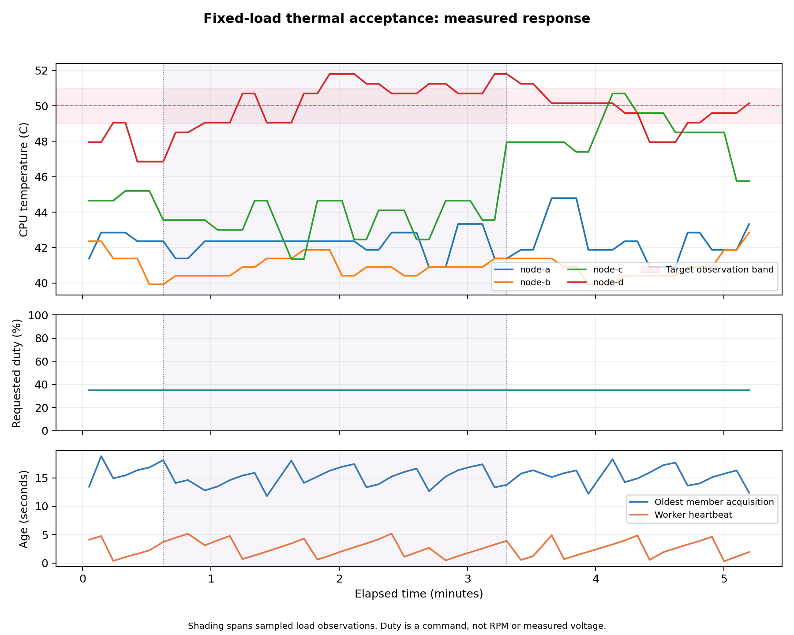
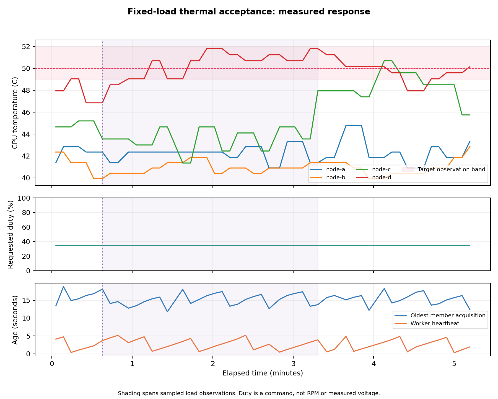
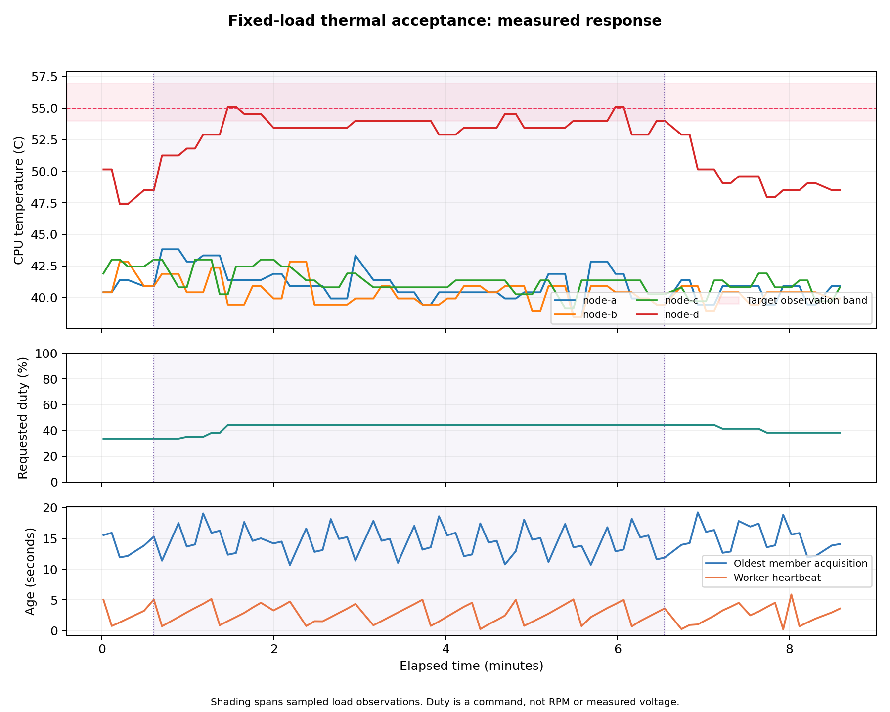
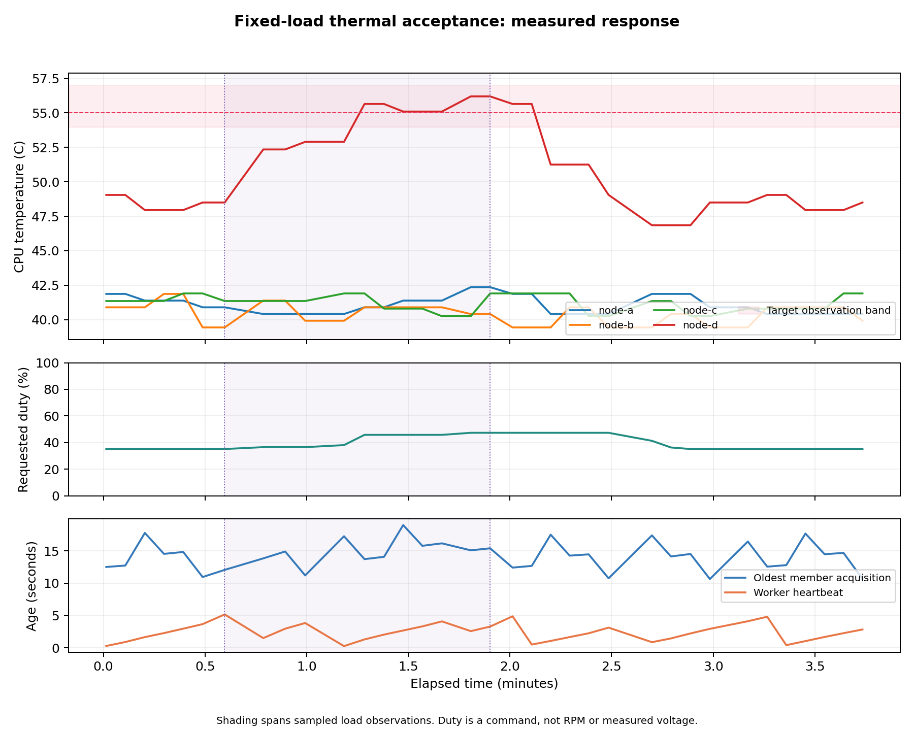
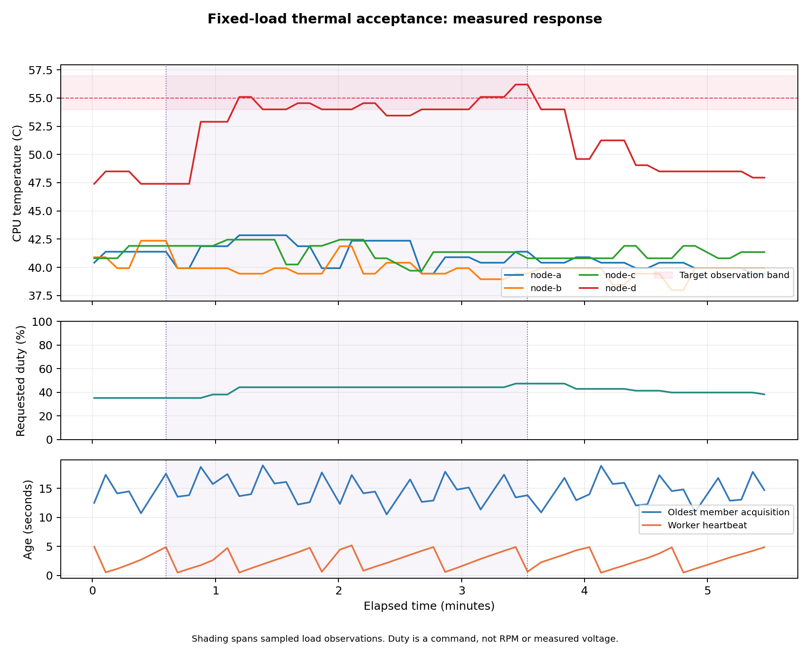
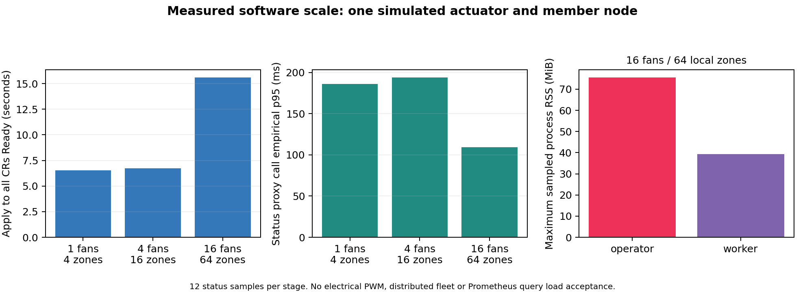
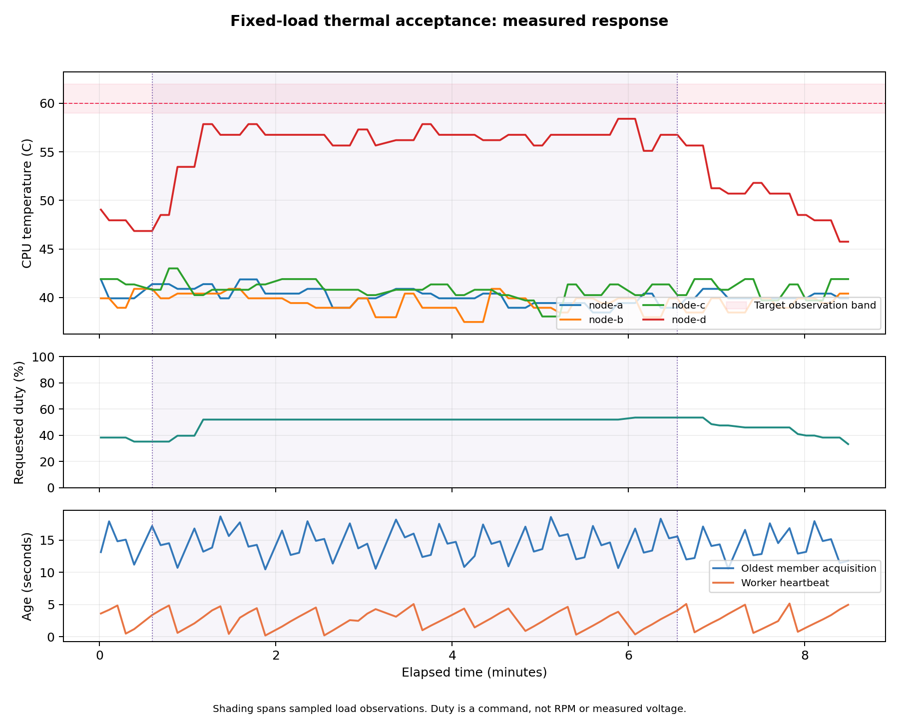
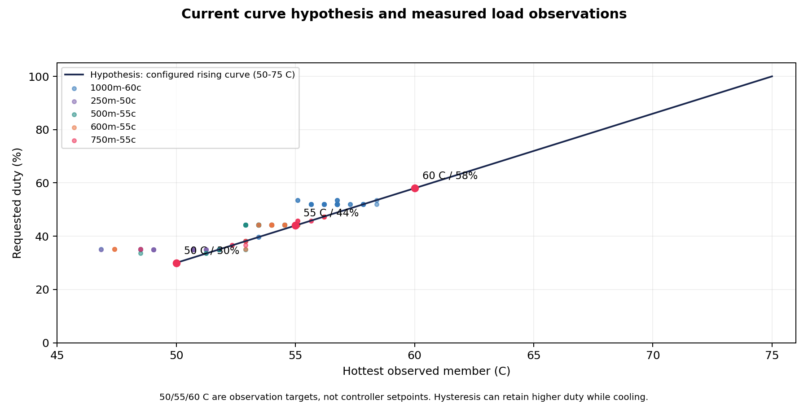

# pifanctl v1 Release Acceptance Field Manual

**Status:** Live v1 alpha runtime and thermal observations recorded through 2026-10-07
**Release target:** `1.0.0`
- **Active deployment:** alpha.6 Python 3.12 compatibility operator and worker; alpha.2 temperature agents
- **v1 candidate under review:** app `1.0.0-alpha.6`, operator chart `0.1.0-alpha.6`
**Decision:** Current practical verification is complete by maintainer approval on 2026-10-07. Proceed with release preparation for the observed deployment scope; unmeasured hardware and broader scenarios are deferred, not passed. Section 23 supersedes earlier release-blocking decisions.

This manual records MicroK8s trials, bounded temperature-response tests, measured evidence, and remaining release checks. The alpha.6 CRD operator and worker now regulate the shared rack with v1 storage and served alpha compatibility after verified migration and image rollback. Earlier alpha.3 observations remain historical evidence. The maintainer-approved `v1-3c` policy uses target - 1 C through target + 2 C. The unchanged 50 C trial passes for 140.24 seconds under this policy; its original 1 C failure remains archived. Fresh 55 C trials include complete member clocks but fail the 120-second hold. The 60 C bounded trial remains below its target observation band. Sections 17-22 record these new trials, scale/fault evidence and final verification; Section 16 preserves the policy approval and reassessment. A user visually confirmed normal fan rotation; RPM and electrical PWM measurements remain unavailable. Values unavailable from Kubernetes or direct measurements are explicitly marked **Not recorded** instead of being guessed.

## 1. Initial alpha.2 trial configuration (2026-10-04)

This inventory documents the earlier alpha.2 load trial. The later alpha.3 CRD
operator and shared-rack worker are recorded in Sections 9 and 10; Section 14
records the current alpha.6 deployment.

| Item | Observed value |
| --- | --- |
| Kubernetes context | `microk8s` |
| Trial namespace | `pifanctl-v1-trial` |
| Nodes | `raspi-40`, `raspi-41`, `raspi-50`, `raspi-51` |
| Node platforms | ARM64, Kubernetes `v1.36.2`, Debian GNU/Linux 12, Linux `6.12.93+rpt-rpi-*` kernels |
| Known board labels | `raspi-40` and `raspi-41`: Raspberry Pi 4 Model B; `raspi-50`: Raspberry Pi 5 Model B; `raspi-51`: model label not present |
| Operator / agent / worker image | `ghcr.io/jyje/pifanctl-issue:887f6f1-py312` |
| Image digest | `sha256:525ef9f01f7bd4d5af5ac4d4014d9f0320187628c41cd2eacd028d5fbb896cf5` |
| Source revision | `887f6f1ff05301255e7a5f01e22e117ef8e8e9ef` |
| Runtime chart | `pifanctl` chart `0.2.0-alpha.2`; topology source preserved from `837b3d5` |
| Image build | [GitHub Actions run #25](https://github.com/jyje/pifanctl/actions/runs/37201259327), Python 3.12, passed |
| Current topology | One shared rack fan cools the four Nodes in CoolingZone `r4spi-rack` |
| Actuator | Fan `r4spi-rack-fan` on `raspi-40`, RPi.GPIO BCM pin 18, 1000 Hz |
| Curve | Idle 0%; starts at 30% at 50°C; reaches 100% at 70°C; downward changes are limited to 5 percentage points per refresh |
| Safety commands | Failsafe duty 100%; exit duty 100%; refresh every 5 seconds; worker heartbeat timeout 120 seconds |
| Topology hash | `eb8b2a42289be4271f52103db3c7980ce5c9a0bb06fe83bc7f17d804b5c3f37c` |
| Readiness | Argo CD `Synced/Healthy`; operator, four agents, worker, Fan, and CoolingZone reported Ready after rollout |
| Immediate image rollback | `ghcr.io/jyje/pifanctl-issue:6a0f5a5-py312`, runtime chart source `837b3d5`; the archived v0 configuration remains the full rollback target |

At the last recorded sample, `2026-10-04T13:23:40Z`, the Fan resource reported a 51.25°C control temperature and a 34.375% requested duty. The measured node temperatures and Fan status vary over time; see the timestamped sample file rather than treating this point as a steady-state result.

## 2. Filled hardware inventory

The table describes the shared-fan controller during the initial 2026-10-04
trial. That workload ran on member `raspi-41`, which has no local fan in this
topology. The later alpha.3 55°C run targeted `raspi-51` and is recorded in
Section 10.

| Field | Recorded value |
| --- | --- |
| Controller Raspberry Pi model | Raspberry Pi 4 Model B, based on the Kubernetes node label; exact PCB revision not recorded |
| Controller OS, kernel, firmware | Debian GNU/Linux 12; kernel `6.12.93+rpt-rpi-v8`; firmware version not recorded |
| Controller Node and UID | `raspi-40`; `2b557e96-e346-4e26-b053-04d3cfaa094e` |
| Driver and PWM channel | RPi.GPIO, BCM GPIO 18, 1000 Hz |
| Fan manufacturer, model, rated voltage/current | Not recorded in Kubernetes; physical fan label or datasheet inspection required |
| Fan supply, fuse, and current limit | Not recorded; physical wiring and supply inspection required |
| PWM input type and polarity | Not recorded; verify from the exact fan datasheet and measured waveform |
| Ground/reference and signal wiring | Not recorded; inspect the physical rack |
| Independent hardware default and measured signal state | Not recorded; oscilloscope or logic-analyzer measurement required |
| Tachometer/RPM | No RPM metric or tachometer record was available |
| Visual rotation after the image update | User visually confirmed normal fan rotation before the 2026-10-06 load run; continuous observation during the load was not recorded; tachometer/RPM was not measured |
| Test member Node and UID | `raspi-41`; `cabfc25d-6991-427c-a941-3ff323fd6531`; Raspberry Pi 4 Model B label |

`100%` is a requested PWM duty, not measured voltage, RPM, or proof that the fan has power. A floating input or GPIO HIGH must not be assumed to mean maximum cooling. No universal pull-up, pull-down, or polarity is prescribed. Verify a hardware safe default and independently powered fan circuit for the actual wiring. Software cannot correct fan-supply loss or mechanical failure.

## 3. Temperature-response test

### Method and guardrails

- The live Fan stayed enabled throughout the CPU-load test. No CR, ConfigMap, Helm value, or temperature threshold was changed.
- Temporary, non-privileged CPU-load Pods were pinned to `raspi-41` and used the deployed candidate image. Each stage had a CPU and memory limit and exited automatically after its fixed duration.
- Prometheus temperatures and Fan status were sampled every 10 to 15 seconds. The load test was set to stop if any member reached 65°C or if temperature/status monitoring failed. Neither stop condition was reached.
- The 65°C abort threshold was a conservative test guardrail, not a pifanctl release setting. Raspberry Pi documents SoC thermal throttling between 80°C and 85°C; this test stayed well below that range. [Raspberry Pi hardware documentation](https://www.raspberrypi.com/documentation/hardware/rf/)
- The raw records are in [thermal-load-observations.csv](thermal-load-observations.csv). They contain Prometheus CPU-thermal readings and contemporaneous Fan resource status. The Prometheus samples were fresh, with observed sample age below 1.1 seconds.
- The CSV has 68 observations from `2026-10-04T12:54:19Z` through `2026-10-04T13:23:40Z`. SHA-256: `78a3226fbfc82a8cced5c18061e08d256909d11a80333ae9def67f2ba81794f5`.

### Results

| Stage | Applied load | Highest member reading | `raspi-41` reading | Fan resource observation | Result |
| --- | --- | --- | --- | --- | --- |
| A | 1 vCPU, up to 150 seconds | 51.8°C | 49.173°C maximum | Requested duty 29.375% to 36.3% | Partial; 55°C band not reached |
| B | 2 vCPU, up to 120 seconds | 52.35°C | 50.147°C maximum | Requested duty reached 38.225% | Partial; brief readings only, no stable hold |
| C | 3 vCPU, up to 120 seconds | 55.1°C on `raspi-51` | 49.173°C maximum | At control temperature 55.1°C, status requested 47.85% | Partial; hottest member was not the load target and did not remain at 55.1°C |
| D | Five-minute no-load observation, begun about seven minutes after the final stress stage | 54.55°C maximum during the interval | Recorded separately in the CSV | Control temperature 49.05°C to 54.55°C; requested duty 17.45% to 45.925% | No stable plateau established; this delayed interval does not measure the immediate cooldown transient |

The expected steady-state commands from the configured curve are 30% at 50°C, 47.5% at 55°C, 65% at 60°C, 82.5% at 65°C, and 100% at 70°C. The trial reached a short 55.1°C control-temperature snapshot and reported 47.85%, consistent with the configured curve. It did not reach 60°C or higher, and no temperature band was held long enough to claim thermal stabilization.

The test is not an isolated causal measurement. The hottest readings came from `raspi-51`, not the stress target `raspi-41`, and the cluster hosts other services. The stress target peaked at 50.147°C, while the hottest rack member peaked at 55.1°C. A later `kubectl top nodes` sample showed about 19% CPU on both `raspi-40` and `raspi-41`, and about 6% on `raspi-50` and `raspi-51`, after the load had ended. The data demonstrate changing cluster telemetry and corresponding Fan status, but they do not prove that the injected load alone caused the `raspi-51` temperature peak.

This figure plots the node selected for load, the concurrently hottest node, the cluster maximum, the Fan status control temperature, and the requested duty. Gaps between test stages remain gaps in time. Fan status is not measured PWM voltage or RPM.

The solid line is the configured rising curve. Markers are observed Fan status snapshots. The downward ramp can lag the curve because the configured controller limits each decrease to 5 percentage points per refresh. Target points at 60°C and above are curve calculations, not live measurements.

### Stability criteria and interpretation

The active maintainer-approved policy is `v1-3c`: the hottest member must remain within target - 1 C through target + 2 C, with at most 3 C total variation, for at least 120 continuous acquisition-clock seconds and eight observations. Requested-duty variation must not exceed 5 percentage points. Every member acquisition age must be at most 25 seconds, worker heartbeat age at most 15 seconds, and advancing source-clock gaps at most 20 seconds. The original `legacy-1c` policy remains available for historical reproduction; Section 16 records its separately approved replacement. Record fan RPM when instrumentation is available, or direct visual rotation. The initial 2026-10-04 trial did not satisfy that criterion. The later alpha.3 run remains partial because it lacks individual member acquisition clocks, regardless of the permitted temperature span; its original verdict is preserved in Section 10. In the initial trial, the member temperatures varied independently, and the hottest member was outside the node receiving the test load. Its five-minute no-load interval began about seven minutes after the last CPU-load sample, so it is not evidence for the immediate cooling slope or time-to-stability.

The live test ended below the 65°C abort guardrail, all temporary load Pods were removed, and no trial configuration was changed. The physical-fan-stop and recovery test has **not** been run. Its safe abort threshold is awaiting confirmation; the hardware default and RPM remain unverified. Post-upgrade normal rotation was subsequently confirmed by the user; see Section 12.

## 4. Other scenario records

| Scenario | Current evidence | Status |
| --- | --- | --- |
| Normal shared-rack regulation | Fan and CoolingZone Ready; Fan status follows the hottest available member samples and reports requested duty | Observed; stability remains open after Section 10 re-evaluation |
| Local node CPU load | Capped stages on `raspi-41` plus a 1 vCPU capped run on `raspi-51`; see Sections 3, 7, and 10 | All target stability gates remain untested or partial |
| Temperature missing or stale | The worker is configured for fail-safe 100%; no live telemetry fault was injected | Not run live; automated mock/API scenarios cover this behavior |
| Operator heartbeat expires | Worker plan uses a 120-second heartbeat timeout and fail-safe 100%; no live heartbeat fault was injected | Not run live |
| Physical shared fan stopped, then restored | No stop command or fan-power interruption was applied; actual fan circuit default is not yet documented | Not run; safety guardrail confirmation pending |
| Controller process exit, reboot, or power loss | No live fault was injected; process and electrical defaults need measurement | Not run |
| Pi 5 PWM hardware | `raspi-50` is labelled Pi 5 Model B, but the trial fan actuator uses RPi.GPIO on Pi 4 `raspi-40` | Not run on Pi 5 hardware |

The examples below describe expected control behavior, not measured thermal traces:

- **Normal load:** the shared fan follows the hottest member. A hotter member raises the shared fan request while cooler members remain in the same CoolingZone.
- **One hot member:** the selected zone's fan should rise along the configured curve; unrelated zones should not change.
- **Missing temperature or expired heartbeat:** the affected worker should request 100% and report an unhealthy reason. No thermal rise is predicted here because the live faults were not injected.
- **Fan stops or loses supply:** a software duty command cannot guarantee cooling. The measured hardware default and restoration behavior must be recorded before this scenario can pass.

## 5. Remaining release procedures

### Pi 4 GPIO PWM waveform and physical behavior

Record the actual board revision, OS/firmware, fan part number, supply/current protection, wiring, polarity, voltage levels, and instrument setup. With a person at the hardware, capture startup, requested duty changes, fan start-from-rest, normal stop, and process termination. Repeat at least three cold starts and three normal stops. **Pass only when measured waveform and physical fan behavior agree with the fan datasheet at all tested points.**

### Pi 5 kernel PWM

Verify the actual overlay, PWM chip/channel, pin mux, polarity, and frequency on the physical Pi 5. The sample `chip: 0`, `channel: 2` in `design/v1/examples/sysfs.yaml` is illustrative. Check single-writer ownership and repeat startup, duty, reboot, and shutdown measurements. Do not infer a Pi model or pin map from a Node name.

### Process, reboot, power, and network faults

In an isolated maintenance window, test graceful stop and `SIGKILL` separately, then orderly reboot, abrupt controller power loss, fan-supply interruption, worker/operator partition, and Prometheus loss. Record physical rotation, scope/tachometer data, failsafe time, `/readyz`, status reason, and recovery. Never count Python cleanup as protection against `SIGKILL`.

### Migration, rollback, and fleet load

Capture the archived v0 configuration and checksum. Inventory every writer of each PWM channel. Compare a read-only v1 plan to the physical rack, keep cooling at the safe state during handover, stop the old writer and verify lock release before starting v1, then exercise rollback. Measure CPU/memory, API requests, reconciliation duration, status writes, Prometheus latency, scrape gaps, and heartbeat age at a declared fleet size.

## 6. Evidence and release decision

| Record | Candidate and method | Result | Evidence |
| --- | --- | --- | --- |
| Deployment | `887f6f1-py312`, digest recorded in Section 1 | Argo CD Synced/Healthy; Fan and CoolingZone Ready | [Workflow run #25](https://github.com/jyje/pifanctl/actions/runs/37201259327) |
| Load stage A | `raspi-41`, 1 vCPU, maximum 150 seconds | Partial; maximum zone sample 51.8°C | [Raw samples](thermal-load-observations.csv) |
| Load stage B | `raspi-41`, 2 vCPU, maximum 120 seconds | Partial; maximum zone sample 52.35°C | [Raw samples](thermal-load-observations.csv) |
| Load stage C | `raspi-41`, 3 vCPU, maximum 120 seconds | Partial; 55.1°C transient on `raspi-51`; no steady hold | [Raw samples](thermal-load-observations.csv) |
| Cooldown | Five-minute no-load observation, started about seven minutes after the final load sample | Not stable; immediate cooldown transient was not captured | [Raw samples](thermal-load-observations.csv) |
| Electrical waveform, RPM, and physical fan-off recovery | Normal post-upgrade rotation confirmed by the user; no instrument measurements or fan-off recovery recorded | Not run | Electrical and fault-recovery acceptance evidence required |
| Pi 5 hardware, fault injection, rollback, fleet scale | No live trial records | Not run | Procedures in Sections 5 and 3 |
| 2026-10-06 live shared-fan follow-up | alpha.2 chart and image; bounded member CPU load | Response observed; 61.15°C sample crossed the 60°C stage gate, so load was stopped; no stable hold claimed | [Follow-up samples](thermal-load-observations-2026-10-06.csv) and Section 7 |
| 2026-10-06 isolated alpha.3 CRD runtime probe | alpha.3 operator chart and Python 3.12 ARM64 issue image in a temporary namespace; probe CRs targeted nonexistent Nodes | CRD defaulting/admission, operator reconciliation, expected missing-node status, and Argo health passed; no worker or GPIO access | [Workflow run 37429082468](https://github.com/jyje/pifanctl/actions/runs/37429082468) and Section 8 |

## 7. 2026-10-06 live shared-fan follow-up

This bounded follow-up exercised the currently deployed `ghcr.io/jyje/pifanctl:v1.0.0-alpha.2` controller from chart `0.2.0-alpha.2` on the four-node `microk8s` cluster. The Argo CD application was Synced and Healthy before the run. The shared fan controller stayed Ready on `raspi-40`; four agents continued publishing temperatures. A checksum-verified snapshot of the current GitOps application, chart, DaemonSets, Pods, monitoring objects, and node inventory was captured before applying load. No Helm values, ConfigMaps, CRDs, PWM settings, or production workloads were changed.

Two unprivileged Pods were pinned to the hottest member, `raspi-51`, and used the deployed image with CPU and memory limits. The 1 vCPU stage ran for 85 seconds. A 2 vCPU stage was started, then deleted as soon as a 15-second Prometheus poll observed the 60°C stage gate. The load harness also stopped on stale or missing telemetry, an unavailable controller, or a 65°C hard abort guardrail. Because the threshold is evaluated at polling intervals and thermal sensors report with delay, the sampled value reached 61.15°C before the Pod was removed. The 65°C abort limit was not reached.

| Observation | Result |
| --- | --- |
| Baseline hottest member | `raspi-51`, 47.95°C; requested duty 35.04% |
| 1 vCPU stage | Peak 58.95°C; requested duty reached 58.14%; Pod exited after 85 seconds |
| 2 vCPU stage | Sampled peak 61.15°C; requested duty 55.06%; stopped at the 60°C stage gate and Pod removed |
| No-load follow-up | 12 samples over 3 minutes; `raspi-51` was 46.85°C in the final sample, with requested duty 35.18% |
| Monitoring and controller | Four node series remained fresh; maximum observed sample age was under 4 seconds; controller stayed Ready |
| Cleanup | Both temporary load Pods were absent after the run; GitOps and production configuration were unchanged |

These observations show the shared controller's requested duty rising while the hottest member warmed and falling during cooldown. They do not establish a stable target-temperature hold, prove that injected CPU load alone caused every temperature change, or measure electrical PWM, fan RPM, or airflow. The exact board model for `raspi-51` remains unrecorded. No fan-stop, fault-injection, reboot, or power-loss test was run. Fan rotation was not directly observed during this remote follow-up.

Raw timestamped samples, including the aborted-stage observation and cooldown, are in [thermal-load-observations-2026-10-06.csv](thermal-load-observations-2026-10-06.csv). The plot separates each node's temperature from the requested fan duty and marks both the 60°C stage gate and 65°C hard abort limit.

The live experiment is a response check for the deployed alpha.2 shared-fan topology only. It does not validate the v1 CRD operator, Pi 5 PWM, fail-safe behavior after hardware or process faults, electrical signal polarity, or physical cooling capacity.

## 8. 2026-10-06 isolated alpha.3 CRD runtime probe

An isolated Argo CD Application installed the operator chart from pifanctl commit `69a829f2bb17977b692954c905129498d63abcf7` into namespace `pifanctl-v1-runtime-test`. The chart established the cluster-scoped `Fan` and `CoolingZone` CRDs, and Kubernetes admitted both probe resources. API defaulting added `temperatureHysteresis: 5` to the Fan. The probe used the commit-specific ARM64 Python 3.12 image `ghcr.io/jyje/pifanctl-issue:69a829f-py312`, built and smoke-tested by [workflow run 37429082468](https://github.com/jyje/pifanctl/actions/runs/37429082468). The deployed image digest was `sha256:1bbee7f514a3547ac9c0b1413f159f077f4ed90821ff2d39080119f3cd528115`.

| Check | Observed result |
| --- | --- |
| CRD installation and admission | Both CRDs established; Fan and CoolingZone creation succeeded |
| Operator image and API connection | One operator Pod Ready, zero restarts, no recurring reconciliation errors |
| Argo CD | Synced and Healthy |
| Missing-node conditions | Fan reported `MissingWorkerNode`; CoolingZone reported `MissingNode`, as expected |
| Worker and GPIO | No worker Pod was created; no GPIO-capable workload ran |
| Cleanup | Argo pruned both probe resources; the probe Application and namespace were deleted |
| Production pifanctl after staged handoff | Alpha.2 agent DaemonSet remains 4/4; its controller DaemonSet was pruned. The alpha.3 staging operator is 1/1 Ready; no Fan resource or worker exists |

The first probe attempt used alpha.2 with the alpha.3 CRD. Kubernetes defaulted the new hysteresis field, which the older alpha.2 topology schema rejected. The alpha.3 Python 3.12 image then reconciled the same probe successfully. This confirms the need to keep the operator image and CRD revision compatible; it does not establish cross-version compatibility.

This is live MicroK8s API and operator-runtime evidence, not the disposable-cluster test, a worker startup test, physical PWM/RPM verification, or temperature stabilization acceptance. The CRDs remain installed cluster-wide after the isolated resources and namespace were removed. The staged GitOps handoff is now active: [PR #144](https://github.com/jyje/cluster/pull/144) installed the alpha.3 operator with no `extraResources`; [PR #145](https://github.com/jyje/cluster/pull/145) disabled the alpha.2 controller; [PR #146](https://github.com/jyje/cluster/pull/146) enabled app-scoped pruning so the old DaemonSet and Pod were removed. The live rack topology was subsequently added through [PR #147](https://github.com/jyje/cluster/pull/147). See the next section for worker and telemetry evidence. Preserve the archived baseline for rollback.

## 9. 2026-10-06 alpha.3 shared rack worker

The GitOps change in [cluster PR #147](https://github.com/jyje/cluster/pull/147), merged as `53fdb9f86cc4b85974e4e410121f2f3dd2bfc810`, declares `r4spi-rack-fan` on `raspi-40` using RPi.GPIO BCM GPIO18 at 1000 Hz. CoolingZone `r4spi-rack` groups `raspi-40`, `raspi-41`, `raspi-50`, and `raspi-51`, reads `pifanctl_temperature_celsius` from the in-cluster Prometheus service, and keeps the existing 50-75 C curve, 5 C hysteresis, 5-second refresh, and 100% failsafe and exit duties.

| Check | Observed result |
| --- | --- |
| GitOps | Argo CD `pifanctl-v1-staging` Synced and Healthy after PR #147 |
| Fan and CoolingZone admission | Both resources created; zone resolved all four nodes and one fan |
| Worker placement and readiness | One worker Pod on `raspi-40`, Ready, zero restarts |
| Fan status | Ready=True, reason `Regulating`; requested duty started at 100% and entered closed-loop control |
| Zone telemetry | Fresh Prometheus samples from all four nodes; zone Ready=True |
| Unforced observation | At 2026-10-06 11:11:44 UTC, temperatures were `raspi-40` 41.381 C, `raspi-41` 41.381 C, `raspi-50` 44.65 C, and `raspi-51` 50.7 C. The worker reported a 50.7 C zone maximum and 45.96% requested duty. |

The unforced observation confirms that the alpha.3 worker reconciles the real Fan and CoolingZone, collects rack-wide node temperatures, and changes its requested duty as the measured zone temperature changes. It is not a controlled load test or a stable target-temperature hold. The brief 65 C control reading during startup was followed by lower readings as the worker entered its control loop; it was not a staged thermal stimulus. No CPU load, fan-stop, fault injection, or target-curve modification was performed in this run.

The requested duty is a software command, not a tachometer or airflow measurement. The user visually confirmed normal rotation after the image update, but no tachometer/RPM or electrical waveform was measured. The bounded 55°C run and its remaining limitations are recorded in Section 10. Keep the archived v0 configuration available for rollback.

## 10. 2026-10-06 alpha.3 55°C shared-rack stability run

After the user confirmed that the physical shared fan was rotating normally, a bounded thermal-response run exercised the active v1 alpha.3 Fan and CoolingZone on MicroK8s. The worker controlled one shared fan on `raspi-40` for the four-member rack zone. A non-privileged Pod with a 1 vCPU limit was pinned to `raspi-51`, the hottest member at baseline. The fan remained enabled throughout. No Fan, CoolingZone, ConfigMap, Helm, or GPIO settings were changed.

The load stage was capped at 180 seconds. The harness sampled the worker status and each Prometheus source-observation timestamp, accepted only fresh telemetry, and removed the load if the source became stale, the worker became unhealthy, or the rack maximum reached its 58°C soft stop or 62°C hard stop. The configured temperature band for this target was 54-56°C. The original acceptance criterion requires at least 120 continuous seconds inside the target band with no more than 1°C total temperature variation, fresh per-member telemetry, and at most 5 percentage points of requested-duty variation. A 65°C ceiling remained the absolute test guardrail.

| Measurement | Result |
| --- | --- |
| Baseline hottest member | `raspi-51`, 49.05°C; 36.58% requested duty |
| Applied load | 1 vCPU CPU limit on `raspi-51`; maximum load duration 180 seconds |
| Load-stage peak | 57.3°C; requested duty peaked at 50.44%; neither the 58°C soft stop nor 62°C hard stop was reached |
| Target-band interval (not a stability pass) | 23 composite observations from 2026-10-06 14:22:48 UTC through 14:25:12 UTC; 144 seconds in the 54-56°C band |
| Temperature and requested duty in the interval | 54.55-55.65°C; fixed at 50.44% requested duty (0 percentage-point span) |
| Telemetry freshness | Maximum observed source age for the full run was 17.83 seconds; longest gap between stable-interval source observations was 10 seconds |
| Physical fan observation | User confirmed normal rotation before the load; continuous observation during the run was not recorded. No RPM/tachometer measurement or electrical PWM waveform was recorded |
| Cooldown and cleanup | After load removal, the hottest member returned to 47.4-49.05°C in the recorded cooldown window. The temporary load Pod was absent on follow-up. Operator and worker were Ready with zero restarts; Fan and CoolingZone were Ready. |

This run **does not pass the original 55°C stability criterion**. The entire 144-second band interval spans 1.10°C, exceeding the required 1°C total range. The longest qualifying 1°C interval is 75 seconds, shorter than the required 120 seconds. The archived source clock is the minimum across members; individual member observation timestamps were not retained, so these 23 composite observations must not be described as independent hottest-node sensor samples. It does not prove measured RPM, airflow, PWM voltage/polarity, or fan-failure detection. The initial rise to 57.3°C and the later sensor readings are part of the observed response, not a claim that the entire load stage stayed at the target. Only the 55°C target was examined in this worker run; acceptance at 50°C, 55°C, and 60°C remains open. The cooldown samples demonstrate a return toward baseline but are not a calibrated cooling-capacity or time-to-stability measurement.

The machine-readable [verification result](thermal-stability-55c-2026-10-06-verification.json) is derived with `python scripts/verify_thermal_acceptance.py docs/v1/thermal-stability-55c-2026-10-06.csv` from the repository root. The verifier exits nonzero when acceptance is incomplete. The graph reports this result rather than a hard-coded passing claim.

The retained [CSV](thermal-stability-55c-2026-10-06.csv) contains host sample time, source-observation time, each member temperature, hottest member, control temperature, requested duty, source age, and worker-heartbeat age. SHA-256: `071f9ed3a9833e618ac43c0f393a442c624133aef7c20e8cd0ce2e56dbcf8a9b`. Regenerate the [figure](figures/thermal-stability-55c-2026-10-06.png) and this PDF with `python scripts/build_release_acceptance.py`.

Do not label `1.0.0` stable until every applicable release gate has evidence for the exact release candidate. Hardware or topologies not tested must be listed as unsupported. Preserve the v0 rollback archive until the release decision is recorded.

## 11. 2026-10-07 disposable Kubernetes API verification

A dedicated local kind cluster (`kind-pifanctl-release`, Kubernetes `v1.37.0`, ARM64) used a separate kubeconfig. The operator chart installed the Fan and CoolingZone CRDs and both custom-resource fixtures through `extraResources`. The operator used the same pinned alpha.3 compatibility image as the rack (`69a829f-py312`). The fixtures intentionally targeted a nonexistent Node, so no hardware worker was created.

The [machine-readable report](release-api-verification-2026-10-07.json) records fifteen passing real-API and lifecycle checks: both CRDs Established; hysteresis defaulting; expected `MissingWorkerNode` and `EmptySelection` status; operator availability; no hardware worker; and rejection of reversed temperature bounds, zero PWM frequency, immutable Node changes, and immutable hardware changes; plus release-finalizer attachment and cleanup for a temporary Fan and CoolingZone targeting a nonexistent Node. Reproduce these read-only/server-dry-run checks with `scripts/verify_release_api.py --kubeconfig <isolated-kind-kubeconfig> --exercise-lifecycle --report <path>` after installing the chart and `tests/fixtures/operator-extra-resources.yaml`.

Helm 4.3.0's readiness watcher timed out when waiting for these deliberately unhealthy custom resources. The operator itself was Ready. Reapplying with custom-resource readiness waiting disabled completed the fixture installation; the validator then checked the expected unhealthy CR conditions explicitly. This is negative-fixture behavior, not a passing healthy fan deployment. A production topology should reach Ready and keep normal Helm readiness checking.

The local [regression report](release-local-verification-2026-10-07.json) records 303 passing tests, zero skips, 95.87% statement coverage and 89.10% branch coverage on Python 3.13.2. Matplotlib is pinned in development requirements so rendering verification runs in the Python CI matrix rather than being skipped.

This result covers real API admission/defaulting and missing-node reconciliation. The later software verification in Section 13 covers disposable-cluster Argo CD ordering, active simulated-worker finalizers, stable API migration and active worker deployment. Fleet scale, electrical behavior, live migration and physical fault recovery remain open.

## 12. Direct visual rotation confirmation

The user explicitly confirmed that the shared fan blades were continuing to rotate normally. This satisfies the direct visual observation check for the running deployment. The question presented a previously reported 38.12% requested duty and 49.6°C maximum temperature; those values describe that earlier remote snapshot, not measurements made by the observer.

A read-only follow-up on the cluster clock at approximately 2026-10-06 15:29 UTC found:

| Check | Result |
| --- | --- |
| Physical blades | User confirmed continuous normal rotation |
| Worker and operator | Ready, zero restarts |
| Fan and CoolingZone | Ready; one shared fan assigned to four members |
| Requested duty | 38.12% |
| Worker-reported rack maximum | 49.05°C on `raspi-51` |
| Other member temperatures | `raspi-40`: 44.79°C; `raspi-41`: 40.407°C; `raspi-50`: 43.0°C |
| Test changes | None; no GPIO, topology, workload, or fan-power changes |

This is qualitative human observation of normal rotation at the confirmation point. It does not provide RPM, electrical PWM measurements, continuous observation during the earlier load run, or fan-stop/restart acceptance. The temperature-stability and remaining hardware gates stay open. The machine-readable [observation record](physical-rotation-confirmation.json) preserves this distinction. The timestamp above is the actual host/cluster observation clock; it is not inferred from the session's calendar date.

<!-- pagebreak -->

## 13. Software acceptance progress and remaining release gates

At this software checkpoint, the candidate was app `1.0.0-alpha.6` with operator chart `0.1.0-alpha.6`. The live shared-rack operator and worker remained alpha.3 during the tests below. They did not upgrade MicroK8s or change physical fan commands. Section 14 records the subsequent live migration. Disposable runtime trials use explicit GPIO and temperature simulations, while Kubernetes and Argo CD are real services.

| Verification | Recorded result | Evidence |
| --- | --- | --- |
| Stable API and storage | 19 real API checks and 4 migration/rollback checks on Kubernetes 1.37.0 | [Stable API report](stable-api-verification.json), [storage report](storage-migration-verification.json) |
| Active worker lifecycle | 14 checks on Kubernetes 1.37.0: two fans per worker, Node UID, credential isolation, stale/missing sensors, recovery and cooperative deletion | [Runtime report](runtime-lifecycle-alpha6.json), [procedure](runtime-lifecycle.md) |
| Minimum Kubernetes | 19 API and 14 simulated-runtime checks on Kubernetes 1.30.0 | [API report](minimum-kubernetes-api.json), [runtime report](minimum-kubernetes-runtime.json) |
| Live API compatibility preflight | Alpha.6 Python 3.12 image read four Nodes, Fan and CoolingZone and built a valid topology with TLS verification enabled; read-only Pod had no host volumes or GPIO imports | [Compatibility record](minimum-kubernetes.md) |
| Argo CD lifecycle | 17 checks on Argo CD 3.5.2 and Kubernetes 1.30.0: initial CRD/instance admission, first-fan prune, complete instance retirement, operator removal and shared CRD retention | [GitOps report](gitops-lifecycle-verification.json), [procedure](gitops-lifecycle.md) |
| Local regression suite | 330 passed, zero skips on Python 3.13.2; 96.29% statement and 89.81% branch coverage. Related Python 3.10 checks: 77 passed | [Local report](gitops-local-verification.json) |

### GitOps retirement sequence

1. Install the pinned operator chart and instance CRs together through `extraResources`. Verify the current desired source, both resolved sync revisions, Synced/Healthy status and explicit CR readiness.
2. Remove a retired Fan and its zone reference from desired values. Background pruning releases that simulated driver while the other fan continues in the same worker Pod.
3. Remove every desired instance first, including any CLI-created CRs in the inventory. Keep the operator available until instance finalizers complete and the worker Pod disappears.
4. Remove the operator Application only after instance retirement. Both shared CRDs remain Established with unchanged UIDs because they carry `Prune=false,Delete=false`.

The measured single-fan and full-instance prune syncs took 64.82 and 78.73 seconds respectively. They include ConfigMap projection and reconciliation, and are not physical failsafe latency guarantees. Foreground retirement and deletion of an Application with active instances are outside this verified staged procedure. An unreachable worker must leave retirement pending; finalizers were never forced.

The first GitOps verifier could accept a stale successful sync immediately after desired values changed. Its initial report is excluded from acceptance. The [audit](gitops-stale-status-audit.json) and regression fixture preserve this failure. The corrected verifier requires both compared and operation sources, plus resolved revisions, to match the current Application source. A fresh complete trial passed all 17 checks.

<!-- pagebreak -->

### Release decision

**Decision:** Not ready for a stable release. The software checks above do not close physical or production acceptance gates.

- Verify the live candidate upgrade and software rollback. Section 14 now records this completed software window; full v0 topology and supported-hardware rollback remain separate gates.
- Complete 55 C and 60 C acceptance using the approved `v1-3c` policy with every member acquisition clock. Section 16 passes the existing 50 C observation under that policy; the earlier 55 C record lacks the required clocks.
- Measure the exact fan's electrical waveform, polarity, RPM and physical stop/restart behavior; record the fan and supply inventory.
- Validate applicable process, power, network and sensor failures, Pi 5 hardware and a declared fleet size. Mark untested hardware/topologies unsupported rather than assuming coverage.

The direct normal-rotation observation in Section 12 remains valid for its confirmation point. New candidate hardware behavior requires new evidence. Remote PR CI, merge and publication are tracked independently in [PLAN.md](../../PLAN.md).

<!-- pagebreak -->

## 14. Live alpha.6 migration, rollback and GitOps recovery

The actual MicroK8s rack now runs alpha.6 operator/worker with operator chart 0.1.0-alpha.6 at `e04f73b53e52050a31da274723a8d4b2ca8e61a1`. Both CRDs serve v1 and v1alpha1, store v1 and retain their UIDs. Stable v1 instance manifests declare the same shared rack topology. The alpha.2 temperature agents remain reused. Argo CD returned to source-matched Synced/Healthy with automatic self-heal enabled and one Ready worker on the original actuator Node.

The compatibility image is `ghcr.io/jyje/pifanctl-issue:cbc8958-py312`, digest `sha256:774e8355d08ba18bcca660c4045d7dfc8f3ed25e77661c305f97c97ea387f49f`. Python 3.12 is used for the verified legacy-CA path with normal TLS verification. The default Python 3.14 image was not substituted during the trial.

| Stage | Evidence | Recorded result |
| --- | --- | --- |
| Archive and freeze | [Cluster PR #148](https://github.com/jyje/cluster/pull/148) | All 25 original v0 checksums passed. Current non-secret state was archived; child automatic sync was disabled before migration. |
| Initial storage round trip | [Round trip](live-storage-roundtrip.json) | Both resources rewritten to v1 then alpha; original CRD/resource identities, specs and active worker UID retained. |
| Initial candidate runtime | [Candidate hold](live-runtime-candidate.json) | 121.6-second hold, 22 observations, one worker, exact image, direct heartbeat and every member source clock checked. |
| Archived image rollback | [Cluster PR #149](https://github.com/jyje/cluster/pull/149), [rollback hold](live-runtime-rollback.json) | Actual alpha.3 image restored with dual APIs and unchanged rack specs; 62.6-second hold, 12 observations passed. |
| Complete reverse and re-promotion | [Reverse](live-storage-reverse.json), [promotion](live-storage-promotion.json) | Original alpha-only CRD specs/history restored, then all resources rewritten again and v1 declaration/history verified. No finalizer was forced. |
| Candidate and automation recovery | [Cluster PR #150](https://github.com/jyje/cluster/pull/150), [final hold](live-runtime-restored.json) | Alpha.6 and automatic self-heal restored; 120.6-second hold, 22 observations passed. |
| Local regression | [Local verification](live-migration-local-verification.json) | 368 tests passed, zero skips; statement coverage 96.29%, branch coverage 89.81%. Python 3.10 related checks: 44 passed. |

The final recorded point, 2026-10-06 20:41:16 UTC, reported temperatures of anonymous members node-a 42.842 C, node-b 40.407 C, node-c 42.45 C and node-d 48.5 C, with 32.1% requested duty. Every original member sample stayed within the 30-second source-age limit; the maximum age in the final hold was 14.95 seconds. Direct worker heartbeat was checked separately from rate-limited CR status publication. These are timestamped observations, not fixed current values or a target-temperature stability result.

Earlier failed freshness and observer attempts are retained in the [audit](live-migration-excluded-attempts.json). A published heartbeat exceeded the strict 20-second observation limit by 0.385 seconds after a successful rewrite; that report remains failed. Later storage checks wait for a genuinely fresh snapshot without increasing the age limit. The repeated complete promotion passed. Runtime observation was also corrected to avoid an unsupported Pod-proxy query, then repeated successfully.

The existing curve, GPIO channel, refresh and safety duties were unchanged. No thermal load, fan-off stimulus, wiring change or hardware fault was introduced. Recreate and the common host lock govern replacement, but snapshots do not measure subsecond electrical handoff or fan RPM. The earlier human rotation confirmation was for alpha.3; no new continuous physical observation was recorded during this window.

**Decision:** Software migration and runtime image rollback pass for the existing rack. Stable v1 remains not ready: target-temperature stability, electrical/RPM measurements, physical failures, full v0 topology/supported-hardware rollback and fleet acceptance remain open.

Public live-migration evidence is a redacted projection: it includes anonymous measurements and check results, while full UID/IP/configuration snapshots remain private. See [the live migration procedure](live-migration.md) and [PLAN.md](../../PLAN.md) for reproduction and remaining gates. Remote CI and merge for these new verification tools are recorded independently from their local and live results.

<!-- pagebreak -->

## 15. Fixed 250m CPU trial: 50 C observation target

**Historical verdict under `legacy-1c`: failed thermal stability; collection and cleanup passed.** Section 16 records the approved 3 C reassessment of these unchanged measurements. Trial UTC: 2026-10-06 21:19:10 to 21:24:33. Alpha.6 remained deployed with unchanged fan/curve settings and source-matched GitOps state. A temporary nonprivileged Pod heated one assigned member; a read-only probe identified that member as a Raspberry Pi 5 Model B Rev 1.0. This does not identify or validate Pi 5 actuator hardware.

| Check | Recorded result |
| --- | --- |
| Evidence inventory | 51 independent advancing composite acquisition-clock observations: 6 baseline, 27 load, 18 cooldown. Every member clock is retained. |
| Fixed CPU execution | 250m quota; 155.57 seconds of execution, 38.72 CPU seconds, average 0.249 vCPU. |
| Independent local guard | Local thermal sensor reached the 55 C cutoff and stopped the process. Exact peak was not recorded. Remote soft cutoff was 53 C. |
| Remote measured response | Maximum rack temperature 51.8 C; requested duty remained 35.04%. Maximum member source age was 18.84 seconds. |
| Original stability criterion | Required 120 seconds, at most 1 C total span and 5 percentage points of duty span. Strict qualifying duration: 0 seconds; broader target-band duration: 50.21 seconds. No invalid samples. |
| Cleanup and cooldown | Temporary Pod deleted; 120-second immediate cooldown collected. Last sample at 21:24:22 UTC: rack maximum 50.15 C, requested duty 35.04%. |

The local cutoff uses a direct local read, independently of Prometheus acquisition and scrape delays. Its activation must not be replaced by the lower remote maximum. Exact local peak and electrical/RPM behavior were not measured. Requested duty is a software command, not verified fan speed.

The 50 C target is an acceptance observation band. The existing temperature curve and hysteresis remain the control policy; this trial does not add setpoint regulation. The measured temperature varied across the band and exceeded it. Ending at a lower temperature does not establish a stable plateau or complete return to baseline.

Evidence: [anonymous CSV](thermal-fixed-250m-50c-2026-10-07.csv), [result JSON](thermal-fixed-250m-50c-2026-10-07.json). Seven original archive files were checksum-verified privately. Reproduce collection with `scripts/collect_live_thermal.py`, projection and figures with `scripts/publish_thermal_evidence.py`, and the original verdict with `scripts/verify_thermal_acceptance.py --target 50 --policy legacy-1c`. Local regression: 396 tests, zero skips; related Python 3.10 suite: 42 passed.

**Release decision remains not ready.** The original failure remains in the archive; the approved policy reassessment in Section 16 passes the 50 C observation. The 55 C and 60 C repetitions and all physical/fault/fleet gates remain open.

<!-- pagebreak -->

### Fixed-load measured response

Each line is a recorded member temperature. Dashed 50 C and the red band denote the acceptance target, not a predicted temperature. Purple shading spans the first and last sampled load observations, rather than asserting exact Pod start/stop boundaries. The lower panels show requested duty and actual acquisition/heartbeat ages. The existing [configured-curve hypothesis](figures/thermal-control-curve.png) is a separate model; hysteresis can keep duty unchanged while temperature varies.

<!-- pagebreak -->

## 16. Approved 3 C policy and 50 C reassessment

**Active verdict: 50 C thermal observation passed under `v1-3c`.** The maintainer approved this measurement policy after reviewing the existing trial. This is a post-hoc reassessment of the same CSV, not a new experiment. Original 1 C results and figures remain available in Section 15.

The fixed observation bounds are target - 1 C through target + 2 C, inclusive. This permits a 3 C total span: 49-52 C at target 50, 54-57 C at target 55, and 59-62 C at target 60. The window is fixed before evaluation and cannot shift to fit observations. Duration stays 120 continuous source-clock seconds with at least eight observations, duty variation at most 5 percentage points, source ages at most 25 seconds and worker heartbeat at most 15 seconds. Source clocks must advance with no gap over 20 seconds. Hardware cutoffs and deployed control settings are unchanged.

| Reassessment check | Result from unchanged source data |
| --- | --- |
| Approved 50 C observation interval | 49-52 C; maximum total span 3 C |
| Qualifying source-clock interval | 2026-10-06 21:19:55.071883 to 21:22:15.307699 UTC: 140.24 seconds |
| Measured temperature interval | 49.05-51.8 C, total span 2.75 C |
| Requested duty | 35.04%, constant across the qualifying interval |
| Telemetry integrity | Every member acquisition clock retained; zero invalid load observations |
| Original criterion | Still failed: 0 qualifying seconds at the legacy 1 C span |

The direct local 55 C cutoff and subsequent cooldown remain part of this same trial. The approved observation pass does not establish the exact local peak, electrical PWM, RPM, setpoint regulation or continuous physical rotation. It closes only this 50 C thermal-observation gate for the existing rack and workload. The 55 C and 60 C scenarios, physical/fault/fleet and full rollback gates remain open; stable v1 is still not ready.

Evidence: [approved reassessment](thermal-fixed-250m-50c-2026-10-07-reassessment.json), [unchanged anonymous samples](thermal-fixed-250m-50c-2026-10-07-reassessment.csv), and [original failed result](thermal-fixed-250m-50c-2026-10-07.json). The new CSV is byte-identical to the original CSV; its SHA-256 is recorded in the reassessment JSON. Reproduce with `scripts/verify_thermal_acceptance.py CSV --target 50 --policy v1-3c`, or use `--policy legacy-1c` to reproduce the original failure. `strict_stability_seconds` in the new JSON is a retained legacy diagnostic; the active result uses `stability_seconds` and `thermal_stability_passed`.

<!-- pagebreak -->

### Approved observation band: unchanged measured response

The red band now shows the approved 49-52 C observation interval. Temperatures, acquisition clocks, requested duty and sampled load shading are unchanged. The dashed line is the nominal 50 C observation target; it is not a temperature setpoint supplied to the deployed controller. The policy was approved after this trial and must be fixed before future trials.

<!-- pagebreak -->

## 17. Fresh 55 C thermal acceptance: first fixed-load attempt

The alpha.6 rack kept its deployed 50-75 C rising curve, 5 C hysteresis and
shared fan enabled. A fixed 500m CPU limit on the hottest member ran for
360.09 seconds, consumed 179.88 CPU seconds (0.500 vCPU mean), and exited at
the independent local duration deadline. The remote cutoff was 58 C and the
local cutoff 60 C. Neither was reached. Eighty complete acquisition-clock
observations include baseline, 56 load samples and immediate 120-second
cooldown. No fan settings, topology or worker identity changed.

| Check | Measured result |
| --- | --- |
| Approved 55 C interval | 54-57 C, inclusive; 120 continuous source-clock seconds required |
| Longest qualifying interval | 50.40 seconds: failed |
| Peak observed member temperature | 55.1 C |
| Maximum member source age | 19.25 seconds; below the 25-second limit |
| Load execution | 360.09 seconds / 179.88 CPU seconds |
| Cleanup and cooldown | Load Pod deleted; last recorded cooldown maximum 48.5 C |

[CSV](thermal-fixed-500m-55c-2026-10-07.csv) and
[verdict](thermal-fixed-500m-55c-2026-10-07.json) retain this failed attempt.
Temperatures repeatedly fell below 54 C, so an eventual lower temperature is
not counted as successful 55 C stabilization. The next attempt uses a new,
fixed 750m load rather than changing the load inside a qualifying window.

### Second attempt: 750m load and independent local cutoff

The separately bounded 750m attempt stopped at the node-local guard after
76.25 seconds, consumed 57.19 CPU seconds (0.750 vCPU mean), and recorded a
local peak of 60.05 C. The sampled remote peak was 56.2 C. These values have
different observation times; the difference is not a simultaneous sensor-error
measurement. Every per-member acquisition clock is retained, but freshness
limits do not guarantee that a scrape catches a short local temperature peak.
The guard reads directly at approximately 50 ms intervals, independently of
Prometheus and the remote collector.

Only twelve load observations were available. No interval met the minimum
sample and duration conditions, so this attempt also failed. Both the load Pod
and its process were removed, and immediate cooldown ended at a recorded
48.5 C rack maximum. The next fixed load is 600m, between the previous loads;
the 60 C local and 58 C remote cutoffs remain unchanged.

Evidence: [CSV](thermal-fixed-750m-55c-2026-10-07.csv),
[verdict and local guard](thermal-fixed-750m-55c-2026-10-07.json).

### Third attempt: 600m load

The 600m trial ran for 174.98 seconds, consumed 105.00 CPU seconds
(0.600 vCPU mean), and stopped at the unchanged local 60 C guard with a
60.05 C peak. Remote temperatures fell below 54 C during the load. Its longest
qualifying interval was 65.42 source-clock seconds, below the required 120.
All twenty-nine load observations retain complete member clocks. Cleanup and
immediate cooldown passed; the last recorded maximum was 47.95 C.

Evidence: [CSV](thermal-fixed-600m-55c-2026-10-07.csv),
[verdict and local guard](thermal-fixed-600m-55c-2026-10-07.json).
This is a third failed attempt, not a candidate software crash. The existing
curve regulates fan duty from temperature; it does not regulate the board to
an exact setpoint. None of these fixed loads establishes the required 55 C
thermal hold. Do not relax the cutoffs to obtain a passing verdict.

<!-- pagebreak -->

## 18. Isolated resource scale and software-fault acceptance

This campaign runs the unmodified alpha.6 runtime with explicitly simulated
GPIO and local temperatures on a real Kubernetes 1.30.0 kind API. One actuator
and one member node host the declared sizes below. The simulated channels are
fixtures, not a claim that sixteen physical fans can be wired safely to this
board. These are resource-scale observations, not a supported distributed-fleet
capacity declaration.

| Simulated fans / local zones | Apply to all CRs Ready | Status median / empirical p95 |
| --- | --- | --- |
| 1 / 4 | 6.55 seconds | 99.62 / 186.24 ms |
| 4 / 16 | 6.75 seconds | 97.23 / 193.74 ms |
| 16 / 64 | 15.58 seconds | 94.48 / 109.45 ms |

Each stage records twelve status and metrics samples. Latencies include the kubectl process and Kubernetes Pod proxy, not just the worker HTTP handler. Empirical p95 uses nearest
rank on twelve observations, so it is the maximum observed latency. It is not
a throughput or tail-latency guarantee. At sixteen fans / sixty-four zones,
six process samples over 33.67 seconds measured operator mean 0.0193 vCPU and
maximum sampled RSS 75.48 MiB, and worker mean 0.00393 vCPU / 39.25 MiB. The
API server counted 117 custom-resource requests during that interval, including
the operator and observer. This count excludes core APIs and does not measure
Prometheus query traffic or end-to-end distributed sensor load.

Ten lifecycle checks passed. Normal worker SIGTERM restarted the container in
2.26 seconds and emitted simulated full-duty exit commands plus driver close
for every fan. Stopping only the lab operator caused all sixteen fans to report
`OperatorHeartbeatExpired` and request 100% after 116.26 seconds from the scale
action. This interval begins after the last heartbeat renewal, so it is not an
exact 120-second watchdog latency measurement. Operator restoration returned all
CRs to Ready in 30.91 seconds. Cooperative finalization removed every fixture
and the worker without overriding finalizers.

Evidence: [scale/fault report](fleet-fault-verification-2026-10-07.json),
[process/API report](fleet-resource-verification-2026-10-07.json).
Reproduce with `scripts/verify_fleet_faults.py` and, during the sixteen-fan
steady interval, `scripts/measure_lab_resources.py`, using the separately owned
kind kubeconfig described in `tests/runtime_lab/README.md`.

The new read-only [actuator inventory](actuator-readonly-inventory-2026-10-07.json)
identifies the production controller as Raspberry Pi 4 Model B Rev 1.5,
revision d03115, kernel 6.12.93+rpt-rpi-v8. Its exposed sysfs view contains no
PWM-chip or tachometer input. RPi.GPIO software PWM remains the configured
driver; absent sysfs entries do not prove absent electrical output. Exact fan
model, supply, polarity, waveform and RPM remain unmeasured.

<!-- pagebreak -->

## 19. Real HTTP telemetry faults and abrupt worker restart

The real Kubernetes worker queried a deliberately synthetic HTTP source using
the production Prometheus client. The candidate planner, worker, watchdog,
status server and reconciliation code were unchanged; GPIO and sensor values
were explicitly simulated. No production rack fault, node restart or power
interruption was injected.

| HTTP scenario | Full-duty detection | Fresh-source recovery |
| --- | --- | --- |
| Acquisition clock 120 seconds old | 71.57 seconds | 80.05 seconds |
| Required temperature sample missing | 86.65 seconds | 75.89 seconds |
| Malformed response | 82.07 seconds | 71.44 seconds |
| Service endpoint unavailable | 2.18 seconds | 2.21 seconds |

For every fault, direct worker status was unhealthy and requested 100%.
Recovery restored 47.5% regulation. The first three intervals include Kubernetes
ConfigMap projection delay; they must not be reported as the worker's intrinsic
fault-detection latency. Removing only the synthetic Service's endpoint tested
real HTTP unavailability. It does not establish recovery from a physical node
network partition or validate a policy CNI.

Nine initial normal/fault/recovery checks passed, but the first harness run
failed its abrupt-restart step: a SIGKILL sent inside the container namespace
did not terminate its PID 1. Its fixture cleanup also timed out, so the
[initial report](telemetry-fault-initial-2026-10-07.json) remains failed.
The second attempt used SIGKILL from the verified kind-node ancestor PID
namespace. It observed worker recovery in 2.22 seconds, but its auxiliary
source Pod cleanup again exceeded the thirty-second wait; the
[cleanup failure](telemetry-hardstop-cleanup-failure-2026-10-07.json) remains
failed. Both failures describe the test harness and are not erased by a retry.

The corrected harness verifies the exact worker Pod UID, runtime container ID,
lab image, namespace, component and non-init host PID before killing the
simulated worker. It handles SIGTERM in its source fixture and limits that
fixture's termination grace to five seconds. The corrected bounded restart
retry passed all three checks: fresh HTTP regulation, abrupt worker recovery
in 2.25 seconds and cooperative worker cleanup in 4.45 seconds. All source
fixtures were also removed within the bounded wait. See the
[corrected restart report](telemetry-hardstop-verification-2026-10-07.json).
Reproduce the full fault campaign with `scripts/verify_telemetry_faults.py`;
`--restart-only` selects the corrected isolated abrupt-restart retry.

This verifies process recovery and software commands with simulated GPIO. It
cannot prove voltage during SIGKILL, continued physical fan rotation, reboot
or power-loss safety. The source fixture is not an actual Prometheus server,
so these HTTP compatibility checks do not constitute Prometheus fleet-load
acceptance.

<!-- pagebreak -->

## 20. Fresh 60 C fixed-load response

After the third 55 C trial and immediate cooldown, a new fixed 1000m load used
the same candidate, actuator, four-member zone and unchanged fan settings.
The 60 C observation interval is 59-62 C. The independent local cutoff remains
65 C and the remote cutoff 63 C. This trial ran to its local duration deadline
at 360.06 seconds and consumed 359.70 CPU seconds (0.999 vCPU mean). Its local
peak was 61.15 C, below the local cutoff. The remote peak was only 58.4 C, so
the qualifying interval is zero. Requested duty rose to 53.52%.

The fixed load did not generate a 60 C plateau under the existing shared fan
curve. This is not a worker crash, and cooler readings are not treated as a
passed target hold. No fan was disabled and no curve or cutoff was relaxed.
The controller regulates duty from measured temperature; it is not a board
setpoint controller. These experiments do not isolate ambient conditions or
other cluster workloads and do not establish a universal cooling-capacity
limit. They preserve the actual observed response and its acceptance result.

Eighty complete member-clock observations include fifty-six load samples and
immediate 120-second cooldown. Maximum recorded source age was 18.68 seconds.
The temporary load Pod was deleted; the last cooldown maximum was 45.75 C.
Evidence: [CSV](thermal-fixed-1000m-60c-2026-10-07.csv),
[verdict](thermal-fixed-1000m-60c-2026-10-07.json).

The current rising-curve hypothesis is 30% at 50 C, 44% at 55 C and 58% at
60 C, reaching 100% at 75 C. These are mathematical commands, not measured
RPM or a prediction that the board settles at those temperatures. Hysteresis
and downward slew can keep duty above this line while temperature falls.

<!-- pagebreak -->

## 21. Read-only production fleet measurement and current release decision

The unchanged production rack has one operator, one worker, one shared fan and
four sensor members. Twelve read-only samples over 81.02 seconds used the real
Prometheus temperature and acquisition-clock queries. All required telemetry,
GitOps source matching and runtime readiness checks passed. No source, CR,
fan setting or workload was changed by the measurement.

| Production measurement | Observed result |
| --- | --- |
| Operator process | Mean 0.00835 vCPU; maximum sampled RSS 82.25 MiB |
| Worker process | Mean 0.02291 vCPU; maximum sampled RSS 38.19 MiB |
| Worker status query | Median 66.46 ms; empirical p95 96.06 ms |
| Real Prometheus temperature query | Median 68.11 ms; empirical p95 140.06 ms |
| Real Prometheus acquisition-clock query | Median 66.39 ms; empirical p95 88.84 ms |
| Custom-resource API requests | 87 including operator and observer; core API requests excluded |

Latencies include kubectl startup and Kubernetes proxying. Empirical p95 is the
largest of twelve observations. CPU is process CPU consumption divided by the
observed monotonic interval; RSS is sampled resident memory, not a memory-limit
stress result. This confirms measurement on the existing one-fan/four-member
fleet, not performance guarantees for larger or multiple-rack deployments.
Evidence: [production fleet report](live-fleet-verification-2026-10-07.json).
Reproduce the read-only probe with `scripts/measure_live_fleet.py --report <new-path>`.

### Release gate matrix

| Gate | Current decision |
| --- | --- |
| CRD/API, migration, software rollback and GitOps lifecycle | Passed in the previously documented scopes |
| 50 C approved observation | Passed post-hoc: 140.24 seconds, original measurements retained |
| 55 C approved observation | Not passed: three fresh attempts; longest qualifying hold 65.42 seconds |
| 60 C approved observation | Not passed: fixed 1 vCPU load remained below 59 C |
| Software sensor/heartbeat/process fault responses | Observed in the isolated simulated-I/O lab; failed harness attempts retained |
| Resource scale and current production fleet | Measured: single actuator 16 simulated fans/64 zones, and actual one-fan/four-member rack |
| Larger/distributed fleet and Prometheus saturation | Not measured; do not claim broader capacity |
| Pi 4 electrical PWM, exact fan/supply and RPM | Not measured; instrumented hardware inspection required |
| Pi 5 sysfs actuator, reboot, power loss, physical network partition | Not tested on supported hardware |
| Full v0 topology rollback after expanded adoption | Not demonstrated; historical rollback archive retained |

**Decision:** Not ready for stable app 1.0.0 or operator chart 1.0.0. The new tests
advance software and observational evidence but do not waive thermal or physical
release gates. Cooling below a target is not an application crash, and a duty
command cannot certify a safe electrical default. Define any replacement
workload-based thermal acceptance policy before its experiment; preserve these
failed target-hold records and obtain explicit approval for policy changes.

All four new thermal trials independently verified Pod deletion and immediate
cooldown. The isolated lab returned to its empty operator/worker baseline,
retaining shared CRDs. Original configurations, clocks and execution records
are privately archived with owner-only permissions and verified SHA-256
checksums. Public files contain selected or anonymous measurements, not full
latest Kubernetes objects, node UIDs or IPs. Final live readiness and CI are
recorded in PLAN and the accompanying verification record.

<!-- pagebreak -->

## 22. Final verification and evidence integrity

The postflight at 2026-10-07 00:06:24 UTC confirmed source-matched Synced and
Healthy GitOps, Ready Fan/CoolingZone, one Ready worker, unchanged worker Pod
and container identities, and unchanged topology UIDs and specs. No temporary
load Pod or legacy controller remained. The isolated kind namespace contains
no operator, worker or synthetic source fixtures after cooperative cleanup;
shared CRDs remain installed. See the
[anonymous postflight record](remaining-live-postflight-2026-10-07.json).

The current production source and image are the same alpha.6 candidate
recorded before this campaign. Test harness, plotting and documentation changes
do not upgrade its application or chart. Every thermal observation therefore
belongs to that pinned candidate and current rack configuration. The physical
rotation confirmation from an earlier candidate is retained at its original
confirmation point, not promoted into a new RPM measurement.

### Evidence interpretation checklist

- Distinguish collector success from thermal acceptance. All four collectors
  completed cleanup and cooldown; all four new target holds failed.
- Preserve failed attempts. The initial in-namespace SIGKILL and both source
  cleanup timeouts remain false in their original public reports.
- Label simulated I/O. Real Kubernetes and HTTP faults with simulated GPIO do
  not certify voltage, RPM, airflow or power-loss behavior.
- Preserve time provenance. Source acquisition clocks, not scrape or host
  polling time, determine thermal hold duration. High-frequency local peaks
  and slower remote samples are not simultaneous measurements.
- Bound capacity claims. Current production measurement covers one fan/four
  members; kind resource scale covers one actuator with sixteen simulated fans
  and sixty-four zones. Larger physical fleets remain unmeasured.
- Retain rollback archives and record a supported configuration before stable
  tags. Full v0 topology restoration after expanded adoption remains open.

### Reproduction

Run the complete regression suite with pytest branch coverage using the pinned
development requirements. Render new thermal figures from private trial
archives using `scripts/publish_thermal_evidence.py`; select a new public
prefix so a prior attempt cannot be overwritten. Render comparative figures
with `scripts/plot_remaining_acceptance.py`. Rebuild this PDF using the
`build_pdf()` entry point in `scripts/build_release_acceptance.py` to leave
unchanged historical figures intact. Inspect the rendered PDF pages before
committing. PLAN and the verification JSON record test counts, coverage,
compatibility checks and the CI/PR lifecycle separately from release readiness.

## References

- [Runtime manual](runtime.md), [v1 architecture and acceptance design](README.md), and [implementation and release checklist](../../PLAN.md)
- [Raspberry Pi frequency and thermal management](https://www.raspberrypi.com/documentation/hardware/rf/), [RPi.GPIO project](https://sourceforge.net/projects/raspberry-gpio-python/), and [Linux kernel PWM interface](https://docs.kernel.org/driver-api/pwm.html)

<!-- pagebreak -->

## 23. Maintainer-approved practical verification closeout (2026-10-07)

The maintainer approved ending this campaign at the realistically verifiable scope and supplementing the remaining measurements later. This decision supersedes the earlier requirement to block release preparation on every planned experiment. It does not change any recorded test verdict, cutoff, data or thermal acceptance policy. Stable versions and publication remain separate release actions.

### Tested Raspberry Pi models and roles

| Hardware | Observed role and verification boundary |
| --- | --- |
| Raspberry Pi 4 Model B Rev 1.5 | Production shared-fan actuator, GPIO18 via RPi.GPIO. Operator/worker reconciliation and commanded duty observed. Electrical PWM and RPM were not measured. |
| Raspberry Pi 5 Model B Rev 1.0 | Temperature-reporting cooling member and CPU-load target in the mixed Pi 4/Pi 5 rack. Thermal response and cooldown observed. Pi 5 sysfs fan actuation was not exercised. |

The real deployment contains one shared fan and four cooling members. The model probes identify the actuator and the loaded member; they do not establish the model/revision of every other member. The simulated 16-fan/64-zone campaign does not represent a physical fleet of that size.

### Thermal interpretation

CPU execution and temperature increases were measured. The failure was to sustain a specified observation band for 120 seconds, not a failure to apply load or an absence of heating. The 55 C trials reached sampled remote peaks of 55.1-56.2 C; two trials stopped at the independent local 60.05 C guard. Their longest qualifying hold was 65.42 seconds. The 60 C trial reached 58.4 C remotely and 61.15 C locally, but did not enter the required 59-62 C remote band. Local and remote peaks occur at different sample times.

The unchanged controller is a temperature-to-duty curve with hysteresis, not an exact temperature-setpoint regulator. Consequently, failure to produce a sustained target plateau under bounded CPU load is an experimental limitation and does not alone demonstrate defective cooling. No new stability pass is asserted. Every load Pod was deleted and immediate cooldown was verified.

### Accepted scope and deferred follow-up

The verified scope is the existing mixed Pi 4/Pi 5 rack, Pi 4 shared-fan actuation, CRD-only runtime, observed thermal response, source-clock checks, software migration/image rollback, GitOps lifecycle, CI and isolated simulated-I/O fault/scale tests. Maintainer approval accepts the following documented limitations for release preparation:

- Additional 55 C and 60 C workload-based thermal characterization, with the protocol fixed before the experiment. Existing failed holds remain auditable.
- Exact fan/supply/wiring and electrical PWM/RPM instrumentation, including startup and shutdown defaults. Commanded duty is not measured rotation speed.
- Physical process-kill, reboot, power-loss and network-partition behavior. Simulated failsafe results do not certify an electrical default.
- Pi 5 actuator validation, full v0 topology rollback after expanded adoption, and larger distributed-fleet/Prometheus capacity characterization. These remain unverified configurations/scenarios.

Follow-up checklist: [issue #64](https://github.com/jyje/pifanctl/issues/64).

**Closeout:** Practical verification and reporting are complete for this campaign. Proceed with the v1 release proposal while carrying these limitations into release notes and the follow-up backlog. Do not advertise universal hardware safety, Pi 5 actuator validation, exact setpoint regulation or an unmeasured fleet capacity.
