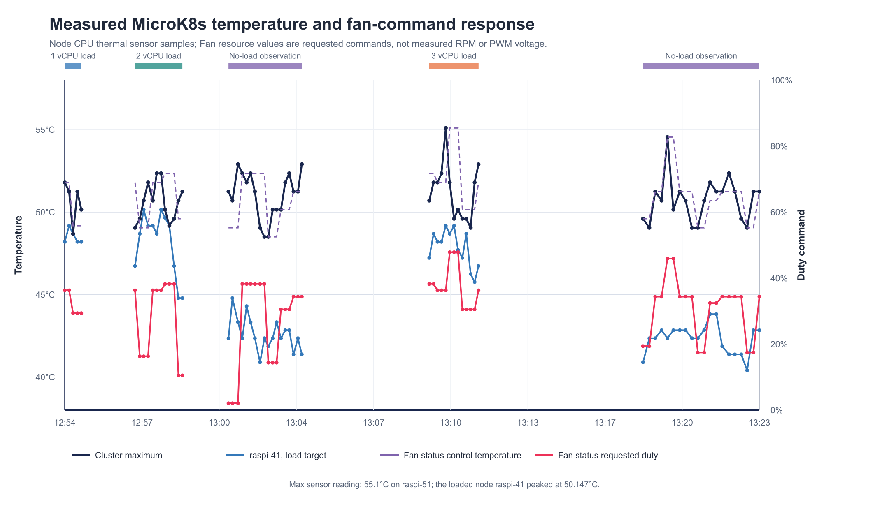
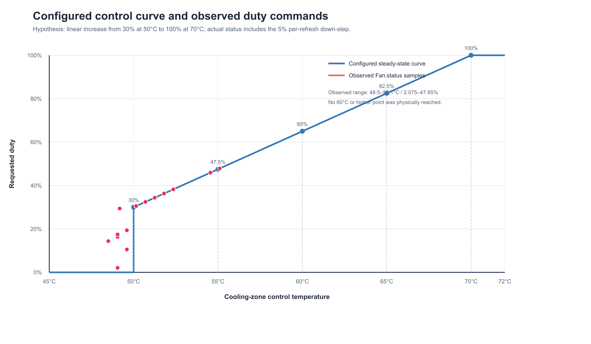
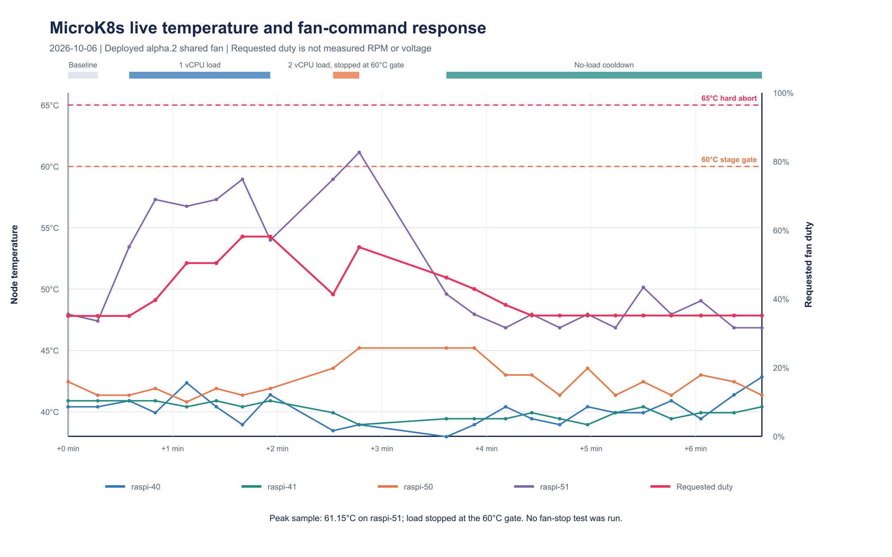
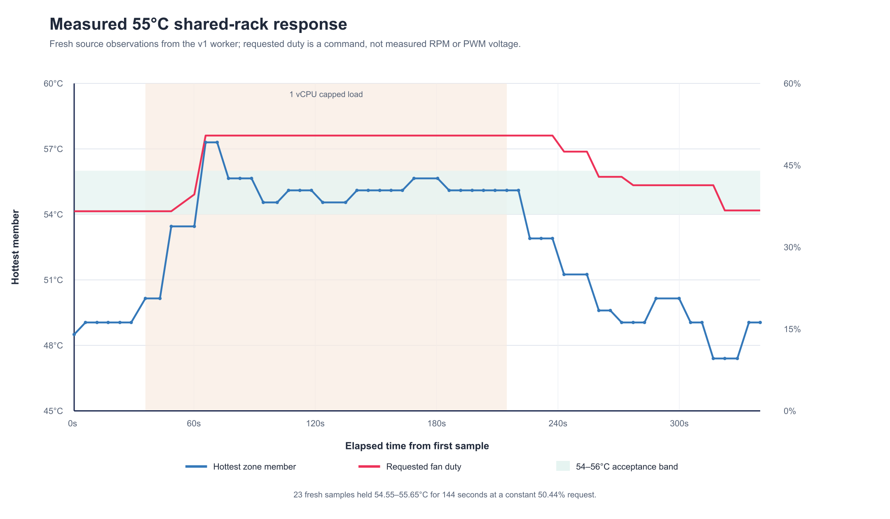

# pifanctl v1 Release Acceptance Field Manual

**Status:** Live v1 alpha runtime and thermal observations recorded through 2026-10-07
**Release target:** `1.0.0`
- **Active deployment:** alpha.3 operator and worker; alpha.2 temperature agents
- **v1 candidate under review:** app `1.0.0-alpha.6`, operator chart `0.1.0-alpha.6`
**Decision:** Not ready for a stable release. Hardware-specific acceptance remains open.

This manual records MicroK8s trials, bounded temperature-response tests, measured evidence, and remaining release checks. The v1 alpha.3 CRD operator, worker, Fan, and CoolingZone are active for the shared rack. The 55°C test below recorded a target-band response. Re-evaluation against the original 1°C total-range requirement leaves thermal stability acceptance open. A user visually confirmed normal fan rotation; RPM and electrical PWM measurements remain unavailable. Values unavailable from Kubernetes or direct measurements are explicitly marked **Not recorded** instead of being guessed.

## 1. Initial alpha.2 trial configuration (2026-10-04)

This inventory documents the earlier alpha.2 load trial. The active alpha.3 CRD
operator and shared-rack worker are recorded in Sections 9 and 10.

| Item | Observed value |
| --- | --- |
| Kubernetes context | `microk8s` |
| Trial namespace | `pifanctl-v1-trial` |
| Nodes | `raspi-40`, `raspi-41`, `raspi-50`, `raspi-51` |
| Node platforms | ARM64, Kubernetes `v1.36.2`, Debian GNU/Linux 12, Linux `6.12.93+rpt-rpi-*` kernels |
| Known board labels | `raspi-40` and `raspi-41`: Raspberry Pi 4 Model B; `raspi-50`: Raspberry Pi 5 Model B; `raspi-51`: model label not present |
| Operator / agent / worker image | `ghcr.io/jyje/pifanctl-issue:887f6f1-py312` |
| Image digest | `sha256:525ef9f01f7bd4d5af5ac4d4014d9f0320187628c41cd2eacd028d5fbb896cf5` |
| Source revision | `887f6f1ff05301255e7a5f01e22e117ef8e8e9ef` |
| Runtime chart | `pifanctl` chart `0.2.0-alpha.2`; topology source preserved from `837b3d5` |
| Image build | [GitHub Actions run #25](https://github.com/jyje/pifanctl/actions/runs/37201259327), Python 3.12, passed |
| Current topology | One shared rack fan cools the four Nodes in CoolingZone `r4spi-rack` |
| Actuator | Fan `r4spi-rack-fan` on `raspi-40`, RPi.GPIO BCM pin 18, 1000 Hz |
| Curve | Idle 0%; starts at 30% at 50°C; reaches 100% at 70°C; downward changes are limited to 5 percentage points per refresh |
| Safety commands | Failsafe duty 100%; exit duty 100%; refresh every 5 seconds; worker heartbeat timeout 120 seconds |
| Topology hash | `eb8b2a42289be4271f52103db3c7980ce5c9a0bb06fe83bc7f17d804b5c3f37c` |
| Readiness | Argo CD `Synced/Healthy`; operator, four agents, worker, Fan, and CoolingZone reported Ready after rollout |
| Immediate image rollback | `ghcr.io/jyje/pifanctl-issue:6a0f5a5-py312`, runtime chart source `837b3d5`; the archived v0 configuration remains the full rollback target |

At the last recorded sample, `2026-10-04T13:23:40Z`, the Fan resource reported a 51.25°C control temperature and a 34.375% requested duty. The measured node temperatures and Fan status vary over time; see the timestamped sample file rather than treating this point as a steady-state result.

## 2. Filled hardware inventory

The table describes the shared-fan controller during the initial 2026-10-04
trial. That workload ran on member `raspi-41`, which has no local fan in this
topology. The later alpha.3 55°C run targeted `raspi-51` and is recorded in
Section 10.

| Field | Recorded value |
| --- | --- |
| Controller Raspberry Pi model | Raspberry Pi 4 Model B, based on the Kubernetes node label; exact PCB revision not recorded |
| Controller OS, kernel, firmware | Debian GNU/Linux 12; kernel `6.12.93+rpt-rpi-v8`; firmware version not recorded |
| Controller Node and UID | `raspi-40`; `2b557e96-e346-4e26-b053-04d3cfaa094e` |
| Driver and PWM channel | RPi.GPIO, BCM GPIO 18, 1000 Hz |
| Fan manufacturer, model, rated voltage/current | Not recorded in Kubernetes; physical fan label or datasheet inspection required |
| Fan supply, fuse, and current limit | Not recorded; physical wiring and supply inspection required |
| PWM input type and polarity | Not recorded; verify from the exact fan datasheet and measured waveform |
| Ground/reference and signal wiring | Not recorded; inspect the physical rack |
| Independent hardware default and measured signal state | Not recorded; oscilloscope or logic-analyzer measurement required |
| Tachometer/RPM | No RPM metric or tachometer record was available |
| Visual rotation after the image update | User visually confirmed normal fan rotation before the 2026-10-06 load run; continuous observation during the load was not recorded; tachometer/RPM was not measured |
| Test member Node and UID | `raspi-41`; `cabfc25d-6991-427c-a941-3ff323fd6531`; Raspberry Pi 4 Model B label |

`100%` is a requested PWM duty, not measured voltage, RPM, or proof that the fan has power. A floating input or GPIO HIGH must not be assumed to mean maximum cooling. No universal pull-up, pull-down, or polarity is prescribed. Verify a hardware safe default and independently powered fan circuit for the actual wiring. Software cannot correct fan-supply loss or mechanical failure.

## 3. Temperature-response test

### Method and guardrails

- The live Fan stayed enabled throughout the CPU-load test. No CR, ConfigMap, Helm value, or temperature threshold was changed.
- Temporary, non-privileged CPU-load Pods were pinned to `raspi-41` and used the deployed candidate image. Each stage had a CPU and memory limit and exited automatically after its fixed duration.
- Prometheus temperatures and Fan status were sampled every 10 to 15 seconds. The load test was set to stop if any member reached 65°C or if temperature/status monitoring failed. Neither stop condition was reached.
- The 65°C abort threshold was a conservative test guardrail, not a pifanctl release setting. Raspberry Pi documents SoC thermal throttling between 80°C and 85°C; this test stayed well below that range. [Raspberry Pi hardware documentation](https://www.raspberrypi.com/documentation/hardware/rf/)
- The raw records are in [thermal-load-observations.csv](thermal-load-observations.csv). They contain Prometheus CPU-thermal readings and contemporaneous Fan resource status. The Prometheus samples were fresh, with observed sample age below 1.1 seconds.
- The CSV has 68 observations from `2026-10-04T12:54:19Z` through `2026-10-04T13:23:40Z`. SHA-256: `78a3226fbfc82a8cced5c18061e08d256909d11a80333ae9def67f2ba81794f5`.

### Results

| Stage | Applied load | Highest member reading | `raspi-41` reading | Fan resource observation | Result |
| --- | --- | --- | --- | --- | --- |
| A | 1 vCPU, up to 150 seconds | 51.8°C | 49.173°C maximum | Requested duty 29.375% to 36.3% | Partial; 55°C band not reached |
| B | 2 vCPU, up to 120 seconds | 52.35°C | 50.147°C maximum | Requested duty reached 38.225% | Partial; brief readings only, no stable hold |
| C | 3 vCPU, up to 120 seconds | 55.1°C on `raspi-51` | 49.173°C maximum | At control temperature 55.1°C, status requested 47.85% | Partial; hottest member was not the load target and did not remain at 55.1°C |
| D | Five-minute no-load observation, begun about seven minutes after the final stress stage | 54.55°C maximum during the interval | Recorded separately in the CSV | Control temperature 49.05°C to 54.55°C; requested duty 17.45% to 45.925% | No stable plateau established; this delayed interval does not measure the immediate cooldown transient |

The expected steady-state commands from the configured curve are 30% at 50°C, 47.5% at 55°C, 65% at 60°C, 82.5% at 65°C, and 100% at 70°C. The trial reached a short 55.1°C control-temperature snapshot and reported 47.85%, consistent with the configured curve. It did not reach 60°C or higher, and no temperature band was held long enough to claim thermal stabilization.

The test is not an isolated causal measurement. The hottest readings came from `raspi-51`, not the stress target `raspi-41`, and the cluster hosts other services. The stress target peaked at 50.147°C, while the hottest rack member peaked at 55.1°C. A later `kubectl top nodes` sample showed about 19% CPU on both `raspi-40` and `raspi-41`, and about 6% on `raspi-50` and `raspi-51`, after the load had ended. The data demonstrate changing cluster telemetry and corresponding Fan status, but they do not prove that the injected load alone caused the `raspi-51` temperature peak.

This figure plots the node selected for load, the concurrently hottest node, the cluster maximum, the Fan status control temperature, and the requested duty. Gaps between test stages remain gaps in time. Fan status is not measured PWM voltage or RPM.

The solid line is the configured rising curve. Markers are observed Fan status snapshots. The downward ramp can lag the curve because the configured controller limits each decrease to 5 percentage points per refresh. Target points at 60°C and above are curve calculations, not live measurements.

### Stability criteria and interpretation

Call a temperature band stable only after the hottest member stays within a 1°C range for at least 120 seconds under a declared, repeatable workload, telemetry remains fresh, and requested duty has no unexplained increase. Record fan RPM when instrumentation is available, or direct visual rotation. The initial 2026-10-04 trial did not satisfy that criterion. The later alpha.3 run also remains partial after the original criterion was reapplied in Section 10. In the initial trial, the member temperatures varied independently, and the hottest member was outside the node receiving the test load. Its five-minute no-load interval began about seven minutes after the last CPU-load sample, so it is not evidence for the immediate cooling slope or time-to-stability.

The live test ended below the 65°C abort guardrail, all temporary load Pods were removed, and no trial configuration was changed. The physical-fan-stop and recovery test has **not** been run. Its safe abort threshold is awaiting confirmation; the hardware default and RPM remain unverified. Post-upgrade normal rotation was subsequently confirmed by the user; see Section 12.

## 4. Other scenario records

| Scenario | Current evidence | Status |
| --- | --- | --- |
| Normal shared-rack regulation | Fan and CoolingZone Ready; Fan status follows the hottest available member samples and reports requested duty | Observed; stability remains open after Section 10 re-evaluation |
| Local node CPU load | Capped stages on `raspi-41` plus a 1 vCPU capped run on `raspi-51`; see Sections 3, 7, and 10 | All target stability gates remain untested or partial |
| Temperature missing or stale | The worker is configured for fail-safe 100%; no live telemetry fault was injected | Not run live; automated mock/API scenarios cover this behavior |
| Operator heartbeat expires | Worker plan uses a 120-second heartbeat timeout and fail-safe 100%; no live heartbeat fault was injected | Not run live |
| Physical shared fan stopped, then restored | No stop command or fan-power interruption was applied; actual fan circuit default is not yet documented | Not run; safety guardrail confirmation pending |
| Controller process exit, reboot, or power loss | No live fault was injected; process and electrical defaults need measurement | Not run |
| Pi 5 PWM hardware | `raspi-50` is labelled Pi 5 Model B, but the trial fan actuator uses RPi.GPIO on Pi 4 `raspi-40` | Not run on Pi 5 hardware |

The examples below describe expected control behavior, not measured thermal traces:

- **Normal load:** the shared fan follows the hottest member. A hotter member raises the shared fan request while cooler members remain in the same CoolingZone.
- **One hot member:** the selected zone's fan should rise along the configured curve; unrelated zones should not change.
- **Missing temperature or expired heartbeat:** the affected worker should request 100% and report an unhealthy reason. No thermal rise is predicted here because the live faults were not injected.
- **Fan stops or loses supply:** a software duty command cannot guarantee cooling. The measured hardware default and restoration behavior must be recorded before this scenario can pass.

## 5. Remaining release procedures

### Pi 4 GPIO PWM waveform and physical behavior

Record the actual board revision, OS/firmware, fan part number, supply/current protection, wiring, polarity, voltage levels, and instrument setup. With a person at the hardware, capture startup, requested duty changes, fan start-from-rest, normal stop, and process termination. Repeat at least three cold starts and three normal stops. **Pass only when measured waveform and physical fan behavior agree with the fan datasheet at all tested points.**

### Pi 5 kernel PWM

Verify the actual overlay, PWM chip/channel, pin mux, polarity, and frequency on the physical Pi 5. The sample `chip: 0`, `channel: 2` in `design/v1/examples/sysfs.yaml` is illustrative. Check single-writer ownership and repeat startup, duty, reboot, and shutdown measurements. Do not infer a Pi model or pin map from a Node name.

### Process, reboot, power, and network faults

In an isolated maintenance window, test graceful stop and `SIGKILL` separately, then orderly reboot, abrupt controller power loss, fan-supply interruption, worker/operator partition, and Prometheus loss. Record physical rotation, scope/tachometer data, failsafe time, `/readyz`, status reason, and recovery. Never count Python cleanup as protection against `SIGKILL`.

### Migration, rollback, and fleet load

Capture the archived v0 configuration and checksum. Inventory every writer of each PWM channel. Compare a read-only v1 plan to the physical rack, keep cooling at the safe state during handover, stop the old writer and verify lock release before starting v1, then exercise rollback. Measure CPU/memory, API requests, reconciliation duration, status writes, Prometheus latency, scrape gaps, and heartbeat age at a declared fleet size.

## 6. Evidence and release decision

| Record | Candidate and method | Result | Evidence |
| --- | --- | --- | --- |
| Deployment | `887f6f1-py312`, digest recorded in Section 1 | Argo CD Synced/Healthy; Fan and CoolingZone Ready | [Workflow run #25](https://github.com/jyje/pifanctl/actions/runs/37201259327) |
| Load stage A | `raspi-41`, 1 vCPU, maximum 150 seconds | Partial; maximum zone sample 51.8°C | [Raw samples](thermal-load-observations.csv) |
| Load stage B | `raspi-41`, 2 vCPU, maximum 120 seconds | Partial; maximum zone sample 52.35°C | [Raw samples](thermal-load-observations.csv) |
| Load stage C | `raspi-41`, 3 vCPU, maximum 120 seconds | Partial; 55.1°C transient on `raspi-51`; no steady hold | [Raw samples](thermal-load-observations.csv) |
| Cooldown | Five-minute no-load observation, started about seven minutes after the final load sample | Not stable; immediate cooldown transient was not captured | [Raw samples](thermal-load-observations.csv) |
| Electrical waveform, RPM, and physical fan-off recovery | Normal post-upgrade rotation confirmed by the user; no instrument measurements or fan-off recovery recorded | Not run | Electrical and fault-recovery acceptance evidence required |
| Pi 5 hardware, fault injection, rollback, fleet scale | No live trial records | Not run | Procedures in Sections 5 and 3 |
| 2026-10-06 live shared-fan follow-up | alpha.2 chart and image; bounded member CPU load | Response observed; 61.15°C sample crossed the 60°C stage gate, so load was stopped; no stable hold claimed | [Follow-up samples](thermal-load-observations-2026-10-06.csv) and Section 7 |
| 2026-10-06 isolated alpha.3 CRD runtime probe | alpha.3 operator chart and Python 3.12 ARM64 issue image in a temporary namespace; probe CRs targeted nonexistent Nodes | CRD defaulting/admission, operator reconciliation, expected missing-node status, and Argo health passed; no worker or GPIO access | [Workflow run 37429082468](https://github.com/jyje/pifanctl/actions/runs/37429082468) and Section 8 |

## 7. 2026-10-06 live shared-fan follow-up

This bounded follow-up exercised the currently deployed `ghcr.io/jyje/pifanctl:v1.0.0-alpha.2` controller from chart `0.2.0-alpha.2` on the four-node `microk8s` cluster. The Argo CD application was Synced and Healthy before the run. The shared fan controller stayed Ready on `raspi-40`; four agents continued publishing temperatures. A checksum-verified snapshot of the current GitOps application, chart, DaemonSets, Pods, monitoring objects, and node inventory was captured before applying load. No Helm values, ConfigMaps, CRDs, PWM settings, or production workloads were changed.

Two unprivileged Pods were pinned to the hottest member, `raspi-51`, and used the deployed image with CPU and memory limits. The 1 vCPU stage ran for 85 seconds. A 2 vCPU stage was started, then deleted as soon as a 15-second Prometheus poll observed the 60°C stage gate. The load harness also stopped on stale or missing telemetry, an unavailable controller, or a 65°C hard abort guardrail. Because the threshold is evaluated at polling intervals and thermal sensors report with delay, the sampled value reached 61.15°C before the Pod was removed. The 65°C abort limit was not reached.

| Observation | Result |
| --- | --- |
| Baseline hottest member | `raspi-51`, 47.95°C; requested duty 35.04% |
| 1 vCPU stage | Peak 58.95°C; requested duty reached 58.14%; Pod exited after 85 seconds |
| 2 vCPU stage | Sampled peak 61.15°C; requested duty 55.06%; stopped at the 60°C stage gate and Pod removed |
| No-load follow-up | 12 samples over 3 minutes; `raspi-51` was 46.85°C in the final sample, with requested duty 35.18% |
| Monitoring and controller | Four node series remained fresh; maximum observed sample age was under 4 seconds; controller stayed Ready |
| Cleanup | Both temporary load Pods were absent after the run; GitOps and production configuration were unchanged |

These observations show the shared controller's requested duty rising while the hottest member warmed and falling during cooldown. They do not establish a stable target-temperature hold, prove that injected CPU load alone caused every temperature change, or measure electrical PWM, fan RPM, or airflow. The exact board model for `raspi-51` remains unrecorded. No fan-stop, fault-injection, reboot, or power-loss test was run. Fan rotation was not directly observed during this remote follow-up.

Raw timestamped samples, including the aborted-stage observation and cooldown, are in [thermal-load-observations-2026-10-06.csv](thermal-load-observations-2026-10-06.csv). The plot separates each node's temperature from the requested fan duty and marks both the 60°C stage gate and 65°C hard abort limit.

The live experiment is a response check for the deployed alpha.2 shared-fan topology only. It does not validate the v1 CRD operator, Pi 5 PWM, fail-safe behavior after hardware or process faults, electrical signal polarity, or physical cooling capacity.

## 8. 2026-10-06 isolated alpha.3 CRD runtime probe

An isolated Argo CD Application installed the operator chart from pifanctl commit `69a829f2bb17977b692954c905129498d63abcf7` into namespace `pifanctl-v1-runtime-test`. The chart established the cluster-scoped `Fan` and `CoolingZone` CRDs, and Kubernetes admitted both probe resources. API defaulting added `temperatureHysteresis: 5` to the Fan. The probe used the commit-specific ARM64 Python 3.12 image `ghcr.io/jyje/pifanctl-issue:69a829f-py312`, built and smoke-tested by [workflow run 37429082468](https://github.com/jyje/pifanctl/actions/runs/37429082468). The deployed image digest was `sha256:1bbee7f514a3547ac9c0b1413f159f077f4ed90821ff2d39080119f3cd528115`.

| Check | Observed result |
| --- | --- |
| CRD installation and admission | Both CRDs established; Fan and CoolingZone creation succeeded |
| Operator image and API connection | One operator Pod Ready, zero restarts, no recurring reconciliation errors |
| Argo CD | Synced and Healthy |
| Missing-node conditions | Fan reported `MissingWorkerNode`; CoolingZone reported `MissingNode`, as expected |
| Worker and GPIO | No worker Pod was created; no GPIO-capable workload ran |
| Cleanup | Argo pruned both probe resources; the probe Application and namespace were deleted |
| Production pifanctl after staged handoff | Alpha.2 agent DaemonSet remains 4/4; its controller DaemonSet was pruned. The alpha.3 staging operator is 1/1 Ready; no Fan resource or worker exists |

The first probe attempt used alpha.2 with the alpha.3 CRD. Kubernetes defaulted the new hysteresis field, which the older alpha.2 topology schema rejected. The alpha.3 Python 3.12 image then reconciled the same probe successfully. This confirms the need to keep the operator image and CRD revision compatible; it does not establish cross-version compatibility.

This is live MicroK8s API and operator-runtime evidence, not the disposable-cluster test, a worker startup test, physical PWM/RPM verification, or temperature stabilization acceptance. The CRDs remain installed cluster-wide after the isolated resources and namespace were removed. The staged GitOps handoff is now active: [PR #144](https://github.com/jyje/cluster/pull/144) installed the alpha.3 operator with no `extraResources`; [PR #145](https://github.com/jyje/cluster/pull/145) disabled the alpha.2 controller; [PR #146](https://github.com/jyje/cluster/pull/146) enabled app-scoped pruning so the old DaemonSet and Pod were removed. The live rack topology was subsequently added through [PR #147](https://github.com/jyje/cluster/pull/147). See the next section for worker and telemetry evidence. Preserve the archived baseline for rollback.

## 9. 2026-10-06 alpha.3 shared rack worker

The GitOps change in [cluster PR #147](https://github.com/jyje/cluster/pull/147), merged as `53fdb9f86cc4b85974e4e410121f2f3dd2bfc810`, declares `r4spi-rack-fan` on `raspi-40` using RPi.GPIO BCM GPIO18 at 1000 Hz. CoolingZone `r4spi-rack` groups `raspi-40`, `raspi-41`, `raspi-50`, and `raspi-51`, reads `pifanctl_temperature_celsius` from the in-cluster Prometheus service, and keeps the existing 50-75 C curve, 5 C hysteresis, 5-second refresh, and 100% failsafe and exit duties.

| Check | Observed result |
| --- | --- |
| GitOps | Argo CD `pifanctl-v1-staging` Synced and Healthy after PR #147 |
| Fan and CoolingZone admission | Both resources created; zone resolved all four nodes and one fan |
| Worker placement and readiness | One worker Pod on `raspi-40`, Ready, zero restarts |
| Fan status | Ready=True, reason `Regulating`; requested duty started at 100% and entered closed-loop control |
| Zone telemetry | Fresh Prometheus samples from all four nodes; zone Ready=True |
| Unforced observation | At 2026-10-06 11:11:44 UTC, temperatures were `raspi-40` 41.381 C, `raspi-41` 41.381 C, `raspi-50` 44.65 C, and `raspi-51` 50.7 C. The worker reported a 50.7 C zone maximum and 45.96% requested duty. |

The unforced observation confirms that the alpha.3 worker reconciles the real Fan and CoolingZone, collects rack-wide node temperatures, and changes its requested duty as the measured zone temperature changes. It is not a controlled load test or a stable target-temperature hold. The brief 65 C control reading during startup was followed by lower readings as the worker entered its control loop; it was not a staged thermal stimulus. No CPU load, fan-stop, fault injection, or target-curve modification was performed in this run.

The requested duty is a software command, not a tachometer or airflow measurement. The user visually confirmed normal rotation after the image update, but no tachometer/RPM or electrical waveform was measured. The bounded 55°C run and its remaining limitations are recorded in Section 10. Keep the archived v0 configuration available for rollback.

## 10. 2026-10-06 alpha.3 55°C shared-rack stability run

After the user confirmed that the physical shared fan was rotating normally, a bounded thermal-response run exercised the active v1 alpha.3 Fan and CoolingZone on MicroK8s. The worker controlled one shared fan on `raspi-40` for the four-member rack zone. A non-privileged Pod with a 1 vCPU limit was pinned to `raspi-51`, the hottest member at baseline. The fan remained enabled throughout. No Fan, CoolingZone, ConfigMap, Helm, or GPIO settings were changed.

The load stage was capped at 180 seconds. The harness sampled the worker status and each Prometheus source-observation timestamp, accepted only fresh telemetry, and removed the load if the source became stale, the worker became unhealthy, or the rack maximum reached its 58°C soft stop or 62°C hard stop. The configured temperature band for this target was 54–56°C. The original acceptance criterion requires at least 120 continuous seconds inside the target band with no more than 1°C total temperature variation, fresh per-member telemetry, and at most 5 percentage points of requested-duty variation. A 65°C ceiling remained the absolute test guardrail.

| Measurement | Result |
| --- | --- |
| Baseline hottest member | `raspi-51`, 49.05°C; 36.58% requested duty |
| Applied load | 1 vCPU CPU limit on `raspi-51`; maximum load duration 180 seconds |
| Load-stage peak | 57.3°C; requested duty peaked at 50.44%; neither the 58°C soft stop nor 62°C hard stop was reached |
| Target-band interval (not a stability pass) | 23 composite observations from 2026-10-06 14:22:48 UTC through 14:25:12 UTC; 144 seconds in the 54–56°C band |
| Temperature and requested duty in the interval | 54.55–55.65°C; fixed at 50.44% requested duty (0 percentage-point span) |
| Telemetry freshness | Maximum observed source age for the full run was 17.83 seconds; longest gap between stable-interval source observations was 10 seconds |
| Physical fan observation | User confirmed normal rotation before the load; continuous observation during the run was not recorded. No RPM/tachometer measurement or electrical PWM waveform was recorded |
| Cooldown and cleanup | After load removal, the hottest member returned to 47.4–49.05°C in the recorded cooldown window. The temporary load Pod was absent on follow-up. Operator and worker were Ready with zero restarts; Fan and CoolingZone were Ready. |

This run **does not pass the original 55°C stability criterion**. The entire 144-second band interval spans 1.10°C, exceeding the required 1°C total range. The longest qualifying 1°C interval is 75 seconds, shorter than the required 120 seconds. The archived source clock is the minimum across members; individual member observation timestamps were not retained, so these 23 composite observations must not be described as independent hottest-node sensor samples. It does not prove measured RPM, airflow, PWM voltage/polarity, or fan-failure detection. The initial rise to 57.3°C and the later sensor readings are part of the observed response, not a claim that the entire load stage stayed at the target. Only the 55°C target was examined in this worker run; acceptance at 50°C, 55°C, and 60°C remains open. The cooldown samples demonstrate a return toward baseline but are not a calibrated cooling-capacity or time-to-stability measurement.

The machine-readable [verification result](thermal-stability-55c-2026-10-06-verification.json) is derived with `python scripts/verify_thermal_acceptance.py docs/v1/thermal-stability-55c-2026-10-06.csv` from the repository root. The verifier exits nonzero when acceptance is incomplete. The graph reports this result rather than a hard-coded passing claim.

The retained [CSV](thermal-stability-55c-2026-10-06.csv) contains host sample time, source-observation time, each member temperature, hottest member, control temperature, requested duty, source age, and worker-heartbeat age. SHA-256: `071f9ed3a9833e618ac43c0f393a442c624133aef7c20e8cd0ce2e56dbcf8a9b`. Regenerate the [figure](figures/thermal-stability-55c-2026-10-06.png) and this PDF with `python scripts/build_release_acceptance.py`.

Do not label `1.0.0` stable until every applicable release gate has evidence for the exact release candidate. Hardware or topologies not tested must be listed as unsupported. Preserve the v0 rollback archive until the release decision is recorded.

## 11. 2026-10-07 disposable Kubernetes API verification

A dedicated local kind cluster (`kind-pifanctl-release`, Kubernetes `v1.37.0`, ARM64) used a separate kubeconfig. The operator chart installed the Fan and CoolingZone CRDs and both custom-resource fixtures through `extraResources`. The operator used the same pinned alpha.3 compatibility image as the rack (`69a829f-py312`). The fixtures intentionally targeted a nonexistent Node, so no hardware worker was created.

The [machine-readable report](release-api-verification-2026-10-07.json) records fifteen passing real-API and lifecycle checks: both CRDs Established; hysteresis defaulting; expected `MissingWorkerNode` and `EmptySelection` status; operator availability; no hardware worker; and rejection of reversed temperature bounds, zero PWM frequency, immutable Node changes, and immutable hardware changes; plus release-finalizer attachment and cleanup for a temporary Fan and CoolingZone targeting a nonexistent Node. Reproduce these read-only/server-dry-run checks with `scripts/verify_release_api.py --kubeconfig <isolated-kind-kubeconfig> --exercise-lifecycle --report <path>` after installing the chart and `tests/fixtures/operator-extra-resources.yaml`.

Helm 4.3.0's readiness watcher timed out when waiting for these deliberately unhealthy custom resources. The operator itself was Ready. Reapplying with custom-resource readiness waiting disabled completed the fixture installation; the validator then checked the expected unhealthy CR conditions explicitly. This is negative-fixture behavior, not a passing healthy fan deployment. A production topology should reach Ready and keep normal Helm readiness checking.

The local [regression report](release-local-verification-2026-10-07.json) records 303 passing tests, zero skips, 95.87% statement coverage and 89.10% branch coverage on Python 3.13.2. Matplotlib is pinned in development requirements so rendering verification runs in the Python CI matrix rather than being skipped.

This result covers real API admission/defaulting and missing-node reconciliation. The later software verification in Section 13 covers disposable-cluster Argo CD ordering, active simulated-worker finalizers, stable API migration and active worker deployment. Fleet scale, electrical behavior, live migration and physical fault recovery remain open.

## 12. Direct visual rotation confirmation

The user explicitly confirmed that the shared fan blades were continuing to rotate normally. This satisfies the direct visual observation check for the running deployment. The question presented a previously reported 38.12% requested duty and 49.6°C maximum temperature; those values describe that earlier remote snapshot, not measurements made by the observer.

A read-only follow-up on the cluster clock at approximately 2026-10-06 15:29 UTC found:

| Check | Result |
| --- | --- |
| Physical blades | User confirmed continuous normal rotation |
| Worker and operator | Ready, zero restarts |
| Fan and CoolingZone | Ready; one shared fan assigned to four members |
| Requested duty | 38.12% |
| Worker-reported rack maximum | 49.05°C on `raspi-51` |
| Other member temperatures | `raspi-40`: 44.79°C; `raspi-41`: 40.407°C; `raspi-50`: 43.0°C |
| Test changes | None; no GPIO, topology, workload, or fan-power changes |

This is qualitative human observation of normal rotation at the confirmation point. It does not provide RPM, electrical PWM measurements, continuous observation during the earlier load run, or fan-stop/restart acceptance. The temperature-stability and remaining hardware gates stay open. The machine-readable [observation record](physical-rotation-confirmation.json) preserves this distinction. The timestamp above is the actual host/cluster observation clock; it is not inferred from the session's calendar date.

<!-- pagebreak -->

## 13. Software acceptance progress and remaining release gates

The current software candidate is app `1.0.0-alpha.6` with operator chart `0.1.0-alpha.6`. The live shared-rack operator and worker remain alpha.3; the tests below did not upgrade MicroK8s or change physical fan commands. Disposable runtime trials use explicit GPIO and temperature simulations, while Kubernetes and Argo CD are real services.

| Verification | Recorded result | Evidence |
| --- | --- | --- |
| Stable API and storage | 19 real API checks and 4 migration/rollback checks on Kubernetes 1.37.0 | [Stable API report](stable-api-verification.json), [storage report](storage-migration-verification.json) |
| Active worker lifecycle | 14 checks on Kubernetes 1.37.0: two fans per worker, Node UID, credential isolation, stale/missing sensors, recovery and cooperative deletion | [Runtime report](runtime-lifecycle-alpha6.json), [procedure](runtime-lifecycle.md) |
| Minimum Kubernetes | 19 API and 14 simulated-runtime checks on Kubernetes 1.30.0 | [API report](minimum-kubernetes-api.json), [runtime report](minimum-kubernetes-runtime.json) |
| Live API compatibility preflight | Alpha.6 Python 3.12 image read four Nodes, Fan and CoolingZone and built a valid topology with TLS verification enabled; read-only Pod had no host volumes or GPIO imports | [Compatibility record](minimum-kubernetes.md) |
| Argo CD lifecycle | 17 checks on Argo CD 3.5.2 and Kubernetes 1.30.0: initial CRD/instance admission, first-fan prune, complete instance retirement, operator removal and shared CRD retention | [GitOps report](gitops-lifecycle-verification.json), [procedure](gitops-lifecycle.md) |
| Local regression suite | 330 passed, zero skips on Python 3.13.2; 96.29% statement and 89.81% branch coverage. Related Python 3.10 checks: 77 passed | [Local report](gitops-local-verification.json) |

### GitOps retirement sequence

1. Install the pinned operator chart and instance CRs together through `extraResources`. Verify the current desired source, both resolved sync revisions, Synced/Healthy status and explicit CR readiness.
2. Remove a retired Fan and its zone reference from desired values. Background pruning releases that simulated driver while the other fan continues in the same worker Pod.
3. Remove every desired instance first, including any CLI-created CRs in the inventory. Keep the operator available until instance finalizers complete and the worker Pod disappears.
4. Remove the operator Application only after instance retirement. Both shared CRDs remain Established with unchanged UIDs because they carry `Prune=false,Delete=false`.

The measured single-fan and full-instance prune syncs took 64.82 and 78.73 seconds respectively. They include ConfigMap projection and reconciliation, and are not physical failsafe latency guarantees. Foreground retirement and deletion of an Application with active instances are outside this verified staged procedure. An unreachable worker must leave retirement pending; finalizers were never forced.

The first GitOps verifier could accept a stale successful sync immediately after desired values changed. Its initial report is excluded from acceptance. The [audit](gitops-stale-status-audit.json) and regression fixture preserve this failure. The corrected verifier requires both compared and operation sources, plus resolved revisions, to match the current Application source. A fresh complete trial passed all 17 checks.

<!-- pagebreak -->

### Release decision

**Decision:** Not ready for a stable release. The software checks above do not close physical or production acceptance gates.

- Archive and exercise the actual MicroK8s candidate upgrade and rollback with a single PWM writer.
- Repeat 50 C, 55 C and 60 C thermal acceptance with fresh timestamps for every member and the original continuous stability criteria. The earlier 55 C record still fails that criterion.
- Measure the exact fan's electrical waveform, polarity, RPM and physical stop/restart behavior; record the fan and supply inventory.
- Validate applicable process, power, network and sensor failures, Pi 5 hardware and a declared fleet size. Mark untested hardware/topologies unsupported rather than assuming coverage.

The direct normal-rotation observation in Section 12 remains valid for its confirmation point. New candidate hardware behavior requires new evidence. Remote PR CI, merge and publication are tracked independently in [PLAN.md](../../PLAN.md).

## References

- [Runtime manual](runtime.md), [v1 architecture and acceptance design](README.md), and [implementation and release checklist](../../PLAN.md)
- [Raspberry Pi frequency and thermal management](https://www.raspberrypi.com/documentation/hardware/rf/), [RPi.GPIO project](https://sourceforge.net/projects/raspberry-gpio-python/), and [Linux kernel PWM interface](https://docs.kernel.org/driver-api/pwm.html)
